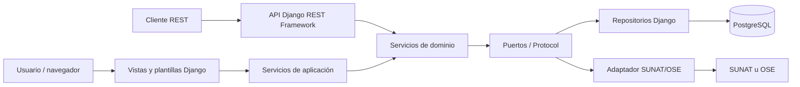
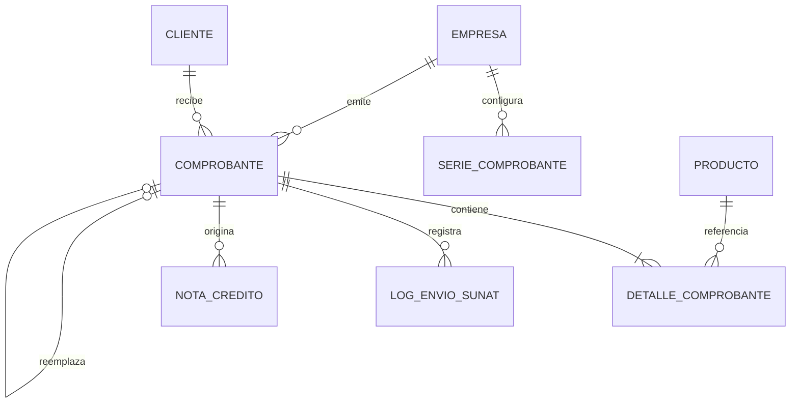
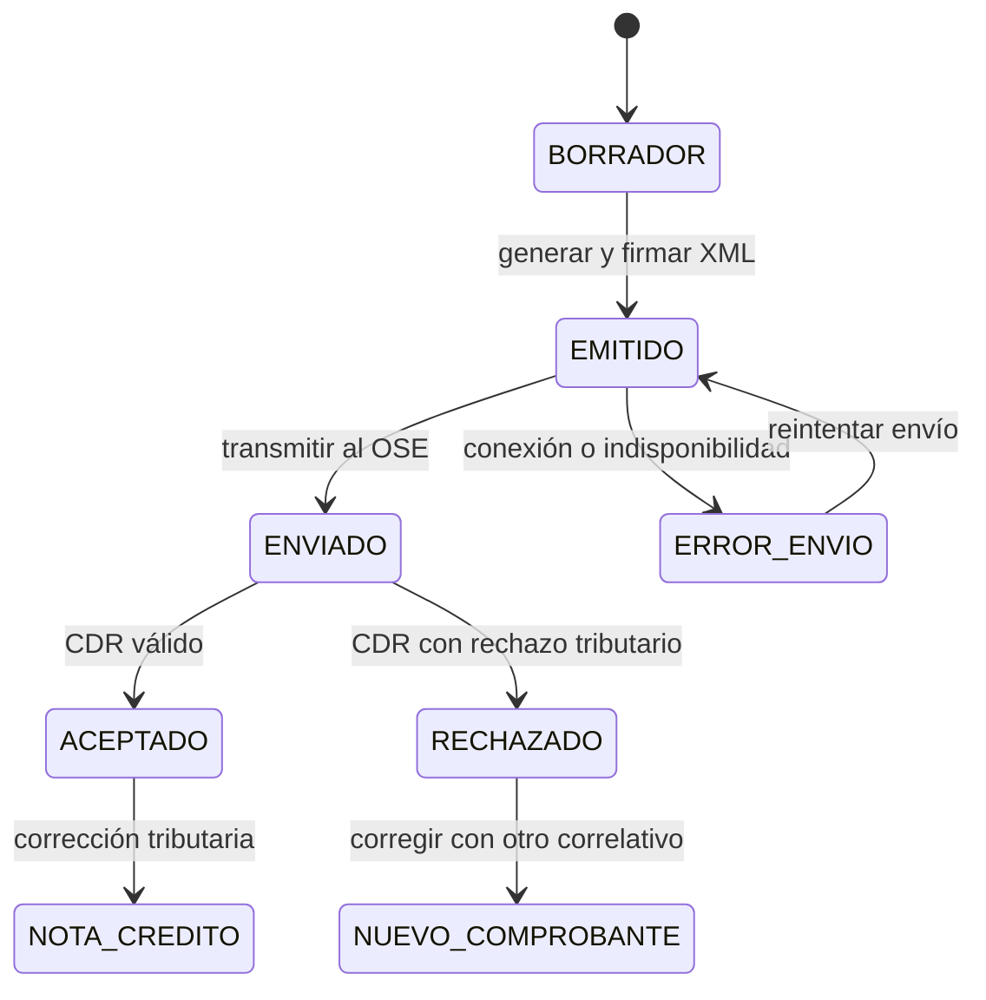
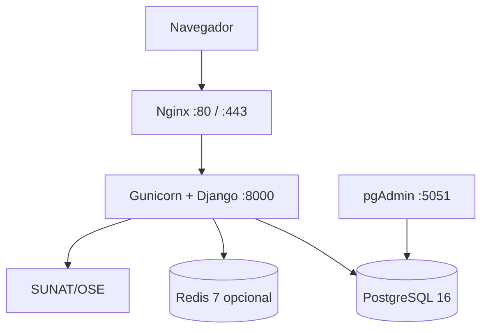

# Guía completa para exponer el sistema de facturación electrónica SUNAT

## 1. Presentación del proyecto

El proyecto es un sistema web de facturación electrónica desarrollado para
administrar clientes, productos, empresas emisoras y comprobantes electrónicos.
Genera facturas, boletas y notas de crédito en formato UBL 2.1, firma el XML y
lo transmite a SUNAT o a un Operador de Servicios Electrónicos (OSE).

El sistema resuelve cuatro necesidades principales:

1. Aplicar las reglas tributarias antes de enviar un comprobante.
2. Evitar rechazos causados por documentos, importes o afectaciones incorrectas.
3. Conservar la trazabilidad del XML, CDR, estado y respuesta de SUNAT.
4. Separar la lógica del negocio de Django, la base de datos y el proveedor OSE.

## 2. Problema que resuelve

Una factura electrónica no es únicamente una representación visual. SUNAT
valida el XML y comprueba que coincidan:

- el tipo de comprobante y la serie;
- el documento de identidad del receptor;
- las bases imponibles, impuestos y totales;
- el tipo de afectación del IGV de cada línea;
- el tipo de operación nacional o de exportación;
- la moneda, firma digital y numeración.

Un dato inconsistente ocasiona el rechazo completo. Por eso el proyecto aplica
las reglas en la interfaz, el dominio y el generador XML, no solamente al final
del envío.

## 3. Objetivos

### Objetivo general

Construir una solución mantenible para emitir y controlar comprobantes
electrónicos compatibles con las reglas de SUNAT.

### Objetivos específicos

- Gestionar empresas, clientes, productos y categorías.
- Emitir facturas `01`, boletas `03` y notas de crédito `07`.
- Implementar los códigos de afectación IGV del Catálogo 07.
- Generar XML UBL 2.1, firmarlo y empaquetarlo en ZIP.
- Integrarse con SUNAT/OSE mediante servicios web.
- Registrar tickets, CDR, mensajes y errores de envío.
- Permitir exportaciones de bienes mediante la operación `0200`.
- Diferenciar rechazos tributarios de fallos técnicos.
- Generar reportes y documentos PDF/Excel.

## 4. Tecnologías y frameworks

| Área | Tecnología | Función |
|---|---|---|
| Lenguaje | Python 3.11 | Implementación del backend y dominio |
| Framework web | Django 5 | ORM, sesiones, vistas web, formularios y administración |
| API | Django REST Framework | Endpoints REST y serialización |
| Autenticación API | SimpleJWT | Tokens de acceso y renovación |
| Documentación API | drf-spectacular | OpenAPI, Swagger y Redoc |
| Base de datos | PostgreSQL 16 | Persistencia principal |
| Desarrollo | SQLite | Alternativa local ligera |
| XML | lxml | Construcción y análisis de XML UBL |
| Firma digital | SignXML y cryptography | Firma XML con certificado digital |
| SOAP | Zeep | Comunicación con servicios SUNAT/OSE |
| PDF | WeasyPrint | Representación imprimible del comprobante |
| Reportes | pandas y openpyxl | Procesamiento y exportación a Excel |
| Servidor WSGI | Gunicorn | Ejecución del backend en contenedores |
| Proxy web | Nginx | Entrada HTTP/HTTPS y archivos estáticos |
| Contenedores | Docker Compose | Orquestación del sistema |
| Pruebas | pytest, pytest-django y Django TestCase | Pruebas unitarias e integración |

El frontend utiliza plantillas Django, HTML, CSS, JavaScript y Bootstrap Icons.
No necesita un framework SPA para ejecutar los casos de uso principales.

## 5. Arquitectura

El proyecto aplica una arquitectura hexagonal o **Ports and Adapters**. La idea
central es que las reglas tributarias no dependan directamente de Django,
PostgreSQL, SOAP o una interfaz específica.



### 5.1 Dominio

Ubicación: `dominio/`

Contiene las reglas de negocio puras:

- entidades como `Cliente`, `Producto`, `Comprobante` y `NotaCredito`;
- servicios que implementan casos de uso;
- puertos para repositorios, unidad de trabajo y SUNAT;
- excepciones del negocio;
- reglas tributarias centralizadas en `dominio/tributos.py`.

El dominio decide, por ejemplo, si una factura nacional admite al cliente, si
las líneas son de exportación y cómo calcular cada afectación.

### 5.2 Infraestructura

Ubicación: `infraestructura/`

Implementa los adaptadores concretos:

- repositorios basados en Django ORM;
- mappers entre modelos Django y entidades de dominio;
- unidad de trabajo con transacciones;
- cliente OSE real y simulador;
- firmador XML, generador XML y compresión ZIP.

### 5.3 Interfaces

Ubicación: `interfaces/`

Son los adaptadores de entrada:

- ViewSets de Django REST Framework;
- serializers para validar las solicitudes;
- endpoints de salud, reportes y documentación;
- contenedor de inyección de dependencias.

Las vistas deben recibir la solicitud, validar la entrada, llamar al caso de uso
y devolver la respuesta. La regla tributaria no debe implementarse en la vista.

### 5.4 Aplicaciones Django

Ubicación: `apps/`

Contienen los modelos ORM, migraciones, administración, vistas web, URLs y
wrappers de compatibilidad. Los módulos principales son:

| Módulo | Responsabilidad |
|---|---|
| `empresas` | Emisores, RUC y certificados digitales |
| `clientes` | Receptores nacionales y extranjeros |
| `productos` | Catálogo comercial y afectación IGV |
| `comprobantes` | Facturas y boletas |
| `notas_credito` | Correcciones sobre comprobantes aceptados |
| `sunat_ose` | XML, firma, envío, CDR y logs |
| `reportes` | Indicadores y exportación de información |
| `usuarios` | Autenticación, perfiles y permisos |

## 6. Principios de diseño aplicados

- **Responsabilidad única:** cada capa tiene una función concreta.
- **Inversión de dependencias:** el dominio trabaja con puertos, no con detalles.
- **Inyección de dependencias:** `interfaces/container.py` conecta servicios y
  adaptadores.
- **Unidad de trabajo:** agrupa operaciones de persistencia en una transacción.
- **Mappers:** impiden que las entidades dependan de modelos Django.
- **Excepciones de dominio:** expresan errores del negocio y se traducen a HTTP.
- **Soft delete:** conserva registros importantes para auditoría.
- **Trazabilidad:** cada envío almacena estado, mensaje, XML, ticket y CDR.

## 7. Modelo funcional

Las relaciones principales son:



Un comprobante conserva empresa, cliente, serie, correlativo, fecha, moneda,
tipo de operación, estado y totales. Sus detalles conservan producto, cantidad,
precio, descuento, afectación, base e impuesto.

## 8. Lógica tributaria

### 8.1 Venta nacional

- Factura `01`: requiere cliente con RUC peruano, tipo de documento `6`.
- Boleta `03`: admite DNI u otros documentos permitidos para el consumidor.
- Operación nacional: utiliza `tipo_operacion=0101`.
- No admite productos con afectación `40`.

### 8.2 Afectaciones principales

| Afectación | Operación | Tributo | Tasa | Total pagable |
|---:|---|---|---:|---|
| `10` | Gravada onerosa | `1000 / IGV / VAT` | 18 % | Base + IGV |
| `17` | IVAP | `1016 / IVAP / VAT` | 4 % | Base + IVAP |
| `20` | Exonerada onerosa | `9997 / EXO / VAT` | 0 % | Base |
| `30` | Inafecta onerosa | `9998 / INA / FRE` | 0 % | Base |
| `40` | Exportación | `9995 / EXP / FRE` | 0 % | Base |
| `11-16` | Gratuita gravada | `9996 / GRA / FRE` | Referencial | Cero |
| `21`, `31-37` | Gratuita sin impuesto | `9996 / GRA / FRE` | 0 % | Cero |

### 8.3 Operaciones gratuitas

En una transferencia gratuita, el valor ingresado es referencial:

- `LineExtensionAmount` contiene la base referencial;
- `TaxableAmount` contiene la misma base;
- `PriceAmount` pagable es `0.00`;
- `AlternativeConditionPrice` contiene el valor referencial con código `02`;
- el total comercial y pagable permanecen en cero;
- se agrega la leyenda SUNAT `1002`.

Esta lógica evita las diferencias de línea reportadas por los códigos SUNAT
`3271` y `3272`.

## 9. Exportación de bienes: SUNAT-40

`SUNAT-40` es un producto demostrativo configurado con afectación `40`. Si todas
las líneas tienen ese código, el dominio deriva automáticamente la operación
`0200`.

### Reglas

- El comprobante debe ser una factura `01` con serie `F...`.
- Todas las líneas deben usar afectación `40`.
- No se pueden mezclar líneas nacionales y de exportación.
- El cliente debe ser no domiciliado.
- El país ISO debe ser diferente de `PE`.
- El documento extranjero puede tener entre 1 y 15 caracteres sin espacios.
- Los 11 dígitos son exclusivos del RUC peruano, tipo `6`.
- La operación puede utilizar `PEN`, `USD` o `EUR` según la implementación.

### Cliente extranjero creado para la demostración

| Campo | Valor |
|---|---|
| Código interno | `CL0006` |
| Tipo de documento | `0 - Documento tributario no domiciliado sin RUC` |
| Número | `ABC123` |
| Longitud | 6 caracteres |
| Razón social | `IMPORTADORA ANDINA SPA - DEMO` |
| País | `CL - Chile` |
| Correo | `compras.demo@importadoraandina.cl` |

Este registro demuestra que el receptor extranjero no necesita un documento de
11 dígitos. El número se conserva tal como fue emitido por el país de origen.

### XML esperado

```xml
<cbc:ProfileID>0200</cbc:ProfileID>
<cbc:InvoiceTypeCode listID="0200">01</cbc:InvoiceTypeCode>
<cbc:DocumentCurrencyCode>USD</cbc:DocumentCurrencyCode>

<cbc:CompanyID schemeID="0">ABC123</cbc:CompanyID>

<cbc:TaxableAmount currencyID="USD">100.00</cbc:TaxableAmount>
<cbc:TaxAmount currencyID="USD">0.00</cbc:TaxAmount>
<cac:TaxScheme>
  <cbc:ID>9995</cbc:ID>
  <cbc:Name>EXP</cbc:Name>
  <cbc:TaxTypeCode>FRE</cbc:TaxTypeCode>
</cac:TaxScheme>
<cbc:TaxExemptionReasonCode>40</cbc:TaxExemptionReasonCode>
```

## 10. Flujo completo de un comprobante



### Significado de los estados

| Estado | Significado | Acción correcta |
|---|---|---|
| `BORRADOR` | Todavía es editable | Revisar, editar o emitir |
| `EMITIDO` | Tiene XML preparado | Enviar |
| `ENVIADO` | Fue transmitido | Esperar o consultar CDR |
| `ACEPTADO` | SUNAT/OSE lo validó | Conservar; corregir con nota |
| `RECHAZADO` | Existe rechazo tributario | Crear un comprobante nuevo |
| `ERROR_ENVIO` | Falló la transmisión sin rechazo | Reintentar el mismo número |

Una factura rechazada no se edita ni reenvía con el mismo número. El sistema
conserva el documento original y crea otro mediante **Corregir y generar nuevo
comprobante**, relacionándolo con `reemplaza_a`.

## 11. Integración con SUNAT/OSE

El envío sigue este proceso:

1. El dominio valida el comprobante.
2. Se genera el XML UBL 2.1.
3. El XML se firma con el certificado digital del emisor.
4. Se guarda y empaqueta en ZIP.
5. El adaptador transmite el archivo mediante SOAP.
6. SUNAT/OSE devuelve ticket o CDR.
7. El sistema interpreta la respuesta y actualiza el estado.
8. El log conserva la evidencia de la operación.

Existen dos adaptadores:

- `MockOSEAdapter`: demostraciones y pruebas sin transmisión real.
- `RealOSEAdapter`: conexión real o beta mediante WSDL y credenciales SOL.

> **Precaución para la exposición:** la configuración Docker actual tiene
> `SUNAT_OSE_MOCK=False`. Para una demostración sin transmisión, cambie esa
> variable a `True` y reconstruya el backend antes de pulsar **Enviar**.

## 12. Seguridad

- Autenticación web mediante sesiones Django.
- Autenticación API mediante JWT.
- Roles de administrador, emisor y contador.
- Contraseñas administradas por Django.
- Certificados digitales protegidos y contraseñas cifradas con Fernet.
- Validación de entrada en interfaz, serializers, modelos y dominio.
- Transacciones para numeración y persistencia.
- Logs para auditoría de envíos.
- Separación entre secretos de configuración y código fuente mediante variables
  de entorno.

En producción deben reemplazarse todas las credenciales de ejemplo, utilizar
HTTPS y restringir el acceso a PostgreSQL y pgAdmin.

## 13. API REST

| Método | Endpoint | Función |
|---|---|---|
| `POST` | `/api/auth/token/` | Obtener JWT |
| `GET/POST` | `/api/clientes/` | Listar o registrar clientes |
| `GET/POST` | `/api/productos/` | Listar o registrar productos |
| `GET/POST` | `/api/comprobantes/` | Listar o crear comprobantes |
| `POST` | `/api/comprobantes/{id}/emitir/` | Emitir y preparar XML |
| `POST` | `/api/comprobantes/{id}/enviar/` | Transmitir al OSE |
| `GET` | `/api/comprobantes/{id}/xml/` | Descargar XML |
| `GET` | `/api/comprobantes/{id}/pdf/` | Descargar PDF |
| `POST` | `/api/comprobantes/{id}/corregir/` | Reemplazar un rechazo |
| `GET/POST` | `/api/notas-credito/` | Gestionar notas de crédito |
| `GET` | `/api/logs-sunat/` | Consultar trazabilidad |
| `GET` | `/api/health/` | Comprobar disponibilidad |

Documentación interactiva:

- Swagger: `/api/docs/swagger/`
- Redoc: `/api/docs/redoc/`

## 14. Infraestructura de despliegue

Docker Compose levanta:



- Nginx publica el sistema y sirve archivos estáticos.
- Gunicorn ejecuta Django.
- PostgreSQL conserva la información transaccional.
- pgAdmin permite administrar la base de datos.
- Redis queda disponible para caché.
- Los volúmenes conservan datos y archivos entre reinicios.

## 15. Pruebas y calidad

El proyecto cubre:

- entidades y servicios del dominio;
- repositorios y mappers;
- endpoints REST y permisos;
- generación y firma XML;
- afectaciones gratuitas;
- exportación `0200` y afectación `40`;
- rechazo de mezclas tributarias;
- cliente extranjero con documento corto;
- notas de crédito y estados de envío;
- comando idempotente de productos SUNAT.

Comandos:

```powershell
docker compose exec -T backend pip install -r requirements/local.txt
docker compose exec -T backend python -m pytest -q
```

Prueba específica del módulo de comprobantes:

```powershell
docker compose exec -T backend python manage.py test apps.comprobantes.tests
```

## 16. Demostración recomendada

### Preparación

```powershell
docker compose up -d
docker compose exec -T backend python manage.py migrate
docker compose exec -T backend python manage.py crear_productos_sunat_ejemplo
```

Abra `http://localhost/` e inicie sesión.

### Caso 1: mostrar el cliente extranjero

1. Ingrese a **Clientes**.
2. Busque `IMPORTADORA ANDINA SPA - DEMO`.
3. Muestre el tipo `0`, documento `ABC123` y país `CL`.
4. Explique que `ABC123` tiene 6 caracteres y es válido.
5. Cambie temporalmente el tipo a RUC para enseñar que recién ahí el formulario
   exige 11 dígitos; no guarde ese cambio.

### Caso 2: crear la factura SUNAT-40

1. Ingrese a **Comprobantes → Nuevo comprobante**.
2. Seleccione la empresa emisora.
3. Seleccione `IMPORTADORA ANDINA SPA - DEMO`.
4. Elija factura y moneda `USD`.
5. Agregue `SUNAT-40 - Bien destinado a exportación`.
6. Use cantidad `1` y precio `100.00`.
7. Guarde el comprobante.
8. Muestre que el sistema deriva operación `0200`, impuesto cero y total 100.
9. Genere el XML y enseñe `schemeID="0"`, `ABC123`, `0200`, `9995` y `40`.

Para no consumir correlativos innecesariamente durante varios ensayos, prepare
un comprobante borrador antes de la exposición o restaure una copia de la base.

### Caso 3: demostrar una validación

Intente agregar un producto nacional `SUNAT-10` junto con `SUNAT-40`. El sistema
debe impedir la mezcla porque una factura no puede ser nacional y de exportación
al mismo tiempo.

### Caso 4: mostrar trazabilidad

Abra el detalle del comprobante y explique:

- estado actual;
- XML generado;
- ticket o respuesta;
- log de envío;
- acción permitida según el estado.

## 17. Guion oral sugerido

### Introducción — 1 minuto

> Nuestro proyecto automatiza la emisión de comprobantes electrónicos y valida
> las reglas tributarias antes de enviar la información a SUNAT. El objetivo no
> es solo imprimir una factura, sino generar un XML UBL válido, firmarlo,
> transmitirlo y conservar toda su trazabilidad.

### Arquitectura — 2 minutos

> Utilizamos arquitectura hexagonal. En el centro está el dominio con reglas
> independientes de Django. Las interfaces web y REST son adaptadores de
> entrada, mientras que PostgreSQL y SUNAT son adaptadores de salida. Esto nos
> permite probar la lógica sin depender de la red o de la base de datos.

### Lógica SUNAT — 2 minutos

> Cada producto tiene una afectación IGV del Catálogo 07. El sistema determina
> el tributo, la tasa, la gratuidad y los totales. Además distingue un rechazo
> tributario, que consume la numeración, de un error técnico que sí se puede
> reintentar.

### Demostración de exportación — 3 minutos

> Este cliente es chileno y su documento ABC123 solo tiene seis caracteres. Los
> once dígitos pertenecen exclusivamente al RUC peruano. Al seleccionar un
> producto con afectación 40, el sistema genera una factura de exportación 0200,
> utiliza el tributo 9995, no cobra IGV y conserva el valor comercial.

### Cierre — 1 minuto

> La separación por capas facilita modificar la interfaz, cambiar el OSE o usar
> otra base de datos sin reescribir las reglas tributarias. Las pruebas
> automatizadas verifican cálculos, XML, seguridad y flujos críticos.

## 18. Preguntas frecuentes para la sustentación

### ¿Por qué una factura nacional no admite DNI?

Porque el receptor de una factura nacional debe identificarse con RUC. Para un
cliente con DNI corresponde una boleta, salvo tratamientos específicos que no
deben confundirse con una exportación.

### ¿Por qué el cliente extranjero no necesita 11 dígitos?

Porque 11 dígitos es la longitud del RUC peruano. Los documentos extranjeros
tienen formatos diferentes; el sistema admite de 1 a 15 caracteres sin espacios
y envía el tipo del Catálogo 06.

### ¿Por qué SUNAT-40 no cobra IGV?

Porque representa una operación de exportación y utiliza el tributo
`9995 / EXP / FRE` con tasa cero. El valor comercial sí forma parte del total.

### ¿Por qué no se puede mezclar SUNAT-40 con SUNAT-10?

Porque `40` deriva la operación de exportación `0200`, mientras que `10`
corresponde a una venta nacional `0101`. Un mismo comprobante no puede declarar
simultáneamente ambas operaciones.

### ¿Qué diferencia hay entre rechazo y error de envío?

El rechazo contiene una respuesta tributaria que invalida el comprobante y
obliga a usar otro correlativo. El error técnico no tiene CDR de rechazo y
permite transmitir nuevamente el mismo documento.

### ¿Qué aporta la arquitectura hexagonal?

Reduce el acoplamiento. Las reglas pueden probarse sin levantar Django ni llamar
a SUNAT, y los adaptadores pueden reemplazarse sin cambiar el dominio.

### ¿Cómo se evita duplicar correlativos?

La numeración se administra mediante el servicio de numeración y transacciones
de la unidad de trabajo. Además, la corrección de rechazados bloquea reemplazos
directos duplicados.

### ¿Cómo se protege la firma digital?

El certificado se administra por empresa y la contraseña se almacena cifrada.
En producción los secretos deben proporcionarse mediante variables seguras y no
deben quedar escritos en el repositorio.

## 19. Mejoras futuras

- Incorporar más monedas ISO-4217.
- Incorporar más variantes de exportación `0201-0208`.
- Añadir colas asíncronas para envíos y consultas masivas.
- Utilizar Redis para caché y bloqueo distribuido de correlativos.
- Implementar observabilidad con métricas y alertas.
- Añadir pruebas end-to-end del navegador.
- Automatizar despliegues mediante integración continua.

## 20. Referencias

- [SUNAT - Tipos de comprobantes de pago](https://cpe.sunat.gob.pe/informacion_general/tipos_comprobantes_pago)
- [SUNAT - Guías y reglas de validación](https://cpe.sunat.gob.pe/guias-y-manuales)
- [SUNAT - Guía XML de factura UBL 2.1](https://cpe.sunat.gob.pe/sites/default/files/inline-files/guia%2Bxml%2Bfactura%2Bversion%202-1%2B1%2B0%20%282%29_0%20%282%29.pdf)
- [OASIS - UBL 2.1](https://docs.oasis-open.org/ubl/UBL-2.1.html)
- [Documentación Django](https://docs.djangoproject.com/)
- [Django REST Framework](https://www.django-rest-framework.org/)

