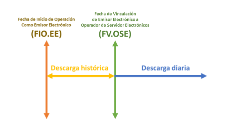
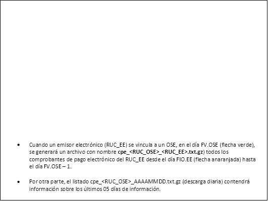



Manual Técnico de Operatividad del Operador de Servicios Electrónicos

**Versión 5.2**

**JULIO 2024**

**INDICE**

1. [Alcance.	3](#_bookmark0)
1. [Definiciones.	3](#_bookmark1)
1. [Sobre el certificado digital del OSE.	4](#_bookmark2)
1. [Sobre la conectividad del OSE con la SUNAT.	5](#_bookmark3)
1. [Sobre la autenticación del emisor.	5](#_bookmark4)
1. [Sobre la descarga de padrones de la SUNAT.	5](#_bookmark5)
1. [Sobre la descarga de Reporte Diario de Envíos del OSE a SUNAT.	8](#_bookmark6)
1. [Sobre el servicio de envío de comprobantes y documentos electrónicos del OSE.	10](#_bookmark7)
   1. [Sobre la dirección del servicio de envío del OSE.	11](#_bookmark8)
   1. [Sobre los métodos de los servicios de envío del OSE.	11](#_bookmark9)
   1. [Sobre las excepciones de los servicios de envío del OSE	11](#_bookmark10)
   1. [Sobre los atributos de los métodos sendBill, sendSummary.	12](#_bookmark11)
      1. [Atributos de ingreso de los métodos sendBill, sendSummary.	12](#_bookmark12)
      1. [Atributos de salida de los métodos sendBill, sendSummary.	12](#_bookmark13)
   1. [Sobre los atributos del método getStatus.	12](#_bookmark14)
      1. [Atributos de ingreso del método getStatus.	12](#_bookmark15)
      1. [Atributos de salida del método getStatus.	12](#_bookmark16)
   1. [Sobre los atributos del método getStatusCdr.	12](#_bookmark17)
      1. [Atributos de ingreso del método getStatusCdr.	12](#_bookmark18)
      1. [Atributos de salida del método getStatusCdr.	13](#_bookmark19)
   1. [Sobre el CDR del OSE.	13](#_bookmark20)
   1. [Sobre los reenvíos.	13](#_bookmark21)
1. [Sobre la validación del ID del comprobante	13](#_bookmark22)
1. [Sobre la conservación de la información	14](#_bookmark23)
1. [Sobre la consulta de la información comprobada por el OSE.	14](#_bookmark24)
1. [Sobre el envío de comprobantes y documentos electrónicos a la SUNAT.	14](#_bookmark25)
   1. [Sobre la dirección del servicio de envío a la SUNAT.	15](#_bookmark26)
   1. [Sobre los métodos del servicio de envío a la SUNAT.	15](#_bookmark27)
   1. [Sobre las excepciones del servicio de envío a la SUNAT	16](#_bookmark28)
   1. [Sobre los atributos de los métodos del servicio de envío a la SUNAT.	16](#_bookmark29)
1. [Sobre la atención a los problemas técnicos o incidentes.	16](#_bookmark30)
   1. [Respecto al Reproceso	18](#_bookmark31)
   1. [Respecto al Bloqueo de Servicios	18](#_bookmark32)
1. [Protección de claves criptográficas.	19](#_bookmark33)
1. [Sincronización de Servidores.	19](#_bookmark34)
1. [Método getStatusAR (Envíos individuales).	19](#_bookmark35)
1. [Sobre la herramienta para la Gestión de Incidentes iTOP	21](#_bookmark36)
   1. [Generalidades	21](#_bookmark37)
   1. [Sobre la Gestión de accesos al iTOP	21](#_bookmark38)
      1. [Altas de usuario	21](#_bookmark39)
      1. [Bajas de usuario y modificación de contraseña	22](#_bookmark40)
   1. [Sobre el uso del Itop	23](#_bookmark41)

[ANEXO 1 – Estructura de los listados	24](#_bookmark42)

[ANEXO 2 – Estructura del CDR del OSE	29](#_bookmark43)

[ANEXO 3 – Mensajes de inconsistencia	33](#_bookmark44)

[ANEXO 4 – Estructura de nombre de archivo a enviar	34](#_bookmark45)

[ANEXO 5 – Mensaje SOAP Request	38](#_bookmark46)

[ANEXO 5 – Mensaje SOAP GETSTATUSAR	42](#_bookmark47)

[ANEXO 6 – Tabla de excepciones del sistema	43](#_bookmark48)

[ANEXO 7 – Acuse de recibo	45](#_bookmark49)

[ANEXO 8 – Compromiso de Confidencialidad y Uso de la Herramienta Itop SUNAT	48](#_bookmark50)

[ANEXO 9 – Adenda al Compromiso de Confidencialidad y Uso de la Herramienta iTop SUNAT 51](#_bookmark51)

**Manual Técnico para el Desempeño del Operador de Servicios Electrónicos - OSE**
1. # **Alcance.**

El presente documento contiene los aspectos técnicos básicos, que deben tener en cuenta los Operadores de Servicios Electrónicos - OSE, para interoperar en forma adecuada con los servicios informáticos propios de la SUNAT.

1. # **Definiciones.**

0. **OSE: Operador de Servicios Electrónicos**. Es el sujeto inscrito en el Registro de Operadores de Servicios Electrónicos, cuyo encargo y función es realizar la comprobación informática de los aspectos esenciales para que se considere emitido el documento electrónico que sirve de soporte a los Comprobantes de Pago Electrónicos.

0. **PSE: Proveedor de Servicios Electrónicos**. Es el sujeto que, de acuerdo con la Resolución de Superintendencia N° 199-2015/SUNAT, se encuentra inscrito en el Registro de Proveedores de Servicios Electrónicos, por lo que puede realizar en nombre del emisor electrónico alguna o todas las actividades, inherentes a la emisión electrónica del Comprobante de Pago Electrónico.

0. **Emisor Electrónico o Emisor**. Es el contribuyente responsable de emitir un Comprobante de Pago Electrónico.

0. **Área Evaluadora**. Responsable del proceso de evaluación de las solicitudes del OSE, de acuerdo con el directorio que pertenece el RUC del OSE la solicitud debe ser dirigida a:

   0. División de Servicios al Contribuyente de la Intendencia de Principales Contribuyentes Nacionales
   0. Gerencia de Operaciones Especiales Contra la Informalidad de la Intendencia de Lima
   0. Divisiones de Auditoría de las Intendencias Regionales y
   0. Secciones de Auditoría de las Oficinas Zonales.

0. **CDR OSE:** Constancia de Recepción emitida por el OSE al emisor electrónico según las especificaciones señaladas en el anexo C de la RS 117-2017/SUNAT y modificatorias, al comprobar informáticamente que aquello que le envió el emisor electrónico, cumple con las condiciones respectivas.

0. **ACUSE DE RECIBO.** Constancia de recepción que la SUNAT envía al OSE al momento de la recepción de los documentos enviados por el OSE.

0. **RS OSE:** Resolución de Superintendencia N° 117-2017/SUNAT y modificatorias que aprueba el Nuevo Sistema de Emisión Electrónica Operador de Servicios Electrónicos (SEE - OSE).

1. # **Sobre el certificado digital del OSE.**
   El OSE debe contar con un certificado digital exclusivo para el servicio que brinda, con las siguientes características:

0. Longitud de la clave privada debe ser 2048 bits
0. Formato de su llave pública debe ser X.509 versión 3
0. Debe consignar su número de RUC en el atributo Subject (Sujeto) campo OU (Organizational Unit) y campo CN (Common Name).

El certificado debe cumplir con lo establecido en el Reglamento de la Ley de Firmas y Certificados Digitales, aprobado por el Decreto Supremo N° 052-2008-PCM y normas modificatorias.

La llave pública del certificado digital debe ser cargada en SUNAT Operaciones en Línea (SOL) en la opción:

Esta llave debe tener embebido (obligatoriamente) el certificado RAIZ del Emisor del Certificado y los Certificados Intermedios, de existir y que se usaron para firmar la llave pública.

Cabe precisar que el OSE debe cargar por lo menos un Certificado Digital vigente y no revocado. Asimismo, es responsabilidad exclusiva del OSE garantizar la continuidad de los servicios que presta, monitoreando la vigencia del certificado digital, el prevenir su caducidad, renovándolo en tiempos y plazos adecuados, por lo menos (10) diez días calendarios antes del vencimiento.

Antes del plazo de vencimiento, el OSE deberá enviar una carta a través de la Mesa de Partes Virtual (MPV) dirigida al [área evaluadora](#_bookmark1)1 considerando el directorio al cual pertenece, solicitando la **Renovación del Certificado Digital**. Posteriormente, remitirá un correo electrónico a la Mesa de Servicio INSI [(mds@sunat.gob.pe](mailto:mds@sunat.gob.pe)) indicando el número de expediente con que ha solicitado la renovación del Certificado Digital, a fin de habilitar los servicios.

El OSE utilizará el Certificado Digital para la descarga de listados y para su autenticación cuando invoca el servicio de recepción de comprobantes de la SUNAT.

El OSE debe acceder los URL pasando el SNI (Server Name Identification).

![ref1]
1. # **Sobre la conectividad del OSE con la SUNAT.**
   La SUNAT publica Servicios Web expuestos en Internet para que el OSE remita y descargue información de la SUNAT. 

   Servicio para el envío de comprobantes y documentos electrónicos a SUNAT de uso exclusivo del OSE: 

   **e-ose.sunat.gob.pe**

Servicio de descarga de los listados publicados por la SUNAT para realizar la verificación de los envíos de los emisores:

**e-descargaose1.sunat.gob.pe y e-descargaose2.sunat.gob.pe**

La SUNAT restringe el acceso de sus servicios por dirección IP. El OSE proporcionará sus direcciones IP con la presentación de la Solicitud de inscripción al Registro de Operadores de Servicios Electrónico – Registro OSE.

En caso de que por algún motivo el OSE requiera actualizar alguna de las direcciones IP durante su operación, deberá presentar una carta a través de la Mesa de Partes Virtual (MPV) dirigida al [área evaluadora](#_bookmark1)2 correspondiente, por lo menos diez (10) días hábiles de anticipación.

1. # **Sobre la autenticación del emisor.**
   Considerando la forma de envío de los documentos electrónicos, prevista en el Anexo B de la Resolución de Superintendencia N° 117- 2017/SUNAT y sus normas modificatorias, el OSE deberá establecer y gestionar un mecanismo seguro de autenticación de los emisores electrónicos con los cuales opere, para que pueda realizar los envíos de los comprobantes y documentos electrónicos a través del servicio web que exponga el OSE, de manera segura.

El OSE debe implementar y certificar el nivel y los mecanismos de seguridad necesario a la referida autenticación garantizando el no repudio de los envíos de parte del Emisor.

1. # **Sobre la descarga de padrones de la SUNAT.**
- El OSE dispone de listados con la información de los envíos realizados a la SUNAT.
- La información de los listados le permitirá al OSE realizar la constatación de que todos sus documentos han sido registrados en SUNAT.
- Contiene la información actualizada al día anterior de cuando realice la descarga.
- Las descargas pueden ser hechas todos los días a partir de la 10:00 am.
- La autenticación del OSE al ingresar a las URL para la descarga, se realiza con el certificado digital que ha sido registrado en la SUNAT.
- La localización (URL) de los listados correspondientes son las siguientes:

![ref1]

|**URL**|**DESCRIPCIÓN**|
| :-: | :- |
|**PADRONES PUBLICOS**||
|
[https://xxx/ose/public/contribuyentes_AAAAMMDD.txt](https://xxx/ose/public/contribuyentes_AAAAMMDD.txt.gz)

[.gz](https://xxx/ose/public/contribuyentes_AAAAMMDD.txt.gz)
|Padrón de contribuyentes.|
|<https://xxx/ose/public/padrones_AAAAMMDD.txt.gz>|Listado de los padrones de los contribuyentes.|
|<https://xxx/ose/public/parametros_AAAAMMDD.txt.gz>|Padrón de parámetros de configuración.|
|**PADRONES Y LISTADOS POR OSE**||
|[https://xxx/ose/<RUC_OSE>/asociados_<RUC_OSE>_AA](https://xxx/ose/%3cRUC_OSE%3e/asociados_%3cRUC_OSE%3e_AAAAMMDD.txt.gz) [AAMMDD.txt.gz](https://xxx/ose/%3cRUC_OSE%3e/asociados_%3cRUC_OSE%3e_AAAAMMDD.txt.gz)|Padrón de emisores electrónicos vinculados a un (PSE/OSE).|
|[https://xxx/ose/<RUC_OSE>/certificados_<RUC_OSE>_](https://xxx/ose/%3cRUC_OSE%3e/certificados_%3cRUC_OSE%3e_AAAAMMDD.txt.gz) [AAAAMMDD.txt.gz](https://xxx/ose/%3cRUC_OSE%3e/certificados_%3cRUC_OSE%3e_AAAAMMDD.txt.gz)|Padrón de certificados digitales de los emisores electrónicos vinculados.|
|[https://xxx/ose/<RUC_OSE>/cpe_<RUC_OSE>_AAAAM](https://xxx/ose/%3cRUC_OSE%3e/cpe_%3cRUC_OSE%3e_AAAAMMDD.txt.gz) [MDD.txt.gz](https://xxx/ose/%3cRUC_OSE%3e/cpe_%3cRUC_OSE%3e_AAAAMMDD.txt.gz)|Listado de comprobantes de pago electrónicos emitidos por los emisores electrónicos vinculados3|
|[https://xxx/ose/<RUC_OSE>/autorizacion_cpf_<RUC_O](https://xxx/ose/%3cRUC_OSE%3e/autorizacion_cpf_%3cRUC_OSE%3e_AAAAMMDD.txt.gz) [SE>_AAAAMMDD.txt.gz](https://xxx/ose/%3cRUC_OSE%3e/autorizacion_cpf_%3cRUC_OSE%3e_AAAAMMDD.txt.gz)|Listado de autorizaciones de comprobantes de pago físicos.|
|[https://xxx/ose/<RUC_OSE>/plazo_<RUC_OSE>_AAAA](https://xxx/ose/%3cRUC_OSE%3e/plazo_%3cRUC_OSE%3e_AAAAMMDD.txt.gz) [MMDD.txt.gz](https://xxx/ose/%3cRUC_OSE%3e/plazo_%3cRUC_OSE%3e_AAAAMMDD.txt.gz)|Listado de plazos excepcionales|
|[https://xxx/ose/<RUC_OSE>/contingencia_<RUC_OSE>_](https://xxx/ose/%3cRUC_OSE%3e/contingencia_%3cRUC_OSE%3e_AAAAMMDD.txt.gz) [AAAAMMDD.txt.gz](https://xxx/ose/%3cRUC_OSE%3e/contingencia_%3cRUC_OSE%3e_AAAAMMDD.txt.gz)|Listado de autorizaciones de comprobantes físicos en contingencia.|
|
[https://xxx/ose/RUC_OSE/establecimientos_<RUC_OSE](https://xxx/ose/RUC_OSE/establecimientos_%3cRUC_OSE%3e_AAAAMMDD.txt.gz)

[>_AAAAMMDD.txt.gz](https://xxx/ose/RUC_OSE/establecimientos_%3cRUC_OSE%3e_AAAAMMDD.txt.gz)
|Listado de establecimientos anexos.|
|
[https://xxx/ose/RUC_OSE/padronvigencia_<RUC_OSE](https://xxx/ose/RUC_OSE/padronvigencia_%3cRUC_OSE)

[>_AAAAMMDD.txt.gz](https://xxx/ose/RUC_OSE/establecimientos_%3cRUC_OSE%3e_AAAAMMDD.txt.gz)
|Listado de padrones con vigencia|

Donde:



xxx	: e-descargaose1.sunat.gob.pe y e-descargaose2.sunat.gob.pe RUC\_OSE : Corresponde al RUC del OSE.

AAAAMMDD: Corresponde al año, mes y día de los listados.

Las estructuras de los listados se encuentran en el Anexo 1 del presente documento.

![ref1]

3 El Archivo con la novedad 0 se genera por cada RUC y por única vez, posteriormente es responsabilidad del OSE llevar el control de la numeración de los CPE generados.

**Procedimiento especial de descarga del Listado de comprobantes de pago electrónicos emitidos por los emisores electrónicos vinculados**

Al descargar el listado de comprobantes de pago electrónicos, considerar lo siguiente:

1. **Novedad histórica:**

   Esta novedad se genera cuando un emisor electrónico (RUC\_EE) se vincula a un OSE, se generará la novedad 0 y el archivo tendrá la siguiente estructura como nombre **cpe\_<RUC\_OSE>\_<RUC\_EE>.txt.gz**, conteniendo todos los comprobantes de pago electrónico del RUC\_EE desde fecha de inicio de operaciones hasta un día antes de la fecha de vinculación.

1. **Novedad diaria:**

   Este proceso de generación solo descargará los últimos 05 días de información y estará disponible de forma diaria en su respectivo directorio.

   Por ejemplo, si la fecha de descarga es el día 28/01, se descargará la información  cuya fecha de actualización es del 23/01 en adelante.

RECOMENDACIÓN: Todos los días el OSE debe descargar y actualizar sus novedades, si no      reciben información deben comunicarse a través de correo con Mesa de Servicio INSI para verificar la disponibilidad de sus archivos.

1. # **Sobre la descarga de Reporte Diario de Envíos del OSE a SUNAT.A**
- Está a disposición los reportes diarios de los envíos realizados del OSE a la SUNAT
- Estos listados les permite, entre otros, realizar la constatación de que todos sus envíos han sido registrados.
- Contiene la información actualizada al día anterior de cuando realice la descarga.
- Las descargas pueden ser hechas todos los días a partir de la 10:00 am.
- La autenticación del OSE al ingresar a las URL para la descarga, se realiza con el certificado digital que ha sido registrado en la SUNAT.
- La localización (URL) de los listados correspondientes son las siguientes:

|**REPORTES DIARIOS DE ENVÍOS**||
| :-: | :- |
|[https://xxx/ose/<RUC_OSE>/cuadre/](https://xxx/ose/%3cRUC_OSE%3e/cuadre/%20cuadre_%3cRUC_OSE%3e_AAAAMMDD.zip) [cuadre_<RUC_OSE>_AAAAMMDD.zip](https://xxx/ose/%3cRUC_OSE%3e/cuadre/%20cuadre_%3cRUC_OSE%3e_AAAAMMDD.zip)|Reporte diario resumen con la información que las OSE han enviado a SUNAT|
|
[https://xxx/ose/ <RUC_OSE>/cuadre/cuadredetalle_](https://xxx/ose/%20%3cRUC_OSE%3e/cuadre/cuadredetalle_%20%3cRUC_OSE%3e_AAAAMMDD.zip)

[<RUC_OSE>_AAAAMMDD.zip](https://xxx/ose/%20%3cRUC_OSE%3e/cuadre/cuadredetalle_%20%3cRUC_OSE%3e_AAAAMMDD.zip)
|Reporte diario detallado con la información que las OSE han enviado a SUNAT.|

Donde:

xxx	: e-descargaose1.sunat.gob.pe y e-descargaose2.sunat.gob.pe RUC\_OSE : Corresponde al RUC del OSE.

AAAAMMDD: Corresponde al año, mes y día de los listados

**Procedimiento especial de descarga de los Reportes Diarios de Envíos**

Al descargar el **Reporte Diario de Envíos**, se considera lo siguiente:

1. **Resumen**

En el archivo **cuadre\_99999999999\_aaaammdd.txt,** se muestra un resumen por tipo de comprobante de pago electrónico considerando el total de comprobantes aceptados, aceptados con observación y los errados.

Estructura del nombre del archivo:

0. 99999999999 = RUC del OSE
0. aaaammdd = fecha a la que pertenece la información La información del archivo será la siguiente:
0. RUC emisor electrónico
0. Tipo de comprobante electrónico
   0. Factura	01

0. Boleta	03
0. Nota de crédito	07
0. Nota de débito	08
0. Retención	20
0. Percepción	40
0. Resumen de Boletas	RC
0. Comunicación de Baja RA

Ejemplo: CUADRE\_20100088890\_20190509.txt

**RUC|TIPO\_CPE|TOT\_OK|TOT\_OBS|TOT\_ERROR**

20100088890|01|2|0|0

20100088890|03|0|1|0

2. **Detalle**

En el archivo **cuadredetalle\_99999999999\_aaaammdd.txt,** se muestra un detalle por tipo de comprobante de pago electrónico considerando la siguiente información:

condiciones respecto de la información que se recibe: aceptados (OK), aceptados con observación (OKOBS) y los errados (ERROR).

Estructura del nombre del archivo:

0. 99999999999 = RUC del OSE
0. aaaammdd = fecha a la que pertenece la información

La información del archivo será la siguiente:

0. RUC del emisor del comprobante
0. Tipo de comprobante
   0. Factura	01
   0. Boleta	03
   0. Nota de crédito	07
   0. Nota de débito	08
   0. Retención	20
   0. Percepción	40
   0. Resumen de Boletas	RC
   0. Comunicación de Baja RA
0. Serie del comprobante
0. Número del comprobante
0. Estado final del comprobante
   0. aceptados (OK)
   0. aceptados con observación (OKOBS)
   0. errados (ERROR).
0. Fecha de Recepción
0. Hora de Recepción

Ejemplo:

CUADREDETALLE\_20100088890\_20190509.txt 20100088890|01|FE01|100|OK|09/05/2019|20:00:00

20100088890||01|FE01|101|OK|09/05/2019|22:10:00

20100088890|03|B005|50|OKOBS|09/05/2019|15:10:00

NOTA: Estos reportes permiten identificar la información que no ha podido remitir el OSE a la SUNAT. Dicho envío concluye con la recepción del Acuse de Recibo de SUNAT, por lo que si esto no sucede, lo debe volver a enviar. El OSE debe aplicar el método Get Status CDR para evitar el reenvío innecesario.

Los OSE que no tienen permiso de reenvío con autorización se les bloqueará el envío de sus CPE.

Si hay diferencia entre el envío OSE y lo que tiene SUNAT, el OSE debe comunicarse con Mesa de Servicio INSI para coordinar el reenvío de los faltantes.

1. # **Sobre el servicio de envío de comprobantes y documentos electrónicos del OSE.**
   El OSE debe brindar al emisor un Servicio Web Seguro (WSS) para el envío de sus comprobantes y documentos electrónicos. El WSS debe ser autenticado según lo indicado en el punto 5.

El WSS debe ser del tipo SOAP versión 1.1 y debe responder los códigos de estado estándar del protocolo HTTP ([https://www.w3.org/Protocols/rfc2616/rfc2616-](https://www.w3.org/Protocols/rfc2616/rfc2616-sec10.html) [sec10.html](https://www.w3.org/Protocols/rfc2616/rfc2616-sec10.html)). Por ejemplo:

0. 200 Ok.
0. 401 No autorizado.
0. 406 No aceptable (rechazado).
0. 503 Servicio inhabilitado.

El OSE debe brindar el servicio de comprobación manteniendo actualizadas las reglas de validaciones y de negocio especificadas por la Administración Tributaria en las normas correspondientes o en el Excel de Validaciones vigentes4, publicado en el micrositio del Operador de Servicios Electrónicos (OSE) del Portal de la SUNAT.

![ref1]

4 Enlace vigente de los archivos de validación: <https://cpe.sunat.gob.pe/node/88>

1. ## **Sobre la dirección del servicio de envío del OSE.**

El WSS del OSE deberá tener el siguiente URL: <https://xxx/ol-ti-itcpe/billService>

Dónde: xxx, corresponde al dominio del OSE.

El OSE proporcionará obligatoriamente a la SUNAT la(s) URL del servicio de envío que expone a sus clientes con la presentación de la Solicitud de inscripción al Registro de Sensorización de Operadores de Servicios Electrónico.

Si por algún motivo el OSE requiera actualizar alguna URL durante su operación, deberá presentar una carta a través de la Mesa de Partes Virtual (MPV) dirigida al [área evaluadora](#_bookmark1)5 correspondiente, por lo menos siete (7) días hábiles de anticipación.

1. ## **Sobre los métodos de los servicios de envío del OSE.**

- **sendBill:** Servicio síncrono para el envío de un comprobante o documento electrónico (factura, boleta, nota de crédito, nota de débito, guía de remisión remitente, comprobante de retención, comprobante de percepción, comprobante de servicios públicos).

- **sendSummary:** Servicio asíncrono para el envío de resúmenes diario de boleta o comunicación de baja o resumen diario de comunicación de reversiones. El servicio retorna un ticket que es consultado con el método getStatus.

- **getStatus:** Servicio síncrono para consultar el estado del ticket generado por los métodos sendSummary.

- **getStatusCdr:** Servicio síncrono para obtener el CDR de un comprobante o documento electrónico previamente enviado por los métodos sendBill.

1. ## **Sobre las excepciones de los servicios de envío del OSE.**

Los métodos del servicio de envío del OSE sólo deben devolver el archivo CDR de los envíos aceptados (con observaciones y sin observaciones). Cualquier rechazo en el envío debe generar una excepción en el servicio.

Deben utilizarse los nodos “faultstring” y “detail” del nodo “Fault” del SOAP Response para consignar el código de error o rechazo del envío y su descripción respectivamente.

![ref1]

5 Revisar el punto 2. Definiciones

Sobre la descripción del error o rechazo, el OSE debe consignar información suficientemente clara y completa al emisor para que este identifique correctamente la causa del error o rechazo y lo subsane.

Los mensajes de inconsistencia y los códigos de error o rechazo se encuentran en el Anexo 3 del presente documento.

1. ## **Sobre los atributos de los métodos sendBill, sendSummary.**

1. ### **Atributos de ingreso de los métodos sendBill, sendSummary.**

0. fileName: Corresponde al nombre del archivo a enviar de acuerdo con las especificaciones del anexo 4. Este es un archivo ZIP, en todos los casos.
0. contentFile: Corresponde al contenido del archivo en base64, dicho contenido es representado en un arreglo de bytes.

1. ### **Atributos de salida de los métodos sendBill, sendSummary.**

document: Corresponde al contenido del CDR del OSE en base 64, dicho contenido es representado en un arreglo de bytes.

1. ## **Sobre los atributos del método getStatus.**

1. ### **Atributos de ingreso del método getStatus.**

ticket: Corresponde al número de ticket alcanzado por los servicios sendSummary.

1. ### **Atributos de salida del método getStatus.**

StatusResponse: Es un objeto que cuenta con dos atributos:

1. statusCode: Corresponde al estado del envío: **98 en proceso** y **0 procesado correctamente**.
1. content: Corresponde al contenido del CDR del OSE en base 64, dicho contenido es representado en un arreglo de bytes.

1. ## **Sobre los atributos del método getStatusCdr.**

1. ### **Atributos de ingreso del método getStatusCdr.**

0. **rucComprobante:**	Corresponde	al	número	de	RUC	del comprobante o documento electrónico a consultar.
0. **tipoComprobante:** Corresponde al código del tipo de comprobante o documento electrónico a consultar.
0. **serieComprobante:**	Corresponde	a	la	serie	del	tipo	de comprobante o documento electrónico a consultar.

0. **numeroComprobante:** Corresponde al número del comprobante o documento electrónico a consultar.

1. ### **Atributos de salida del método getStatusCdr.**

0. **document:** Corresponde al contenido del CDR del OSE en base 64, dicho contenido es representado en un arreglo de bytes.

1. ## **Sobre el CDR del OSE.**

El OSE debe generar un CDR por cada envío que realice el Emisor, cuando el documento electrónico cumple satisfactoriamente con las validaciones definidas por la SUNAT. La estructura del CDR se encuentra en el Anexo 2 del presente documento.

El OSE debe generar un número de autorización único que debe ser consignado en el CDR. El número de autorización debe tener la estructura de un Universally Unique Identifier (UUID) Versión 4 (36 caracteres: 32 alfanuméricos y 4 guiones).

El CDR del OSE debe ser firmado con el Certificado Digital registrado en SUNAT.

1. ## **Sobre los reenvíos.**

Para efecto de los reenvíos al site de recepción de SUNAT, el OSE debe cumplir con un mínimo de 3 intentos en intervalos de 20 minutos, dentro del plazo de una hora estipulado en la norma, en función de las condiciones y requerimientos establecidos en el acápite 12 del presente documento.

Con ello, se deja constancia de que el OSE cumplió diligentemente con sus obligaciones formales en lo que corresponde; para tal efecto, se dispone que, en caso persisten los problemas con la recepción del documento, se deberá generar el ticket ITOP de conformidad con las precisiones indicadas en el acápite 13 del presente documento y del punto V del Instructivo para la Gestión de Incidencias (ITOP) en la parte referida a reintentos fallidos. El referido ticket, generado con las características señaladas, será el medio de verificación oficial ante cualquier procedimiento iniciado por SUNAT en aras de constatar el cumplimiento de las obligaciones vigentes del OSE.

1. # **Sobre la validación del ID del comprobante**
   El OSE tiene como función realizar la comprobación informática de los comprobantes y documentos electrónicos. En tal sentido, como parte de sus responsabilidades, se encuentra la de verificar la no duplicidad de los ID de los Comprobantes Electrónicos.

Para tal efecto, el OSE deberá tener un control de los referidos ID y de sus correspondientes estados, los cuales estarán clasificados como Autorizados o de Baja.

Asimismo, se debe tener en cuenta que los métodos de envío marcan una pauta en la gestión de los referidos ID, así se deberá considerar lo siguiente:

1) Con el método sendBill, una vez comprobados los documentos, se dará origen o generarán comprobantes o documentos electrónicos autorizados, cuyos registros deberán ser añadidos a la base de datos que gestione cada OSE.
1) Con el método sendSummary, para las Comunicaciones de Baja y Resumen de reversión, una vez comprobados, se dará origen a la actualización de los estados de los documentos. Es decir, el estado de los referidos comprobantes o documentos electrónicos, pasan de “autorizado” a “Baja”

1. # **Sobre la conservación de la información.**
   De acuerdo con lo señalado en el numeral 7.12 del artículo 7 de la Resolución de Superintendencia N° 117- 2017/SUNAT y sus normas modificatorias, el OSE debe conservar la información de los envíos de los emisores sólo por 30 días calendarios de recibido el envío. Es responsabilidad del OSE eliminar de manera segura dicha información al término de período indicado. Sin embargo, debe mantener la identificación del comprobante de pago para la validación del ID.

1. # **Sobre la consulta de la información comprobada por el OSE.**

Acorde con lo establecido por el inciso 7.15 del artículo 7 de la RS – OSE, se establece que el OSE debe poner a disposición del emisor electrónico, el adquirente o usuario, el destinatario, el remitente y/o el transportista, la posibilidad de consultar en una Página Web información correspondiente a los comprobantes de pago electrónico que ha verificado, es decir que cuentan con una CDR o una comunicación de inconsistencias.

Las especificaciones de esta consulta se detallan en la sección [*Aspectos técnicos - Validez*](http://cpe.sunat.gob.pe/node/88#item-8) *[*de comprobante de pago (OSE),*](http://cpe.sunat.gob.pe/node/88#item-8)* ([*Otros_Aspectos_Interes_OSE*](http://cpe.sunat.gob.pe/node/88#item-4))6 publicado en el micrositio del “Operador de Servicios Electrónicos (OSE)” del portal SUNAT.

![ref1]

6 Link   vigente   del   archivo   *Consulta   de   Validez   de   Comprobantes   Electrónicos*

<http://cpe.sunat.gob.pe/sites/default/files/inline-files/Otros_Aspectos_Interes_OSE.pdf>
1. # **Sobre el envío de comprobantes y documentos electrónicos a la SUNAT.**
   El OSE debe remitir todos los envíos del Emisor que han superado satisfactoriamente las validaciones definidas por la SUNAT, además del CDR generado por dicho envío.

La SUNAT provee un Servicio Web Seguro (SOAP 1.1/WS-Security 1.0) para los envíos del OSE. El Servicio Web Seguro (WSS) requiere la autenticación con el Certificado Digital según el estándar X.509 ([https://docs.oasis-open.org/wss/2004/01/oasis-200401-wss-](https://docs.oasis-open.org/wss/2004/01/oasis-200401-wss-x509-token-profile-1.0.pdf) [x509-token-profile-1.0.pdf](https://docs.oasis-open.org/wss/2004/01/oasis-200401-wss-x509-token-profile-1.0.pdf)), el “Key identifier type” debe ser “Binary Security Token”, adicionalmente es necesario incluir el atributo soapenv:mustUnderstand="1". El Certificado utilizado para autenticar debe ser estar cargado por el OSE en el ambiente SOL.

El WSS responde los códigos de estado estándar del protocolo HTTP (<https://www.w3.org/Protocols/rfc2616/rfc2616-sec10.html>).

Por ejemplo:

0. 200 Ok.
0. 401 No autorizado.
0. 404 No se ha encontrado
0. 406 No aceptable (rechazado).
0. 503 Servicio inhabilitado.

**El OSE debe esperar la respuesta del WSS de la SUNAT o luego de unos minutos aplicar el método GetStatus/GetstatusAR según corresponda para evitar el reenvío innecesario del documento.**

Se adjunta un ejemplo de invocación al WSS (Ver Anexo 5).

El envío debe ser realizado <b>en el plazo de una hora contada</b> desde que el OSE realizó la comprobación informática de las condiciones de emisión respectivas, siguiendo los requisitos técnicos indicados en el anexo C de la RS - OSE. Si esa remisión se realiza cumpliendo los citados requisitos técnicos, la SUNAT envía al OSE un <b>acuse de recibo.7</b>

Se adjunta un ejemplo de Acuse de Recibo (Ver Anexo 7).

Asimismo, de existir algún error que SUNAT detecte en el proceso de recepción, el código y la descripción de este, será consignado en el referido acuse, en el campo

<cbc:Description>.

No obstante, debido a intermitencias que pueden presentarse en los servicios de SUNAT, el OSE debe procurar regularizar sus envíos **dentro del mes** de emisión de los documentos.

![ref1]7 Obligación regulada por el numeral 7.5 del artículo 7° de la RS 117-2017/SUNAT

1. ## **Sobre la dirección del servicio de envío a la SUNAT.**

El WSS de la SUNAT tiene el siguiente URL:

[https://e-ose.sunat.gob.pe/ol-ti-itemision-cpe/billService](https://nam01.safelinks.protection.outlook.com/?url=https%3A%2F%2Fe-ose.sunat.gob.pe%2Fol-ti-itemision-cpe%2FbillService&data=04%7C01%7Cmmaldonado%40sunat.gob.pe%7C4303853ce4e24ac4960f08d9b4e65c42%7C67a7dfd5e02e45d6966f6b11ce99f3ce%7C0%7C0%7C637739723762432503%7CUnknown%7CTWFpbGZsb3d8eyJWIjoiMC4wLjAwMDAiLCJQIjoiV2luMzIiLCJBTiI6Ik1haWwiLCJXVCI6Mn0%3D%7C3000&sdata=1prCpoHLMPauMCDrCNcMYIQ6FMYWx4Bs5%2BP%2FurpCGjw%3D&reserved=0)

1. ## **Sobre los métodos del servicio de envío a la SUNAT.**
   0. sendBill: Servicio síncrono para el envío de un comprobante y/o documento electrónico (factura, boleta, nota de crédito, nota de débito, guía de remisión remitente, comprobante de retención, comprobante de percepción, comprobante de servicios públicos).
   0. sendSummary: Servicio asíncrono para el envío de un resumen diario de boleta o comunicación de baja o resumen diario de comunicación de reversiones. El servicio retornará un ticket que será consultado con el método getStatus.
   0. getStatus: Servicio síncrono para consultar el estado del ticket generado por los métodos sendSummary.
      ##
1. ## **Sobre las excepciones del servicio de envío a la SUNAT.**

En caso de existir un incidente en la transmisión del OSE a SUNAT, al no haber recibido el OSE el Acuse de Recibo de la SUNAT o si el Código de Excepción recibido es uno que pertenece a la Tabla de Excepciones del Sistema (Anexo 6), se entiende que el comprobante electrónico no ha llegado correctamente a los servidores de SUNAT (problema de plataforma o de carácter genérico), por lo tanto, luego de hacer las coordinaciones y de haberse tomado las acciones correspondientes, debe efectuarse el reenvío.

En el numeral 7.12 del artículo 7 de la Resolución de Superintendencia N° 117- 2017/SUNAT y sus normas modificatorias se señala, como responsabilidad del OSE:

“7.12 *“Mantener por un mes el documento electrónico respecto del cual se emitió una CDR, así como las CDR y las comunicaciones de inconsistencias que haya emitido. Durante aquel plazo y por única vez, la SUNAT puede solicitar al OSE el envío de aquellos documentos electrónicos, las CDR y las comunicaciones de inconsistencias. Dicho envío debe efectuarse en la forma y plazo que la SUNAT señale”*

1. ## **Sobre los atributos de los métodos del servicio de envío a la SUNAT.**
   Los atributos de los métodos del servicio de envío a la SUNAT son idénticos a los métodos del servicio de envío del OSE, con las siguientes diferencias:

0. sendBill, el archivo ZIP contendrá tanto el comprobante o documento electrónico como el CDR del OSE.

1. # **Sobre la atención a los problemas técnicos o incidentes.**
   Los problemas técnicos relacionados con los códigos de error menores a 200, errores tipo HTTP (código de error 4XX, 5XX) o intermitencia en la comunicación, deben ser reportados por el OSE al canal de atención de Monitoreo INSI (<monitor@sunat.gob.pe>) con copia a Mesa de Servicio INSI (<mds@sunat.gob.pe>) y a su gestor OSE asignado, así como generar el ticket ITOP correspondiente.

Celular: 961-698-296 Atención 24x7

Los incidentes relacionados con el envío de documentos y reproceso de envíos se atienden según el acápite 17 del presente documento. El OSE debe hacer seguimiento de sus incidencias a través del ticket de atención.

Sin perjuicio de lo indicado, el OSE debe intentar la regularización de los documentos pendientes haciendo los reenvíos necesarios según las instrucciones pertinentes.

A continuación, se presenta un listado de códigos de errores que el OSE deberá tener   en cuenta antes de reportar la incidencia a la Mesa de Servicio de SUNAT.

|**COD**|**DESCRIPCIÓN**|**OBSERVACIONES ACLARACIONES**|**SOLUCIÓN**|
| :-: | :- | :- | :- |
|**0306**|No se puede leer (parsear) el archivo XML|Comprobante no será aceptado de ninguna forma por SUNAT hasta que se corrija el XML|El OSE debe revisar y validar correctamente la estructura del XML|
|**2119**|El documento modificado en la Nota de crédito no está registrada.|

Comprobante ha sido aceptado con observación por SUNAT
|

El OSE debe interpretar el AR que entrega SUNAT y hacer los ajustes necesarios para los próximos envíos.

**No corresponde que el OSE reporte este caso como incidencia.**
|
|**3025**|El dato ingresado en factor de cargo o descuento global no cumple con el formato establecido.|||
|**3097**|El emisor a la fecha no se encuentra registrado ó habilitado en el Registro de exportadores de servicios SUNAT|||
|**3108**|El producto del factor y monto base de la afectación del ISC no corresponde al monto de afectación de línea.|||
|**3123**|El dato ingresado como monto valor referencial en Detracciones - Servicios de transporte de carga no cumple con el formato establecido.|||
|**3218**|El comprobante que se realizo el anticipo no existe|||
|**3249**|Si el tipo de transacción es al Crédito debe existir al menos información de una cuota de pago|||
|**2324**|El comprobante ya fue informado y se encuentra anulado o rechazado|El archivo de comunicación de baja ya fue presentado anteriormente.||
|**2987**|El comprobante ya fue informado y se encuentra anulado o rechazado|Se rechaza toda la RC si es que no cumple las validaciones en su totalidad de CPE, es decir se estaría impidiendo el registro del resto de los CPE que se informaron en la RC y que fueron aceptados por el OSE.||
|**2990**|El comprobante (electrónico) a la que hace referencia la nota, se encuentra anulado o rechazada.|
El Receptor SUNAT detecta que el comprobante RA fue presentado anteriormente por una OSE vinculada al emisor y no será aceptado.

No es un error sino una validación definida.
||

|**2335**|El documento electrónico ingresado ha sido alterado|El Receptor SUNAT detecta que el archivo enviado ha sido alterado.|El OSE debe revisar y validar la alteración del documento|
| :-: | :- | :- | :- |
|**2105**|Comprobante a dar de baja no se encuentra registrado en SUNAT|El Receptor SUNAT valida la existencia del comprobante referenciado en la comunicación de baja (debe encontrarse informado y registrado en SUNAT antes del envío de la comunicación).|El OSE debe revisar los comprobantes referenciados y validar la existencia en SUNAT antes de comunicar la RA. De no encontrarse registrados los comprobantes, debe enviarlo/reenviarlo antes del envío de la comunicación de baja.|
|**2663**|El documento indicado no existe no puede ser modificado|El Receptor SUNAT valida que el documento referenciado en la RC previamente haya sido informado y aceptado en SUNAT.|
No corresponde reportar esto como incidente.

El OSE debe asegurar que las RC donde se modifican BVE o sus notas, sólo aplica para los CPE que anteriormente han sido informados por una RC (no aplica RC donde se informa comprobantes por rangos, vigencia anterior a Ene-18).
|
|**2278**|Debe indicar Información acerca del importe total de IGV/IVAP|
Es obligatorio informar el **TAG**

/SummaryDocuments/sac:Sum maryDocumentsLine/cac:TaxTot al/cac:TaxSubtotal/cac:TaxCateg ory/cac:TaxScheme/cbc:ID = "1000" o "1016".
|El OSE debe asegurar la existencia del TAG antes de reportar este caso como incidencia.|
|**2282**|Existe documento ya informado anteriormente|El Receptor SUNAT valida la existencia del documento.|El OSE debe verificar los comprobantes que está informando. Se sugiere contrastar con los padrones CPE.|

1. # **Respecto al Reproceso**

Para algunos casos a través del ticket generado según el acápite 17, la Mesa de Servicio INSI solicitará hasta en 03 oportunidades la remisión de los documentos necesarios para el REPROCESO. Las notificaciones se realizarán durante 03 días calendarios consecutivos (dado que el personal que labora está en horario de 7x24), y se otorgará 02 días de espera al OSE, al 5to día se procede a cerrar el ticket indicando que no se ha obtenido respuesta de la OSE a las notificaciones realizadas.

1. # **Respecto al Bloqueo de Servicios**
La SUNAT mediante el siguiente electrónico podrá comunicar el bloqueo de servicios, que se producen cuando los envíos del OSE saturan el procesamiento de los comprobantes:

Monitoreo INSI: <monitor@sunat.gob.pe> Celular de contacto: 961-698-296 Atención 24x7

El OSE debe estar pendiente de la casilla de correo de comunicación con la SUNAT (<monitor@sunat.gob.pe>) ya que ese será el medio por donde se comunicarán las posibles incidencias asociadas a bloqueos de Servicio.

Cuando el OSE reciba dicha comunicación deberá identificar y rectificar las operaciones que estarían afectando a los servicios de SUNAT.

1. # **Protección de claves criptográficas.**

Los OSE son responsables de implementar como parte de la solución informática dispositivos HSM que permitan la gestión y protección de las claves criptográficas que vayan a utilizar.

- Estos dispositivos podrán ser de uso exclusivo o compartido.

- En el caso de uso exclusivo, deberán cumplir como mínimo con las siguientes condiciones:
  - El estándar FIPS 140-2 Nivel 2
  - El estándar Common Criteria EAL4

- En el caso de uso compartido (Cloud), deberán cumplir como mínimo con las siguientes condiciones:
  - El estándar FIPS 140-2 Nivel 3
  - El estándar Common Criteria EAL4

1. # **Sincronización de Servidores.**
   La SUNAT mantiene la sincronización de la fecha y hora de sus servidores utilizando un servicio NTP (Network Time Protocol), a fin de que establecer el time true de las transmisiones de los OSE.

1. # **Método getStatusAR (Envíos individuales).**

El método GetStatusAR tiene el siguiente URL para ser utilizado:

0. <https://e-ose.sunat.gob.pe/ol-ti-itemision-cpe/billService?wsdl>

El método contempla los envíos individuales de los CPE (Factura, Boleta, Nota de Crédito, Nota de Débito, Percepción y Retención), y requiere los siguientes parámetros como entrada: RUC de Emisor, tipo de comprobante, serie y número de comprobante.

Recuerde utilizar el método **getStatusAR** exclusivamente para los envíos síncronos y verificar dentro de su estructura los siguientes tags.

**REQUEST:**

<soapenv:Envelope xmlns:soapenv="[http://schemas.xmlsoap.org/soap/envelope/](https://nam01.safelinks.protection.outlook.com/?url=http%3A%2F%2Fschemas.xmlsoap.org%2Fsoap%2Fenvelope%2F&data=04%7C01%7Cjrisco%40sunat.gob.pe%7Ce01df4471d0643bf734508d926bb38a2%7C67a7dfd5e02e45d6966f6b11ce99f3ce%7C0%7C0%7C637583407824149397%7CUnknown%7CTWFpbGZsb3d8eyJWIjoiMC4wLjAwMDAiLCJQIjoiV2luMzIiLCJBTiI6Ik1haWwiLCJXVCI6Mn0%3D%7C1000&sdata=wI593Pzx7Z53FXAuDqzJyZpaGvg8pP4NxqhXOunx1%2Fg%3D&reserved=0)" xmlns:ser="[http://service.sunat.gob.pe](https://nam01.safelinks.protection.outlook.com/?url=http%3A%2F%2Fservice.sunat.gob.pe%2F&data=04%7C01%7Cjrisco%40sunat.gob.pe%7Ce01df4471d0643bf734508d926bb38a2%7C67a7dfd5e02e45d6966f6b11ce99f3ce%7C0%7C0%7C637583407824159397%7CUnknown%7CTWFpbGZsb3d8eyJWIjoiMC4wLjAwMDAiLCJQIjoiV2luMzIiLCJBTiI6Ik1haWwiLCJXVCI6Mn0%3D%7C1000&sdata=cD1kaoMgwHkwGRb6dSWtSD%2F5pGgLhrSsGlC9hoKuFxI%3D&reserved=0)">

<soapenv:Header/>

<soapenv:Body>

<ser:getStatusAR>

<!--Optional:-->

<rucComprobante></rucComprobante>

<!--Optional:-->

<tipoComprobante></tipoComprobante>

<!--Optional:-->

<serieComprobante> </serieComprobante>

<!--Optional:-->

<numeroComprobante></numeroComprobante>

</ser:getStatusAR>

</soapenv:Body>

</soapenv:Envelope>

**RESPUESTA:**

<S:Envelope xmlns:soap="[http://schemas.xmlsoap.org/soap/envelope/](https://nam01.safelinks.protection.outlook.com/?url=http%3A%2F%2Fschemas.xmlsoap.org%2Fsoap%2Fenvelope%2F&data=04%7C01%7Cjrisco%40sunat.gob.pe%7Ce01df4471d0643bf734508d926bb38a2%7C67a7dfd5e02e45d6966f6b11ce99f3ce%7C0%7C0%7C637583407824169389%7CUnknown%7CTWFpbGZsb3d8eyJWIjoiMC4wLjAwMDAiLCJQIjoiV2luMzIiLCJBTiI6Ik1haWwiLCJXVCI6Mn0%3D%7C1000&sdata=u1kLjJALZif9UCLFBycnbg7A6beOPC4LTbhT37RuxYk%3D&reserved=0)" xmlns:soap- env="[http://schemas.xmlsoap.org/soap/envelope/](https://nam01.safelinks.protection.outlook.com/?url=http%3A%2F%2Fschemas.xmlsoap.org%2Fsoap%2Fenvelope%2F&data=04%7C01%7Cjrisco%40sunat.gob.pe%7Ce01df4471d0643bf734508d926bb38a2%7C67a7dfd5e02e45d6966f6b11ce99f3ce%7C0%7C0%7C637583407824169389%7CUnknown%7CTWFpbGZsb3d8eyJWIjoiMC4wLjAwMDAiLCJQIjoiV2luMzIiLCJBTiI6Ik1haWwiLCJXVCI6Mn0%3D%7C1000&sdata=u1kLjJALZif9UCLFBycnbg7A6beOPC4LTbhT37RuxYk%3D&reserved=0)" xmlns:S="[http://schemas.xmlsoap.org/soap/envelope/](https://nam01.safelinks.protection.outlook.com/?url=http%3A%2F%2Fschemas.xmlsoap.org%2Fsoap%2Fenvelope%2F&data=04%7C01%7Cjrisco%40sunat.gob.pe%7Ce01df4471d0643bf734508d926bb38a2%7C67a7dfd5e02e45d6966f6b11ce99f3ce%7C0%7C0%7C637583407824179381%7CUnknown%7CTWFpbGZsb3d8eyJWIjoiMC4wLjAwMDAiLCJQIjoiV2luMzIiLCJBTiI6Ik1haWwiLCJXVCI6Mn0%3D%7C1000&sdata=0fj0CCwkg9b%2BrfGJw%2B4H9CuxXLgTGaUoTmWOhZNds8w%3D&reserved=0)">

<S:Body>

<ns2:getStatusResponseAR xmlns:ns2="[http://service.sunat.gob.pe](https://nam01.safelinks.protection.outlook.com/?url=http%3A%2F%2Fservice.sunat.gob.pe%2F&data=04%7C01%7Cjrisco%40sunat.gob.pe%7Ce01df4471d0643bf734508d926bb38a2%7C67a7dfd5e02e45d6966f6b11ce99f3ce%7C0%7C0%7C637583407824189376%7CUnknown%7CTWFpbGZsb3d8eyJWIjoiMC4wLjAwMDAiLCJQIjoiV2luMzIiLCJBTiI6Ik1haWwiLCJXVCI6Mn0%3D%7C1000&sdata=rC%2BJIkJHiEfE4jXYRI3CoOLqjA4bDak5Hcz37QLEe9c%3D&reserved=0)">

<status>

<content> </content>

<statusCode>0000</statusCode>

<statusMessage>La constancia existe</statusMessage>

</status>

</ns2:getStatusResponseAR>

</S:Body>

</S:Envelope>

**CÓDIGOS DE RESPUESTA:**

|**STATUSCODE**|**DESCRIPCIÓN**|
| :- | :- |
|0000|Indica que el Acuse de Recibo fue encontrado y existe|
|0001|RUC del comprobante no enviado o es vacío|
|0002|Solo se permite dato numérico de 11 dígitos para el RUC del comprobante|
|0003|El número de RUC no está inscrito en los registros de la SUNAT|
|0004|Tipo de comprobante no enviado o es vacío|
|0005|Código de comprobante no permitido o no valido|

|0006|Serie del comprobante no enviado o es vacío|
| :- | :- |
|0007|Serie del comprobante solo se permite dato alfanumérico de 4 caracteres para la serie del comprobante|
|0008|Serie del comprobante no permitido o no valido|
|0009|Número de comprobante no enviado o es vacío|
|0010|Número de comprobante solo permite dato numérico de 1 hasta 8 dígitos y mayor a cero para el Número de comprobante|
|0011|Comprobante no encontrado o no existe|
|0015|No se permiten solicitudes de la constancia para envíos de comprobantes realizados antes del 01/05/2020|

Si el OSE obtiene como respuesta el código 100 o cualquier otro código no contemplado en el listado anterior, deberá reportarlo a la Mesa de Servicio como un incidente.

1. # **Sobre la herramienta para la Gestión de Incidentes iTOP**

1. ## **Generalidades**

1) La SUNAT ha puesto a disposición de los Operadores de Servicio Electrónico -- OSE, la herramienta web para el registro de incidencias denominada iTOP.
1) El iTOP es considerada la herramienta oficial para el registro de incidencias relacionadas con el envío y recepción de comprobantes y documentos electrónicos asociados a una intermitencia del servicio o a un código de respuesta del archivo de ajustes de validación.
1) En el caso que el iTOP no se encuentre disponible, los incidentes se reportan como contingencia al correo <mds@sunat.gob.pe>

1. ## **Sobre la Gestión de accesos al iTOP**

1. ### **Altas de usuario**

1. La SUNAT ha definido una cantidad de usuarios de hasta dos (02), para que las OSE registren incidentes.

El OSE debe presentar una carta de solicitud de acceso de usuario externo (Alta de Usuario al iTOP), adjuntando el Compromiso de Confidencialidad y Compromiso de uso firmados. La carta se deberá presentar a través de la Mesa de Partes Virtual (MPV) dirigida al [área evaluadora](#_bookmark1)8 correspondiente, por lo menos con diez (10) días hábiles de anticipación.

1. Los datos requeridos para adjuntar en la solicitud formal de alta de usuario son:

|**Datos del Usuario Externo (Proveedor de Servicio)**||
| :- | :- |
|Denominación||
![ref1]

8 Revisar el punto 2. Definiciones

|Nro. De RUC|||
| :- | :- | :- |
|**Datos del Personal del Proveedor**|||
|**Nombres y Apellidos**|||
|Nro. De DNI/CE|||
|Correo Electrónico|||
|Nro. De Móvil|||
|Nombre de PC|||

1. El formato de Compromiso de Confidencialidad y Compromiso de uso del iTOP, se encuentran en el Anexo 8 del presente documento y es remitido firmado por cada usuario que la OSE designe para el registro de incidentes, así como el Representante Legal del OSE.
1. La SUNAT ha dispuesto proporcionar una contraseña fija de acceso para cada usuario.
1. La SUNAT a través del personal asignado como responsable de accesos INSI, notificará al buzón de correo electrónico consignado en el punto 1.2; las credenciales de acceso (TOKEN) para cada usuario con el manual de acceso a la VPN, también se le notificará en otro correo al usuario final, su usuario y clave del iTOP.
1. La vigencia establecida por la SUNAT, para los accesos proporcionados a los OSE, es de un periodo de dos (02) años, contados a partir, de la fecha de solicitud.
1. La ampliación de vigencia del acceso se podrá tramitar con carta de solicitud adjuntando indicando periodo de ampliación de vigencia, que no debe ser superior a dos (02) años, así como la adenda al Compromiso de Confidencialidad y Uso, ante lo cual, la SUNAT notificará la ampliación de vigencia. La ampliación de vigencia no cambia las credenciales de acceso otorgadas previamente.
1. El Formato de Adenda al Compromiso de Confidencialidad y Uso de la Herramienta ITOP SUNAT se encuentra en el Anexo 9 del presente documento.

1. ### **Bajas de usuario y modificación de contraseña**

1. El OSE debe presentar una carta de solicitud de mantenimiento de cuentas de acceso de usuario externo, consignando los siguientes datos:

|**Datos del Usuario Externo (Proveedor de Servicio)**|||
| :- | :- | :- |
|Denominación|||
|Nro. De RUC|||
|**Datos del Personal del Proveedor**|||
|
**Nombres y Apellidos del responsable de la cuenta**

**otorgada**
|||
|Nro. De DNI/CE|||
|Correo Electrónico|||
|Nro. De Móvil|||
|Nombre de PC|||
|Cuenta de acceso otorgada|
*“indicar la cuenta de acceso al que se daría de baja*

*o a la cual estarían solicitando cambio de contraseña”*
||

|Tipo de solicitud|
*Especificar: Baja de acceso o modificación de*

*contraseña según sea el caso.*
|
| :- | :- |

1. El área evaluadora canalizará con la INSI la generación del ticket de creación de baja/modificación de contraseña de ser el caso.
1. La SUNAT a través del personal asignado como responsable de accesos INSI, notificará al buzón de correo electrónico consignado en el punto 1.1. la modificación de contraseña del iTOP.
1. Para las bajas de usuario, el personal autorizado de la SUNAT notificará al área evaluadora la cancelación de la cuenta quien a su vez comunicará atención al OSE.

3. ## **Sobre el uso del Itop**

0. Previo al uso del iTOP, el usuario debe conectarse a la VPN SUNAT con sus credenciales de acceso.
0. El uso del iTOP se encuentra descrito en el “Instructivo para el registro de Incidencias (Itop) del Operador de Servicios Electrónicos”.

# **ANEXO 1 – Estructura de los listados**

|**Listado de contribuyentes**|||||
| :-: | :- | :- | :- | :- |
|**Alcance:**|Todos los contribuyentes||||
|**Campo**|**Descripción**|**PK**|**Tipo**|**formato**|
|num\_ruc|Número del RUC del contribuyente|Si|n11||
|ind\_estado|Indicador de estado del contribuyente|No|n2||
|ind\_condicion|Indicador de condición del domicilio fiscal|No|n2||

|**Listado de los padrones de los contribuyentes**|||||
| :-: | :- | :- | :- | :- |
|**Alcance:**|Todos los contribuyentes||||
|**Campo**|**Descripción**|**PK**|**Tipo**|**formato**|
|num\_ruc|Número del RUC del contribuyente|Si|n11||
|ind\_padrón|Indicador del padrón del contribuyente|SI|n2|
'01: Agente de percepción de ventas internas 02: Agente de percepción de combustibles 03: Agente de retención

04: Exceptuada de la percepción

05: Exportador de Servicios

10: Buen contribuyente 11: Autorizado a

versión UBL 2.0

12: Obligado a enviar código de producto

13: Afiliados al SEE- Empresas

supervisadas
|
||||||
|**Padrón de contribuyentes asociados a los emisores (OSE / PSE)**|||||
|**Alcance:**|De los Emisores vinculados al OSE o PSE||||
|**Campo**|**Descripción**|**PK**|**Tipo**|**Observaciones**|
|num\_ruc|Número de RUC del Emisor|Si|n11||
|num\_ruc\_asociado|Número de RUC del OSE o PSE|Si|n11||
|ind\_tip\_asociacion|Indicador de tipo de vinculación|Si|n1|
1: PSE

2: OSE
|
|fec\_inicio|Fecha de inicio|Si|an10|YYYY-MM-DD|
|fec\_fin|Fecha de fin|No|an10|YYYY-MM-DD|

|**Padrón de certificados del emisor**|||||
| :-: | :- | :- | :- | :- |
|**Alcance:**|De los contribuyentes vinculados al OSE||||
|**Campo**|**Descripción**|**PK**|**Tipo**|**Observaciones**|
|num\_ruc|Número de RUC del emisor|Si|n11||
|num\_id\_ca|
Número del ID de la CA (Autoridad de

Certificación)
|Si|n10||
|num\_id\_cd|Número del ID de la serie del certificado digital|Si|an..100||
|fec\_alta|Fecha de alta|No|an25|
YYYY-MM-DD

HH:MM:SS.nnnnn
|
|fec\_baja|Fecha de baja|No|an25|
YYYY-MM-DD

HH:MM:SS.nnnnn
|

|**Listado de comprobantes de pago electrónicos**|||||
| :-: | :- | :- | :- | :- |
|**Alcance:**|De los contribuyentes asociados al OSE||||
|**Campo**|**Descripción**|**PK**|**Tipo**|**Observaciones**|
|num\_ruc|Numero de RUC del emisor|Si|n11||
|cod\_cpe|Código de tipo de comprobante|Si|n2||
|num\_serie\_cpe|Numero de serie del comprobante|Si|an4||
|num\_cpe|Numero del comprobante|Si|n..8||
|ind\_estado\_cpe|Indicador de estado del comprobante|No|n1|
2: Anulado

1: Aceptado

0: Rechazado
|
|fec\_emision\_cpe|Fecha y hora de emisión del comprobante|No|an25|
YYYY-MM-DD

HH:MM:SS.nnnnn
|
|~~mto\_importe\_cpe~~|~~Monto del importe total~~|~~No~~|~~n..23~~|
Para mantener la estructura del archivo, se enviará con cero (0) este

campo
|
|cod\_moneda\_cpe|Codigo de moneda del comprobante|No|an3||
|cod\_mot\_traslado|Código de motivo de traslado|No|n2|
Información exclusiva si el comprobante es

guía de remisión.
|
|cod\_mod\_traslado|Código de modalidad de traslado|No|n2|
Información exclusiva si el

comprobante es guía de remisión.
|
|ind\_transbordo|Indicador de transbordo programado|No|n1|
Información exclusiva si el comprobante es guía de remisión. 1: Con transbordo programado

0: Sin transbordo

programado
|

|fec\_ini\_traslado|Fecha de inicio de traslado|No|n1|
Información exclusiva si el

comprobante es guía de remisión.
|
| :- | :- | :-: | :- | :- |
|ind\_for\_pag|Indicador de forma de pago|No|n1|
Información exclusiva si el comprobante es factura.

0: Contado

1: Crédito
|
|

ind\_percepcion
|

Indicador de percepción
|

No
|

n1
|

Información exclusiva si el comprobante es factura

0: No tiene percepción 1: Si tiene percepción
|

|**Listado de autorizaciones de comprobantes de pago físicos**|||||
| :-: | :- | :- | :- | :- |
|**Alcance:**|De los contribuyentes vinculados al OSE||||
|**Campo**|**Descripción**|**PK**|**Tipo**|**Observaciones**|
|num\_ruc|Número de RUC del emisor|Si|n11||
|cod\_cpe|Código de tipo de comprobante|Si|n2||
|num\_serie\_cpe|Número de serie del comprobante|Si|n4||
|num\_ini\_cpe|Número de inicio del comprobante|Si|n8||
|num\_fin\_cpe|Número de fin del comprobante|No|n8||

|**Listado de autorizaciones de rangos de contingencia**|||||
| :-: | :- | :- | :- | :- |
|**Alcance:**|De los contribuyentes asociados al OSE||||
|**Campo**|**Descripción**|**PK**|**Tipo**|**Formato**|
|num\_ruc|Número de RUC del emisor|Si|n11| |
|cod\_cpe|Código de tipo de comprobante|Si|n2| |
|num\_serie\_cpe|Número de serie del comprobante|Si|n4| |
|num\_ini\_cpe|Número de inicio del comprobante|Si|n8| |
|num\_fin\_cpe|Número de fin del comprobante|No|n8| |
| | | | | |
| |
 

| | | |
| | | | | |
|**Parámetros**|||||
|**Alcance:**|Para todos los OSEs||||
|**Campo**|**Descripción**|**PK**|**Tipo**|**Observaciones**|
|cod\_parametro|Código de parámetro|Si|n3|001: Tipo de cambio 002: Regimen de percepción 003: Regimen de retención|
|cod\_argumento|Código de argumento|Si|an..25|Ver hoja de parámetros|
|des\_argumento|Descripción del argumento|No|an..100|Ver hoja de parámetros|
| | | | | |
| | | | | |
|**Listado de Establecimientos Anexos**|||||
|**Alcance:**|De los contribuyentes asociados al OSE||||
|**Campo**|**Descripción**|**PK**|**Tipo**|**Observaciones**|
|num\_ruc|Numero de RUC del emisor|Si|n11| |
|cod\_estab|Código de establecimiento anexo|Si|n4| |
|cod\_tip\_estab|Tipo de establecimiento anexo|No|n2| |
||||||
||||||
|**Listado de padrones con vigencia**|||||
|**Alcance:**|De los contribuyentes asociados al OSE||||
|**Campo**|**Descripción**|**PK**|**Tipo**|**Observaciones**|
|num\_ruc|Numero del RUC del contribuyente|Si|n11| |
|ind\_padron|Tipo de padrón|Si|n2|01: Autorizado a IGV 10%|
|fec\_inivig|Fecha de inicio del mes|Si|an10|YYYY-MM-DD|
|fec\_finvig|Fecha de fin del mes|No|an10|YYYY-MM-DD|

# **ANEXO 2 – Estructura del CDR del OSE**

|

**N°**
|

**DATO**
|**CONDICIÓN INFORMÁTICA**|**TIPO Y LONGITUD (2)**|

**FORMATO**
|

**Tag XML**
|

**Validación**
|
| :- | :- | :- | :-: | :- | :- | :- |
||||||||
|**1**|Número de versión de UBL|M|an..10|=2.1|/ApplicationResponse/cbc:UBLVersionID|Valor fijo: "2.1"|
|**2**|Número de versión del CDR OSE|M|an..10|=1.0|/ApplicationResponse/cbc:CustomizationID|Valor fijo: "1.0"|
|**3**|Número de autorización del comprobante (UUID)|M|an..36||/ApplicationResponse/cbc:ID|Validar estructura: 8-4-4-4-12 (hexadecimal)|
|**4**|Fecha de recepción del comprobante por OSE|M|an..10|YYYY-MM-DD|/ApplicationResponse/cbc:IssueDate|

Debe ser menor o igual al momento de recepción SUNAT
|
|**5**|Hora de recepción del comprobante por OSE|M|an..12|hh:mm:ss.sssss|/ApplicationResponse/cbc:IssueTime||
|**6**|Fecha de comprobación del comprobante (OSE)|M|an..10|YYYY-MM-DD|/ApplicationResponse/cbc:ResponseDate|

Debe ser mayor a la fecha de recepción OSE
|
|**7**|Hora de comprobación del comprobante (OSE)|M|an..12|hh:mm:ss.sssss|/ApplicationResponse/cbc:ResponseTime||
|**8**||M|an..15||/ApplicationResponse/cac:SenderParty/cac:PartyLegalEnti ty/cbc:CompanyID|Debe corresponder al RUC del que envía el CPE al OSE|

||Número de documento de identificación del que envía el CPE (emisor o PSE)|||||Si el RUC es de un PSE, éste debe estar autorizado por el emisor (vinculado) a la fecha de comprobación|
| :- | :- | :- | :- | :- | :- | - |
|**9**|

Tipo de documento de identidad del que envía el CPE (emisor o PSE)
|M|n1|Catálogo 06|/ApplicationResponse/cac:SenderParty/cac:PartyLegalEnti ty/cbc:CompanyID/@schemeID|

Valor fijo; "6"
|
|**10**||M|||/ApplicationResponse/cac:SenderParty/cac:PartyLegalEnti ty/cbc:CompanyID/@schemeAgencyName|Valor fijo: "PE:SUNAT"|
|**11**||M|||/ApplicationResponse/cac:SenderParty/cac:PartyLegalEnti ty/cbc:CompanyID/@schemeURI|Valor fijo: "urn:pe:gob:sunat:cpe:see:gem:catalo gos:catalogo6"|
|**12**|

Número de documento de identificación del OSE
|M|an..11||/ApplicationResponse/cac:ReceiverParty/cac:PartyLegalEn tity/cbc:CompanyID|
El certificado digital con el que se firma el CDR OSE, debe corresponder a este RUC.

Debe corresponder a un OSE registrado en el padrón.

Debe estar vinculado al Emisor del comprobante, a la fecha de comprobación.
|
|**13**|Tipo de documento de identidad del OSE|M|n1|Catálogo 06|/ApplicationResponse/cac:ReceiverParty/cac:PartyLegalEn tity/cbc:CompanyID/@schemeID|Valor fijo: "6"|
|**14**||M|||/ApplicationResponse/cac:ReceiverParty/cac:PartyLegalEn tity/cbc:CompanyID/@schemeAgencyName|Valor fijo: "PE:SUNAT"|
|**15**||M|||/ApplicationResponse/cac:ReceiverParty/cac:PartyLegalEn tity/cbc:CompanyID/@schemeURI|Valor fijo: "urn:pe:gob:sunat:cpe:see:gem:catalo gos:catalogo6"|

|**16**|Código de Respuesta|M|n1||/ApplicationResponse/cac:DocumentResponse/cac:Respo nse/cbc:ResponseCode|Valor fijo: "0", indica que el documento electrónico fue aceptado|
| :-: | :- | :-: | :-: | :- | :- | :- |
|**17**||M|||/ApplicationResponse/cac:DocumentResponse/cac:Respo nse/cbc:ResponseCode/@listAgencyName|Valor fijo: "PE:SUNAT"|
|**18**|Descripción de la Respuesta|M|an..250||/ApplicationResponse/cac:DocumentResponse/cac:Respo nse/cbc:Description|No debe ser nulo|
|**19**|Código de observación|C|n4||/ApplicationResponse/cac:DocumentResponse/cac:Respo nse/cac:Status/cbc:StatusReasonCode||
|**20**||C|||/ApplicationResponse/cac:DocumentResponse/cac:Respo nse/cac:Status/cbc:StatusReasonCode/@listURI|Valor fijo: "urn:pe:gob:sunat:cpe:see:gem:codig os:codigoretorno"|
|**21**|Descripción de la observación|C|an..250||/ApplicationResponse/cac:DocumentResponse/cac:Respo nse/cac:Status/cbc:StatusReason||
|**22**|Serie y número del comprobante|M|an..13|####- ########|/ApplicationResponse/cac:DocumentResponse/cac:Docu mentReference/cbc:ID|

Debe corresponder con el CPE
|
|**23**|Fecha de emisión del comprobante|M|an..10|YYYY-MM-DD|/ApplicationResponse/cac:DocumentResponse/cac:Docu mentReference/cbc:IssueDate||
|**24**|Hora de emisión del comprobante|M|an..12|hh:mm:ss.sssss|/ApplicationResponse/cac:DocumentResponse/cac:Docu mentReference/cbc:IssueTime||
|**25**|Tipo de comprobante|M|n2|Catálogo 01|/ApplicationResponse/cac:DocumentResponse/cac:Docu mentReference/cbc:DocumentTypeCode||
|**26**|Hash del comprobante|M|||/ApplicationResponse/cac:DocumentResponse/cac:Docu mentReference/cac:Attachment/cac:ExternalReference/c bc:DocumentHash||

|**27**|Número de documento de identificación del emisor|M|an..15||/ApplicationResponse/cac:DocumentResponse/cac:Issuer Party/cac:PartyLegalEntity/cbc:CompanyID||
| :-: | :- | :-: | :-: | :- | :- | :- |
|**28**|Tipo de documento de identidad del emisor|M|n1|Catálogo 06|/ApplicationResponse/cac:DocumentResponse/cac:Issuer Party/cac:PartyLegalEntity/cbc:CompanyID/@schemeID||
|**29**|Número de documento de identificación del receptor|M|an..15||/ApplicationResponse/cac:DocumentResponse/cac:Recipi entParty/cac:PartyLegalEntity/cbc:CompanyID||
|**30**|Tipo de documento de identidad del receptor|M|n1|Catálogo 06|/ApplicationResponse/cac:DocumentResponse/cac:Recipi entParty/cac:PartyLegalEntity/cbc:CompanyID/@schemeI D||

# **ANEXO 3 – Mensajes de inconsistencia**

Son aquellos mensajes que el Operador Servicios Electrónicos envía a los Emisores Electrónicos, a través de una comunicación electrónica, cuando producto de la comprobación de los documentos electrónicos, se determina que no cumplen con los aspectos esenciales definidos por la SUNAT para ser considerados comprobantes de pago o documento relacionado directo o indirectamente a éstos. Los referidos mensajes tendrán como mínimo la siguiente estructura:

|**CAMPOS**|**NIVEL**|**CONDICIÓN**|**TIPO Y LONGITUD**|**Campo**|
| :- | -: | :-: | :- | :-: |
|Código de la excepción|Global|M|A4|<faultstring>|
|Descripción de la respuesta del envío|Global|M|an..100|<detail>|

**El listado de códigos de retorno se encuentra en la hoja “CódigosRetorno” del Excel de “Reglas de Validaciones en Excel” publicado en: [**http://cpe.sunat.gob.pe/operador-de-**](http://cpe.sunat.gob.pe/operador-de-servicios-electronicos-ose) [**servicios-electronicos-ose**](http://cpe.sunat.gob.pe/operador-de-servicios-electronicos-ose)**

# **ANEXO 4 – Estructura de nombre de archivo a enviar**

El Receptor SUNAT cuenta con un método personalizado para aceptar cada tipo de documento electrónico. Los métodos de recepción definidos son los siguientes:

- sendBill
- sendSummary

El archivo ZIP y los documentos electrónicos XML contenidos deben tener en cuenta las siguientes consideraciones:

- **Para el método sendBill:**

Para el archivo ZIP de los tipos de documentos Factura, Boleta de venta, Nota de crédito, Nota de Débito, comprobante de percepción, comprobante de retención, guía de remisión remitente y guía de remisión transportista, deberán tener el siguiente formato:

|**Posición**|**Nemotécnico**|**Descripción**|
| :- | :- | :-: |
|01-11|RRRRRRRRRRR|RUC del emisor|
|12|-|Guión separador|
|13-14|TT|Tipo de comprobante|
||01|Factura|
||03|Boleta de venta|
||07|Nota de crédito|
||08|Nota de debito|
||20|Comprobante de retención|
||40|Comprobante de percepción|
||09|Guía de Remisión Remitente|
|15|-|Guión separador|
|16-19|####|
Serie	del	comprobante.	Dependerá	del	tipo	de

comprobante.
|
|20|-|Guión separador|
|21-28|CCCCCCCC|
Número correlativo   del   comprobante.   Este   campo   es

variante, se espera un mínimo de 1 y máximo de 8.
|
|29(\*)|.|Punto de extensión|
|
30-32

(\*)
|EEE|Extensión del archivo|
||ZIP|Para el caso del archivo ZIP|
||XML|Para el caso del documento XML|
||XML (CDR OSE)|Para el caso del CDR OSE|
|(\*) Las posiciones pueden variar dependiendo de la longitud del correlativo. Ejemplos:|||

- **Para el método sendSummary:**

Para el archivo ZIP del tipo de documento Resumen diario de comprobantes (boletas, notas de crédito y débito asociadas a boletas), Comunicación de Baja de comprobantes y Resumen de Reversión (para comprobantes de percepción y retención), deberán tener el siguiente formato:

|**Posición**|**Nemotécnico**|**Descripción**|
| :- | :- | :-: |
|01-11|RRRRRRRRRRR|RUC del emisor|
|12|-|Guión separador|
|13-14|TT|Tipo de Resumen|
||RC|Resumen diario de Boletas|
||RA|Comunicación de Bajas|
||RR|Resumen de Reversión (para CRE y CPE)|
|15|-|Guión separador|
|16-23|YYYYMMDD|Fecha de generación del archivo en formato YYYYMMDD|
|24|-|Guión separador|
|25-29|CCCCC|
Número correlativo del archivo. Este campo es variante, se

espera un mínimo de 1 y máximo de 5.
|
|30 (\*)|.|Punto de extensión|
|
31-33

(\*)
|EEE|Extensión del archivo|
||ZIP|Para el caso del archivo ZIP|
||XML|Para el caso del documento XML|
||XML (CDR OSE)|Para el caso del CDR OSE|

- **Para el método getStatusAR:**

Contenido en un objeto llamado “getStatusAR” con los siguientes atributos:

|**Campo**|**Condición**|
**Tipo de**

**dato**
|**Descripción**|
| :- | :- | :- | :- |
|rucComprobante|M|String(11)|
RUC del emisor de comprobante de

pago a consultar
|
|tipoComprobante|M|String(2)|
Tipo de comprobante a consultar. Los tipos de comprobante permitidos:

- 01 Factura

- 03 Boleta de venta

- 07 Nota de crédito

- 08 Nota de debito

- 20 Comprobante de retención

- 40~~/41~~	Comprobante	de percepción
|
|serieComprobante|M|String(4)|Serie del comprobante a consultar|
|numeroComprobante|M|String(1..8)|
Número de comprobante a

consultar
|

# **ANEXO 5 – Mensaje SOAP Request**

<?xml version="1.0"?>

<SOAP-ENV:Envelope xmlns:SOAP-ENV="<http://schemas.xmlsoap.org/soap/envelope/>" xmlns:math="<http://exslt.org/math>">

<SOAP-ENV:Header>

<wsse:Security xmlns:wsu="<http://docs.oasis-open.org/wss/2004/01/oasis-200401-wss-> wssecurity-utility-1.0.xsd" xmlns:wsse="<http://docs.oasis-open.org/wss/2004/01/oasis-> 200401-wss-wssecurity-secext-1.0.xsd" SOAP-ENV:mustUnderstand="1">

<wsse:BinarySecurityToken	EncodingType="[http://docs.oasis-](http://docs.oasis-/) open.org/wss/2004/01/oasis-200401-wss-soap-message-security-1.0#Base64Binary" ValueType="<http://docs.oasis-open.org/wss/2004/01/oasis-200401-wss-x509-token-> profile-1.0#X509v3"		wsu:Id="X509-

C46279C6030251FE7D1485355223627975">MIIFrjCCBJagAwIBAgIKKh2TNwAAAAAPmzANBgkqhkiG9w0BA

QsFADCBkjELMAkGA1UEBhMCQ0gxEDAOBgNVBAoTB1dJU2VLZXkxJjAkBgNVBAsTHUNvcHlyaWdodCAoYykgMj AxNiBXSVNlS2V5IFNBMRYwFAYDVQQLEw1JbnRlcm5hdGlvbmFsMTEwLwYDVQQDEyhXSVNlS2V5IENlcnRpZnl JRCBBZHZhbmNlZCBTZXJ2aWNlcyBDQSA0MB4XDTE3MDcwMzE0NDIwM1oXDTE4MDcwNDE0NDIwM1owgfAxCzAJ BgNVBAYTAlBFMQ0wCwYDVQQHEwRMaW1hMSswKQYDVQQKEyJQQVBFUkxFU1MgU09DSUVEQUQgQU5PTklNQSBDR VJSQURBMRQwEgYDVQQLEwsyMDUyNDExOTU1MzERMA8GA1UECxMIMjU3MTU5MjQxKDAmBgNVBAsTH0lkZW50aW RhZCB2YWxpZGFkYSBwb3IgQmlnUHJpbWUxKzApBgNVBAMTIlBBUEVSTEVTUyBTT0NJRURBRCBBTk9OSU1BIEN

FUlJBREExJTAjBgkqhkiG9w0BCQEWFmZnb21lekBwYXBlcmxlc3NsYS5jb20wggEiMA0GCSqGSIb3DQEBAQUA A4IBDwAwggEKAoIBAQC4/zwWfHbErGpQGqOrYJyY79CRQBFxmSo9O75vvXC00sSSR/CV4jDU1fpJnH7ducPRA mzU+GEFwwX2ZPZaCwRJdx0VRKNe/E8Hwhb5c+C8ZSYPPegS8iH/ow2gzXbkhjlh65MAorN/ilJYj4K5UU/Nq3 PuOeTSl3Vt1ECcnHuUHjfUuIOFAXlkKLrERcapL0tzfUhUNSeOHYIcQZHuqe88awkFeaSEQaso8lI1PXcNEcq IVevpJZg2fF0XBoqgtqUwFWO1++NVWpBiUYh6Tv2hHRw9WH44au989Q3FcnwzdzcXlJBN1ULhIMNXPweJfv5C 0MvrqCNH28uZpZh1lhiPAgMBAAGjggGkMIIBoDAOBgNVHQ8BAf8EBAMCBPAwHwYDVR0jBBgwFoAU9OSbV9Kuw p6ITQC6K69lyWOph5swPAYDVR0fBDUwMzAxoC+gLYYraHR0cDovL3B1YmxpYy53aXNla2V5LmNvbS9jcmwvd2 NpZGFzY2E0LmNybDBtBggrBgEFBQcBAQRhMF8wNwYIKwYBBQUHMAKGK2h0dHA6Ly9wdWJsaWMud2lzZWtleS5 jb20vY3J0L3djaWRhc2NhNC5jcnQwJAYIKwYBBQUHMAGGGGh0dHA6Ly9vY3NwLndpc2VrZXkuY29tLzA1BgNV HSUELjAsBggrBgEFBQcDAgYKKwYBBAGCNwoDDAYIKwYBBQUHAwQGCisGAQQBgjcUAgIwQwYJKwYBBAGCNxUKB

DYwNDAKBggrBgEFBQcDAjAMBgorBgEEAYI3CgMMMAoGCCsGAQUFBwMEMAwGCisGAQQBgjcUAgIwRAYJKoZIhv cNAQkPBDcwNTAOBggqhkiG9w0DAgICAIAwDgYIKoZIhvcNAwQCAgCAMAcGBSsOAwIHMAoGCCqGSIb3DQMHMA0 GCSqGSIb3DQEBCwUAA4IBAQCs3Kcvqw9l8e5Vv2Iee/yKPt94zwwniZsnH0LhNTU0eGCmJOShPVKLMKd41wG0 p/2umS1fCL7eO9STD3NI31LJbm6TXw0EG0vAQ56m9TbzXJq+qZsLEutoKK1KN+Afhr/Wz3cfub4OsyBEmBHPX oDAyaMNaG89VPFwhjBisGJpte0RKEQGe96oa149Jo7IX0rJGLfvtORZ4hbbkgajtZmlmzOLtGHYqvKcTy/C8u S2yKgsU3SIDjR8v8/owEdlFTQJlA8kZV310jc8rtZ9z4LVVcwlbZ1IKFlitarzvEO25HG0YQYZU8BGzFWBpaN 0seFgKoaDhOZueAzIRfnFn8sv</wsse:BinarySecurityToken>

<ds:Signature xmlns:ds="[http://www.w3.org/2000/09/xmldsig#](http://www.w3.org/2000/09/xmldsig)" Id="SIG-112">

<ds:SignedInfo><ds:CanonicalizationMethod Algorithm="[http://www.w3.org/2001/10/xml-exc-c14n#](http://www.w3.org/2001/10/xml-exc-c14n)">

<ec:InclusiveNamespaces	xmlns:ec="[http://www.w3.org/2001/10/xml-exc-c14n#](http://www.w3.org/2001/10/xml-exc-c14n)" PrefixList="SOAP-ENV"/></ds:CanonicalizationMethod>

<ds:SignatureMethod Algorithm="<http://www.w3.org/2000/09/xmldsig#rsa-sha1>"/>

<ds:Reference	URI="#id-6279"><ds:Transforms><ds:Transform Algorithm="[http://www.w3.org/2001/10/xml-exc-c14n#](http://www.w3.org/2001/10/xml-exc-c14n)">

<ec:InclusiveNamespaces	xmlns:ec="[http://www.w3.org/2001/10/xml-exc-c14n#](http://www.w3.org/2001/10/xml-exc-c14n)" PrefixList=""/></ds:Transform></ds:Transforms>

<ds:DigestMethod Algorithm="<http://www.w3.org/2000/09/xmldsig#sha1>"/>

<ds:DigestValue>3Gz58pFTVJ4TCQuALli9HXfkv/8=</ds:DigestValue></ds:Reference>

</ds:SignedInfo>

<ds:SignatureValue>XlmQQtnyz8Hja0VO01UcTciQBRILhSoES+vUbYKIu9mi1skXC8VTRfK0eL2R/lGv

WUsCG8bZ1UV6e61RwdsuBWDEGXpIeVz+QCZkSN5858xgnaYabFX1ccak7lkN1H2v 0HmkdT2e2lak6sKFYJTWLEh/i6utu+ArnsET6BNoXzbQDdNF1TYx44jjhfm+mNQU KbXwAhruLkfR1mAlr8HCIRi5ZBLmS6lsoUNy1wGKrNmS1zI5GgkI3yAlexBNMJ48 L4BunXg94mcxnXuYiG81cnQ42xDDHr6DT6sEscwsuzwnt9QMwMK2q/cQTZ7UZn3i inQ0vD22e5naqa0uZcr6/A==

</ds:SignatureValue>

<ds:KeyInfo Id="KI-C46279C6030251FE7D1485355223627976">

<wsse:SecurityTokenReference wsu:Id="STR-C46279C6030251FE7D1485355223627977">

<wsse:Reference	URI="#X509-C46279C6030251FE7D1485355223627975"

ValueType="<http://docs.oasis-open.org/wss/2004/01/oasis-200401-wss-x509-token-> profile-1.0#X509v3"/>

</wsse:SecurityTokenReference>

</ds:KeyInfo>

</ds:Signature>

</wsse:Security>

</SOAP-ENV:Header>

<SOAP-ENV:Body	xmlns:wsu="<http://docs.oasis-open.org/wss/2004/01/oasis-200401-wss-> wssecurity-utility-1.0.xsd" wsu:Id="id-6279">

<ns2:sendBill xmlns:ns2="[http://service.sunat.gob.pe](http://service.sunat.gob.pe/)">

<fileName>20520485750-01-FB99-00001.zip</fileName>

<contentFile>UEsDBBQAAAAIABU/+Up7e5ZR3AsAAB0YAAAfAAAAUi0yMDUyMDQ4NTc1MC0wMS1GQjk5LTAw

MDAxLnhtbM1Y2XLiShJ911cQvhETM+F2IwmEJcb2TGkXQgJtbG9aCi1osyQQ8PVTgHHTbt+53R0xEeMHU0pln cyTlZVVqad/7bO0s4NVHRf58x3xFb/71wv2BMoyjX23QUIT1mWR17CDFPP6+W5b5cPCreN6mLsZrId1Cf14/a Y83HrpsPYjmLnDfR0MP8F5IO8uUEPf9X8RjiuyrMhBGFYwdBuIHhEkzJv6BtT7PVAWqfufAcJ981uAwr6B+Sm qn4EGKJBR05TDbrdt269t72tRhV0Sx/EuznSRTlDH4R93L0/I+tBhx+9g9Y+ii+TGXI5GzcuTFYe522yr95X7 CYMdJXi+Q6OcxCkS79PUI4XfXaBgoOTr4uWJc/MiR8zT+Hhmr8EmKoIOSMOiipso+xM7RJfAT3Ye4N5/8Il+/ sdd98bHn0T5ztuqdh/qyCVOQCZcwwrmPuw4pvJ8h3y2Kzev10WV1TfjXzMA8x1MixIGD/XVz5Otn0f7nHT31j U+DmHd/A79K/ULwsxNt/Al1Q/pvBiHa5lyoGM5QI/U14JTd4nx/NS91XzqvocMjW8X+H1NLopatN/Nc1EKd3b Flm3NzDbUQFoM8MM2n9LqLOTyKL4n8Sw8eE7fcnbHgZyLuSEZlGcZmxqzVysomYkoTrc2zicLOd43bbikBNts PY8uHNGL5G1WHklvwq6XYbJxuvvjYaHHj3I4rxRsjStkEsTVkTgQqZLZghyoZs6L402VOakBxHDJFQy3Svuep ppT29QDwmblhGFKHw9UBlMn27XnTHFLaivT2h5jcuNxYNM+KnoLfVBNSXrb0K+rLSJMsK1yxOtBzTIL7VAtUu FYYNlhsVGkvjHLgKklWp2y7VZK9vwiKpX7Fa2RvO1ReyXKdbkcu6axC2cZUSdqxets1BdbTMgi4nGXUsUI3sf

+o5oHTjMNn58vkb+J9pMKD5dlWFA4w7uNi6rxacjBqrlUHLQkiiJWCcexIzcErcKCUFHViLT1Fpz+ptkR6Gy4 eY02scS0OAuMWgQ8x24SYayBjYQBwhHYSOMMPNwLPJiwoT5jQWGzRDByyNl4tdjsRwnYXOS1LTv6zpfTgzsPi oADBbY8bEItAXs9ZhfWTE8tckYpos5q5rIVwZKfGcZYaImRl5upn1FRIKU7LxNrzRbacbvkMaTAC4fo22RBT/ 3cLFd5OjI5ll3Jq8jL9HTFsfZqMSLdOXp/YHnDArjG9hcYbws9jfdb7SjgOq+0GlEskKx/kun8u6wN12DPHcH oQmVpg5QVNQNvMa49uykLram5cyLSrLpVjbNMFQ4jw5ixorPZiw6hhQ5aCsuZCYZjhIZDTe1NqmOGxfLmbGQZ jol4G60QXnnXB413DsiL/cRG04+CqQFaOgWd22uKljg9zXYoTEuMvcqD7D3KeLpZzSncnZsR4k0u5/tyJYmbp cW2Xk8JDVTGHXlUenNnrx5BiV0maraSsqwjzCxbmNnOgbVtXB+ZyKtTIO0NM7EcgkUBFp10xJqCsB/ZIDnlB3 ZNEM4Q5mK2yj2SSOGGbZcLFi3bPvV7er20qMQj8TYMhVgDuMRZr5KleD3eEFgMGA4AfYXlW3BSUEGBstHg+t1 jO1/LnlBJpSG9Tqrl6LB8ZDjTYMV9ZhXM5JHa7RYcjuG1ZZldbtZPeIdYl6Ncfgy2/tQE2dG5lwSxbRfkarpy udYcBXt8Zqo67Aq03EYe5d9zNLayltMpDC06lrtFS4bHhbeJkjQaUBooKr0bp6Nl0lcpx+nqr73pdgJtK+3NG kLg/FzeOpicrJ2tMhHBIt2o40owfbcc481x7USObsGJvFR8YyVvXyFNu+1GhK4lGG5d0KlCTBe+jgn+qzKDu3 K0Csm1iC/Y4jVsXp1WnE+I+3t9Ni/Z2FlGA3tHRrLZMnO533e3DM0YPdHP2yMWHP0FWhmdcMaRoumLaQtH6x3 F4dqueuV0GVWnVbmKiDSKpyDUWACkJAylDSoDbIF27zkPZINmwZoWUD5w7BS08im9TTxh2bAVC+CgLPBmjLpt y4FiG9xAHTDpYT4pI6pusSk4K69Z3kEbCuwL7j4cL5eVK5u4zxe7cY8lltm+XB6onrvQUxft2HGm7zyLSfys3 WEBqZ9S9bgkBRy9OHg827DomsaGgsgaPsoJM9JEutXbpaK2S5Y1HFkDqqSSER7IYICND0wbzEe1O9e2AZkeV/ MmhZfM2y17I3zcC5LTvvBJPdI5KvFzox2Bb2CYBiT0d0FDYGiS3o7zoPTJWYXK2XZJMs34CIhzrCxHGCegvvG Qx0C4VM9oQOL0tuD5G3TQGhIX1xIwDDZMfAcV3NZol6N3/b2jYiy/RJUHqLeoIAEai8509CwgvB4XahrKS4nj TmCOyLaaoIH2DI7dopsAoRcrJdr5OjA2U/ZU1uxTpQ6vZZ1HehxQQMuHyFOki52VW4MDIQc04EusVU/Q+SBfL F63rSZ/3MZce9nFyAOu7qn+7rVlUhpSsx2pQNg9qNOG6R/bNo9XdS7j40i3HRxKXDaaWNF0po41NegTrYRjZZ fcZhax5saPcMJYNt/TlR4xHnnZwF60uCDhO2BQg4yxveNi9Hr/uqrHwrYpVJVQ9XuwxqKqOz/2/PXW60/qAyt

krDxdoCQ/uJruSjQzm4ptlLAoXKOygbipCoYEmUHhEn1mVDwq2AKvRtJ4vWsm5qofed4mdJNmlaXZcTJuJHn5 ulN9+9Dl6K1FHtSwdnqWwicmvaNR+RCCFBNtY5QCerOa9Qg88emqWTHH/ng289vUWxGKKqZx41bHnTAhKVnCl 8Zy5dCsdBTnbOnqOFZDMVQLl48mqy0ER8Vco+sQXe+euh/P8cvJbm29BPqNjhqLF9RCxCkIggrW9fM6LDJ4/H fplrBKkSB1v/pF9oXTn6dgKphjwbI61oRT0AnOd4A+0RUNdDjBNAEPvkycZyVAfUAcuEFnh27r6NftlEXVYeN wWsUZPKmQ1CNBMWT/PEZX/j5BMBTV+zL5GRPj53GcuV+456lw4XbL5MJNqestrCxYxW76neisg5jMFQuiK0/n EpaDgqwEOxddSoMOmrWLfVh3ONA5O6igxqbKz02Hm54EXFEeqjiMms7f/X90SJwYdK54ForAFRx5yMkXD2+Mv wX/7Jq+zTxYvRAMTdN9FAAaHxA4wzzi/QH9OOi9sbtVxW7x3vl13y9tT933i9y3Kx4af96qdX/s6X4QoV4B9b Yn0ezSrSv8C/mVeOr+ID3rcdu6KbK3Hg0JUWd/Uf344qyNfh99n+4FRO+B7NHUg9vvkw9ej+g/0JCgiIEP/TV NXhDeJ53I86dERqF/fMDJB+LNxrc33xRtlHIvxGCIk0MC/0r0b1XP786q168En8J+9/I79Ss4iZ/Bex8mvOG7

/tCCeQCrqVs1h4vgPBzD0E0FtFnO0lOQUM/u5qd0PPf1UOGf7wZ3bw8gRF3T4ZREz3dTYWg5OrCv787d5+lrQ QmHYeEN6y1a+qGPnmqIJDAbop3vpkVY1O+jwd3LTbv9tkpXB1AmfO5m91M6JvRhvPs/ZfhWXX6J4SeE+MLfZm jfXFf3yvz96bzyb83tL2X27azv8osrAthJ47r5NDIvH9LtpH2Zz8Par+LytNVehLSDyndZFZ6Ltn0n/9sfexH 8M4NV0RFZhnlA7T1OfOlEbqeOg6Lj+rBsUM2+QN8CXRK5QSXlrSZcxiZEt9L83dOfWKciiM+rdP6tYFNUeXH3 0qeIt3B8xP3R2kdS6y3sVDBE5isXcSgruIvd01rBk1rR8dzE/RH7msxXSv9beijMv0TPTf1tWnQCmHbsAuUzG nUUaXYWKA3MOnnRQaeUX1QVOvyKv6TX/ZCt32X0+yeZt0L7LTP+e+19fCCpv6i9+OOQGgz/pO5ePbAP5SV9rw Z/eHF2GDSN60fZ+fA6PZ9OKXQ0px8IXCfLbh29bGZlK65tpupJ/cl8aTWbKRluXYZ7dZ6/t3VWv8TpE+DuRwe 6fxZC943m71bD3y7LP1hFVSwuY+Te73vSo/voH9H75fL5neHu5wW0+8mH+hfsP1BLAwQUAAAACAAUP/lKHi+t nUEPAADfQAAAHQAAADIwNTIwNDg1NzUwLTAxLUZCOTktMDAwMDEueG1s7Vtrd6LK0v7ur2Blf9n7zQ53FfImn tMCKgreQBPzDaGDJAjKxduvP81FQ4zJJJPM7NlrzayMQnd1dXVVPV1V3cnVfzZzF1vBIHR87/qMwsmz/9RKV7 K38h0TYqjTC6/P4sC79I3QCS89Yw7Dy3ABTefeMY0IjbqMp+5laM7g3LjchNZlPvaCPsuGX5qG+UEWgj+f+x6 w7QDaRgTR68L3oBeFBabT72NaR+TmSYZmlK80Tn6gCdGnCe8NM7q0fDOeI/KM72GIhQbMomhxSRDr9RpfM7gf 2ARNkiRB8gSisULH/mNPDTfRd0ksbSLoJeY5JfXS+ijTQWy4qBNaooHWs13AArdwb6kw9ozoVW4LGMRFllpCf cpa1IFxSqz4GZPPOlS8X/QJS6FFHXEbecvikvVkyVrKXfWt2IXInrUrZJzLUV056Dp82ZS1FKzhoaeodoWUdg ksy0kmM1zZu/eDeTrzcZeKtBIZwVb3I8OtXSEPvpTFGkWS1BWRv6SNfWNrTF0I5n7sRZgZBwH0zK0sXp/1pe5 ZjeaoMoVX6WzQM+LaFfHmlO+Uh/6QPCROkj9OFuZnyEK8YUPitNWJ0+7xHocxX5sMIQdusnWmj7JnJU7sB7V8 UUetKScpjBw0HDk3dB20kW/7MHB8K2OjoUVGyOthjSap6gVZvaBZjCQv05+M5xMJen+TH+psBn4Y3ugZ85HnR IJvwZrI5lY6tKT9Y8ONYcEk2Xs2y4ER8S1t/Gj963C+cNPlJ+26s/D7ruFFjusaNUnTMwGfNx8L/cTi64VNPL MRQKij7kyt+zeqhohCGKyMEENtoenPjSDT9BPJsxF0rTdWMJKrYIluA9MxXAz5Rfn5IPr5IKZGkuULmmSqzHM 6JsfNk3Q/xlRiHnyB6xhhbr30kWLLFM9wuTWyXuLEiB/tQWirSWZToeHl8j1rITOhnlMRb7H4eoE1x0YhOg4O Gd170hbZuj5DTx5NlmmS5crVMnmWsYJWgtPalWB4voc2I9fZpZBVYTTzLQy4th840Wz+yjwUQZHJPBdwY16YF Ov9cUYUZHwnl2fSBqFxEc4MKmE0hPcwCQsQGw3l6zMksx4gvSYbS1h4/tgE0FtB119A6yLcy5nM9X5upxdNFE UTHRuG0fcsf7/0jEO20T6OF+vGvc4HTJPt3Uy06LFP27HBC8vR9RVRpLwiDipDz0UDH2ySEYrDYCZ3mzTfmT5

Og51SMYHjl1s3t4Np/HBfngSbtkx64sAQ3GAkk2AjzwXdmi+Gw7vHgOKbpfNzCW63/O34YXlDVO7Xol/lKu6g eU6NG+Fmfr4cjqPZvQ8G9WYcTykhuGOJua62Yno+1BqMV+rPwG5pxsumGxABe7vmK3fc7LEjt5t+v0XQ893tm AfytjsIgFrWiGjMVufBpAzJnc1Sw7ZR6tyQDXE26Z+PNnddyNeHI27R0qaNuAvnxPjBu+dDmupF00e706+G8k 0HOP2mTSmcbLmU3+mW5F13BBbjtgv53TkFHjf3Q2G4iIVyS7h3PWHQ5samuq2MHb+nypsd1Wh2luxM89tUEJn 8vVbqePak3hSp83Aa9AAfPy7nkADX15nmC9q+6sBtZobbMsknuSuqzJJHAQZRlt/CmirLUl8UBLDVbLCW68CW pRuFdugH0K3bj8vZo9Pk12QdDEYNIAr1jSg9qILUFLRlU5OnTEkcSG0wnIymXoMybrvru1F9Z92UZ5ZQ9qa0H JvN0UbYgXbd7o7rYKIDt95QB+RaWE/E8WAgl0QwVI0balZobB3aNHLdydo6ojDsDkcNSZYWfU0q6zrJ2ro7Hp VGj+5IG/E9WZgNhuP2uKPVdcWVY11gN4oOgmzmUG1LVGMwGtjaIy/rbrevO/XeeDzUStp42E64dRr1xsgdLeS GGo+csqo8SCO1LjcBNZLAeq2oD4BC/8meOGK6Oli3ZmZX1c11Sd0BGj1Q3YfB9iZpfABr1EYd2h5eKq6ot9L3 KK6ot9L3KK6ot9L3KK6ot9JHFGfbkqMCsqiLegl5GACsXBfXKUEH+MgbB8LirjWPd/Zq5RmzSue8oRPc+LHae byZkHHMxKZr3ZVJ0eNXpe5Ne8D2KFJjxSBcB3M9MNdEH3EVTNLUCLLqTEjlXNlwQrSo9h5uVaJZ7pu34k5b23 ftrVl6RHUfvYuHrZ7pRM1mk7fnzPq2QbAa17/jpHuO3BAjG1j8dtFbNdpNzxkHzaE26wSByT0CtyTF65Yttdm 7VsWMQewMfVXVNHfZD03uzlzdQuZuEjz2XU/jrMWgr8FHpaJMp5X7hqU8NJpESa7Q99bAD6qVfizd2avtY/tW 3QJdXN4qwyVH7zpgabHroDWuL80NPVfGK9rv77Zh/NDWNvSudF4dVchhtx+YrjuIHK8yv/GiZVUF1spXxYZJj GFPJ88nNNesAlutA9B86IpgqwogsZZVaiNTEOvBjVofNAUhbCa4r6/Veh2V53VbatQHpggeQC/xjdaAq4N7Tq oDVaj3wVocTNqljn8nz1ZmFwwSYiAiU9ZBM9Zdg3TYiVifnbcYXb291SKxUQ7qm6Xw4Ct3562wAVpkEJdLo06 HEyZCtcnfUNMgUBhlHipVfskGrS41MWInXm6afcXoxo3WQt01kV+z0ny8sijRWew2oCS12y7XunFVy2Wjc30F pttdxX2YNEyrs/Jl15IqsGeRwtq0Gt5EZpriuVVfj1p3onO7qLSYUtz2wlawbXV9ai6w2vz8pqzCDUphxjNHp Wy2rRvNSFlyg8Z9/yZE23FV3uj2fFnnFGdUHRIlYQUGmqhOKndd/ry3uL+1Vc21t/3m2Jp2yWUsOUyF3IwNx9 C0c9/yVdowAAXWt2FTawjKuETrk6lk9GK9yrbaTnPpDhaixXkL8cGbNft9bWDwN655Z+4kDu37x3t6tstr8fQ BmlHXmMOa0L0uZGF/90bXqgRErN1rdbVeF+uO9KGsy+jpz740HP2FafgQV/C/e+8jU64VVPL9renZt3Ddl/6G

c8NxUYKKCovw2lvGTriA/02PhXDbn+ILmIldFDITWw7DGAYaKhpRZV1s+rUXUpAxV3+6gm48n8IAlRocx9FMe jTyorNU5HBYOHEI2lfEIZA/hfiPZPkvmsK8AK8r4+zkVhZrNJ6X2c9as8OEOIz8eZ6jJ8cqe9Ljjv25S6PO8x coxTw+mUqX+Pw4IS8en3qeCHUHKZOsXpYrlyxZIEvbM7LsZC85kkuPDQ7zHbWnxF0fcT9R8mIX2OmyFnXkpWu Fz/imLFJm+xJRyE+Q0mn6UjejO9mbVnYF++WKOaqQCgo7kPvBtm8E0XZfHKJH2ULsD2eUB2YnGRGvj9p3pH6b aSl56kqaJsndDBb50lMK4mgE8ZqQqDxwIsM9LBdEkWHO5ofqN3HFABWuhcIh9b2hXPvjpEaSnvyA6eVQ4ltTE se6T6pn00zO9hzP1uLFwnVgsJf/4NkwAGGYljM58SkVv06acnoq0p86KtnIU11PNnndPH1JG4ykIcBEGaigq0 vIUAB/y07pqx8i9eQ72dMRaZmkmCOYalEAYR44gIJjaBKxN8RUaSh3e9hQmnQB1h32cIwhq9ifkig3ZEHuYV2 APrtAwfqy1sMoGptgFPPX/pTwwDLTrxNt0d5vOSsn2WnSDg10MVmTxWEvV+wJmsPg9E2RVfBEWyBIlBkkgxN/ R6osEB53ZXB2wihwzOiFDIeOVIX54Fx5z8CUbwC5Il92ZSY5MCBOWWRvMwXahisVxBtCO5Ej5fZND3hBXPCG5

5xTgTyEkogoEu1Pl17Fx7POvfu/EzwMx6IPimF+CnheunzBEcEYx5C9dYBJylhGylTvAI5JmNLTJRyjsD/Hsq IATOspf6FQoPQ0rKfIY/SVeFP2kWQP2EsP/6R178bIrhpKUeojGQFP0lLrCh+1L3GkjYLNMqtn00suSsCC5Bx ORZlOLbkGiwMj/O9uZaXOP40dy0drwFG0zCQ4GnHsLgfux+1HnvJ0qCltzJnh2XB4SAA0Pw5MeDq6nuhLx+hG YMNXIvKJvsxVDdeM3VSX6eQMTpbzYH/c9ewY9kji5Ijf2BQun9Dba3dMZbJSxfdb7oHuwATtTNFX8BGQZLYfb J8YJ3eWT3kHRZLk820/dSa5OS4Gkpz3IZMaA/0w4VN6RRxNQbyQgXixOuJIaegt9d4TN3nAdf21gSJ92vbtu7 tT9Lm5Z4kfvJPNC+J3XSEyDE3x+P7e8fga8dVlGoesVXG8gpWOEuiMxBrERgpyLM5vzK7PRJY5q1WepD8mzRg kzA9lwGtLYCvVKs5XMz4nRuTYRXERobqYwaX3KGl2Fjkr5BtetkUnlPmS0sfX5uXpp+vXJ7rCwBeJ/vPW/U3O qxIQr8v9bvii+HWw7ifQ+zabAnizfmkD54t0K4JGmKcUFHkYfqr734N7OYLzPA9DNVngpCupNYPkFhn7v//HQ BR7ybdhxwa2xUJUn6E3iqAxpY7pqBRPXheukT2YDwa2wVgOYSMbrajo6wK4cydAUIB5YleYKZMplyL3kPf4a4 KSSoU64bFEgQ3xEtuvgJ3+GNiRJb8C7VSSjuHlyk+HO0VTePWXxzvFlSs4y34a8N/g8xvxXk0P/J0fJphtoyo 9BblhQieC2Aqi7O0k7I1pADGUszruCexfHP1ew1eAHsEFp5g9XL4A9cwHUV/+EtBzPIuTPz/EUyz/L4jxDEvi

/Odj/NtsfiN+j/hiiP8U3n9grKfoCk5XKfrLYM9+DPZfgvoKSeNl9h8APY3Tv36gJzmcrXw+zr/J5jfovVrDc SHCOIJr3UdO7v+icZ4m8TLJlb8M8OWPAf6r4jyDlkH9A5Bn/w1xnuZxlv98nH+TzW/IFyEvGFPDdY1fFfPJoQ zDfxnmK//E8V2V55Jj7J+PeVTg8ujfLx/oWQYJWv58pH+bz2/cv417G6XooZ9Ce9hLVnTiFI+ifyTamQQmJPd laK9+DO3cV4C9jHJr5ufX8Rz5LwjvfBWvfL6Kf5PLb5B7NQkV2oH/7NguNNzQwCyIRX7yt2BpbE8jO9oDTsCc Zn8gzCtVvMpXvu68jvsYypmvQDlDIif8ByI6TSHp9zeBvy7Qy2Wc4T4N9De5/Aa6VztrItSmvwuCSZuFf4ZpR mDhmBDAOT70TYxINgC85cBgigMP9eT5fJq1A6KRAN8wH9F7JcH+029g/qiTehovl8mPI5/I32ql/wFQSwECFQ sUAAAACAAVP/lKe3uWUdwLAAAdGAAAHwAAAAAAAAABACAAtoEAAAAAUi0yMDUyMDQ4NTc1MC0wMS1GQjk5LTA wMDAxLnhtbFBLAQIVCxQAAAAIABQ/+UoeL62dQQ8AAN9AAAAdAAAAAAAAAAEAIAC2gRkMAAAyMDUyMDQ4NTc1

MC0wMS1GQjk5LTAwMDAxLnhtbFBLBQYAAAAAAgACAJgAAACVGwAAAAA=</contentFile>

</ns2:sendBill>

</SOAP-ENV:Body>

</SOAP-ENV:Envelope>

# **ANEXO 5 – Mensaje SOAP GETSTATUSAR**
<soapenv:Envelope xmlns:soapenv=**"[**http://schemas.xmlsoap.org/soap/envelope/**](http://schemas.xmlsoap.org/soap/envelope/)"** xmlns:ser=**"[**http://service.sunat.gob.pe**](http://service.sunat.gob.pe/)"**>

<soapenv:Header/>

<soapenv:Body>

<ser:getStatusAR>

<!--Optional:-->

<rucComprobante>**20520485750**</rucComprobante>

<!--Optional:-->

<tipoComprobante>**01**</tipoComprobante>

<!--Optional:-->

<serieComprobante>**FZZ3**</serieComprobante>

<!--Optional:-->

<numeroComprobante>**9999999**</numeroComprobante>

</ser:getStatusAR>

</soapenv:Body>

</soapenv:Envelope>

ME

# **ANEXO 6 – Tabla de excepciones del sistema**

|**Código**|**Descripción de Error u Observación**|
| :-: | :- |
|-|-|
|0100|El sistema no puede responder su solicitud. Intente nuevamente o comuníquese con su Administrador|
|0101|El encabezado de seguridad es incorrecto|
|0102|Usuario o contraseña incorrectos|
|0103|El Usuario ingresado no existe|
|0104|La Clave ingresada es incorrecta|
|0105|El Usuario no está activo|
|0106|El Usuario no es válido|
|0109|El sistema no puede responder su solicitud. (El servicio de autenticación no está disponible)|
|0110|No se pudo obtener la información del tipo de usuario|
|0111|No tiene el perfil para enviar comprobantes electrónicos|
|0112|El usuario debe ser secundario|
|0113|El usuario no está afiliado a Factura Electrónica|
|0125|No se pudo obtener la constancia|
|0126|El ticket no le pertenece al usuario|
|0127|El ticket no existe|
|0130|El sistema no puede responder su solicitud. (No se pudo obtener el ticket de proceso)|
|0131|El sistema no puede responder su solicitud. (No se pudo grabar el archivo en el directorio)|
|0132|El sistema no puede responder su solicitud. (No se pudo grabar escribir en el archivo zip)|
|0133|El sistema no puede responder su solicitud. (No se pudo grabar la entrada del log)|
|0134|El sistema no puede responder su solicitud. (No se pudo grabar en el storage)|
|0135|El sistema no puede responder su solicitud. (No se pudo encolar el pedido)|
|0136|El sistema no puede responder su solicitud. (No se pudo recibir una respuesta del batch)|
|0137|El sistema no puede responder su solicitud. (Se obtuvo una respuesta nula)|
|0138|El sistema no puede responder su solicitud. (Error en Base de Datos)|
|0151|El nombre del archivo ZIP es incorrecto|
|0152|No se puede enviar por este método un archivo de resumen|
|0153|No se puede enviar por este método un archivo por lotes|

|**Código**|**Descripción de Error u Observación**|
| :-: | :- |
|0154|
El RUC del archivo no corresponde al RUC del usuario o el proveedor no esta autorizado a enviar comprobantes del

contribuyente
|
|0155|El archivo ZIP está vacío|
|0156|El archivo ZIP esta corrupto|
|0157|El archivo ZIP no contiene comprobantes|
|0158|El archivo ZIP contiene demasiados comprobantes para este tipo de envío|
|0159|El nombre del archivo XML es incorrecto|
|0160|El archivo XML está vacío|
|0161|El nombre del archivo XML no coincide con el nombre del archivo ZIP|
|0200|No se pudo procesar su solicitud. (Ocurrió un error en el batch)|
|0201|No se pudo procesar su solicitud. (Llego un requerimiento nulo al batch)|
|0202|No se pudo procesar su solicitud. (No llego información del archivo ZIP)|
|0203|No se pudo procesar su solicitud. (No se encontró archivos en la información del archivo ZIP)|
|0204|No se pudo procesar su solicitud. (Este tipo de requerimiento solo acepta 1 archivo)|
|0250|No se pudo procesar su solicitud. (Ocurrió un error desconocido al hacer unzip)|
|0251|No se pudo procesar su solicitud. (No se pudo crear un directorio para el unzip)|
|0252|No se pudo procesar su solicitud. (No se encontró archivos dentro del zip)|
|0253|No se pudo procesar su solicitud. (No se pudo comprimir la constancia)|
|0300|No se encontró la raíz documento xml|
|0301|Elemento raíz del xml no está definido|
|0302|Código del tipo de comprobante no registrado|
|0303|No existe el directorio de schemas|
|0304|No existe el archivo de schema|
|0305|El sistema no puede procesar el archivo xml|
|0306|No se puede leer (parsear) el archivo XML|
|0307|No se pudo recuperar la constancia|
|0400|No tiene permiso para enviar casos de pruebas|
|0401|El caso de prueba no existe|
|0402|La numeración o nombre del documento ya ha sido enviado anteriormente|
|0403|El documento afectado por la nota no existe|
|0404|El documento afectado por la nota se encuentra rechazado|

# **ANEXO 7 – Acuse de recibo**

<?xml version="1.0" encoding="UTF-8"?>

<ar:ApplicationResponse xmlns:ar="urn:oasis:names:specification:ubl:schema:xsd:ApplicationResponse-2" xmlns:ext="urn:oasis:names:specification:ubl:schema:xsd:CommonExtensionComponents-2" xmlns:cbc="urn:oasis:names:specification:ubl:schema:xsd:CommonBasicComponents-2" xmlns:cac="urn:oasis:names:specification:ubl:schema:xsd:CommonAggregateComponents-2"

xmlns:ds="[http://www.w3.org/2000/09/xmldsig#](http://www.w3.org/2000/09/xmldsig)" xmlns:soap="<http://schemas.xmlsoap.org/soap/envelope/>">

<ext:UBLExtensions>

<ext:UBLExtension>

<ext:ExtensionContent>

<Signature xmlns="[http://www.w3.org/2000/09/xmldsig#](http://www.w3.org/2000/09/xmldsig)">

<SignedInfo>

<CanonicalizationMethod Algorithm="<http://www.w3.org/2001/10/xml-exc-c14n#WithComments>"/>

<SignatureMethod Algorithm="<http://www.w3.org/2001/04/xmldsig-more#rsa-sha512>"/>

<Reference URI="">

<Transforms>

<Transform Algorithm="<http://www.w3.org/2000/09/xmldsig#enveloped-signature>"/>

<Transform Algorithm="<http://www.w3.org/2001/10/xml-exc-c14n#WithComments>"/>

</Transforms>

<DigestMethod Algorithm="<http://www.w3.org/2000/09/xmldsig#sha1>"/>

<DigestValue>parEozw2XQHVQ8kaSomtViHg7Lo=</DigestValue>

</Reference>

</SignedInfo>

<SignatureValue>TxrGc9KHWEWG1OE2boVtx7DGunzbeE3PD/5b+SdfHKkojcWDEt+opH6ion61nXUFZm bnZWZnb9R/8BU1lTzaY+d/dofVUqFGv4bWJ8r5ZqfwzUf4bDNpY//ei7u0uZd6A44uX7uamYRg/FrBgWiK2jZ+u5F CSkFLvpIrzOAihX7ySQPyWsq5UlHDlZ9ZUWsqLIvSWml0GV90rXpSJjKP+RlqMry9eBiR3AoHjFTVv/E4r3pczqaO 2N36lvkEjqxQaLdD2T9auNUcqP6eGTvuLhrojrENnduIc589tGF1LL+T4ZmBliC0KjEuPxglFIt9g8lHb+VNqzc5P NnkuOYscQ==</SignatureValue>

<KeyInfo>

<X509Data>

<X509Certificate>MIIDiTCCAnGgAwIBAgIJAKKfZUDFiF4BMA0GCSqGSIb3DQEBCwUAMFwxCzAJBgNVB AYTAlBFMQ0wCwYDVQQIDARMSU1BMQ0wCwYDVQQHDARMSU1BMQ4wDAYDVQQKDAVTVU5BVDENMAsGA1UECwwESU5TST EQMA4GA1UEAwwHU1VOQVRDQTAeFw0xOTA0MDUyMzI0MzJaFw0yMjA0MDQyMzI0MzJaMFQxCzAJBgNVBAYTAlBFMQ0 wCwYDVQQIEwRMSU1BMQ0wCwYDVQQHEwRMSU1BMQ4wDAYDVQQKEwVTVU5BVDEXMBUGA1UEAxQOKi5zdW5hdC5nb2Iu

cGUwggEiMA0GCSqGSIb3DQEBAQUAA4IBDwAwggEKAoIBAQDXEMWCHKXePQ3zoAdAEqf5jcNW0RA/rvewgajzLAHMx GWrLeDJV+xgQbFb8V4uqldU9U0HFhkSt94nVXaylcLUMR+jzh4Fxi6p76Z1vyL7EJsCg3xGHVTXydGkphEdM4kBzu k+sylC8eKjuUDbi0Ipetp1qra7gBDe7foUewDBELJOIhP8YfsWLnEZExlOMoFPPoZPNkqMrUc9Qg44bv1TsSPiTib

+GJbPhdiR/HABT5c4YTlV2qX6KQ/V0OIzF60A0gsWJpBnty9Ti2fYshjEARBoEVFjJCd6dZdBgqHFL4cIYwX9ur51 JtwSbwHjji+GGox+g8S+0xyVtE7yeDrtAgMBAAGjVjBUMB8GA1UdIwQYMBaAFOuH7otmx6Hh+N8osrqXSaN/N9qIM AkGA1UdEwQCMAAwCwYDVR0PBAQDAgTwMBkGA1UdEQQSMBCCDiouc3VuYXQuZ29iLnBlMA0GCSqGSIb3DQEBCwUAA4

IBAQBlUPLz1n1m/zi1HwBLJ2wdZ2r9KVYEEzX2NM3m5xlTKzAu5OO2Q9YTdXIs3UkMbyx5TJZwU8SChQ4TGXPdRzU

jWIzyDLKdXXaplkk3qIMDmZPouwD8BuzykD18P+uMBbdUPIWSTyvh+MfssGTC0SrprN8os866INYvNX2ijqvt68a6 tYeb4S3skyOJVJVx3aOiBgEziaKb3hEfziWpUe6m2AW2QxV/L6OUJ0awPoneHrUySJasEeBZOPCHPRATaS1z/A31m kAm/4qKnCj9iCu3RiXvX7eAFUOZpstw7dxBNGWYv+P2GFxZzEzktxpLc905wIeZEmzc0v0F23i0uf5m</X509Cert ificate>

<X509IssuerSerial>

<X509IssuerName>CN=SUNATCA,

OU=INSI, O=SUNAT, L=LIMA, ST=LIMA, C=PE</X509IssuerName>

<X509SerialNumber>11718196084307680769</X509SerialNumber>

</X509IssuerSerial>

</X509Data>

</KeyInfo> 38

<Proposito>Cumple proposito</Proposito>

<Revocacion>Cumple revocacion</Revocacion>

<TSL>Cumple tsl</TSL>

<Expiracion>No ha expirado</Expiracion>

</Signature>

</ext:ExtensionContent>

</ext:UBLExtension>

</ext:UBLExtensions>

<cbc:UBLVersionID>2.0</cbc:UBLVersionID>

<cbc:CustomizationID>1.0</cbc:CustomizationID>

<cbc:ID>202000005300740</cbc:ID>

<cbc:IssueDate>2020-05-15</cbc:IssueDate>

<cbc:IssueTime/>

<cbc:ResponseDate>2020-05-21</cbc:ResponseDate>

<cbc:ResponseTime>00:18:48</cbc:ResponseTime>

<cac:Signature>

<cbc:ID>SignSUNAT</cbc:ID>

<cac:SignatoryParty>

<cac:PartyIdentification>

<cbc:ID>20131312955</cbc:ID>

</cac:PartyIdentification>

<cac:PartyName>

<cbc:Name>SUNAT</cbc:Name>

</cac:PartyName>

</cac:SignatoryParty>

<cac:DigitalSignatureAttachment>

<cac:ExternalReference>

<cbc:URI>#SignSUNAT</cbc:URI>

</cac:ExternalReference>

</cac:DigitalSignatureAttachment>

</cac:Signature>

<cac:SenderParty>

<cac:PartyIdentification>

<cbc:ID>20131312955</cbc:ID>

</cac:PartyIdentification>

</cac:SenderParty>

<cac:ReceiverParty>

<cac:PartyIdentification>

<cbc:ID>20882992830</cbc:ID>

</cac:PartyIdentification>

</cac:ReceiverParty>

<cac:DocumentResponse>

<cac:Response>

<cbc:ReferenceID>FA78-8729</cbc:ReferenceID>

<cbc:ResponseCode>0</cbc:ResponseCode>

<cbc:Description>El comprobante FA78-8729, ha sido aceptada. 2801-El DNI ingresado no cumple con el estandar.xxx.xxx.xxx value='ticket: 202000005300740 error: INFO: 2801 (nodo: "cac:AccountingCustomerParty/cbc:CustomerAssignedAccountID" valor: "425519300")'</cbc:Description>

</cac:Response>

<cac:DocumentReference>

<cbc:ID>FA78-8729</cbc:ID>

</cac:DocumentReference>

<cac:RecipientParty>

<cac:PartyIdentification>

<cbc:ID>-</cbc:ID>

</cac:PartyIdentification>

</cac:RecipientParty>

</cac:DocumentResponse>

</ar:ApplicationResponse>

# **ANEXO 8 – Compromiso de Confidencialidad y Uso de la Herramienta Itop SUNAT**
Conste por el presente documento el Compromiso de Confidencialidad y Compromiso de uso del ITOP que suscribe de una parte el Representante Legal de la OSE …*nombre y apellido..* identificado con DNI/CE Nro	quien responde solidariamente ante cualquier incumplimiento

y de otra parte suscribe también la persona que tiene la clave y usuario de acceso para el Registro

de Incidentes en el Itop Sr., (Sra.), (Srta.) ………………………………………………………………………………………….

con DNI/CE Nº ……………………….………. en adelante “EL USUARIO”, en el marco del uso de la

herramienta Itop SUNAT.

1. ### **CLAUSULA DE CONFIDENCIALIDAD**

1) El USUARIO se compromete a mantener en reserva y a no revelar a terceros, sin previa autorización escrita de la SUNAT, toda información que le sea suministrada por ésta última y/o sea obtenida en el ejercicio de las actividades relacionadas con el uso del iTOP o conozca directa o indirectamente para la realización de sus tareas.

1) El USUARIO deberá mantener a perpetuidad la confidencialidad y reserva absoluta en el manejo de cualquier información y documentación a la que se tenga acceso a consecuencia del uso de las herramientas proporcionadas por la SUNAT.

1) Dicha obligación comprende la información que se entrega, como también la que se genera durante la realización de las actividades previas al uso del iTOP, durante el uso del iTOP y la producida una vez que se haya concluido el uso del iTOP.

1) El USUARIO se compromete a no revelar las claves de acceso al iTOP que fueran otorgadas.

1. **RESPECTO A LOS REQUISITOS DE ACCESO A LA VPN Y CUENTAS DE ACCESO**

1) La OSE ….*nombre de la OSE…*. garantiza que el equipo informático (PC, Laptop) que se use para el acceso al sistema iTOP, mediante la VPN de SUNAT cuenta con los siguientes requisitos: Sistema Operativo Windows, actualización del antivirus no mayor a los 30 días y el firewall del sistema operativo habilitado.

1) La OSE ….*nombre de la OSE*…. garantiza que EL USUARIO a quien ha designado para el registro de incidentes en el ITOP, cuenta con conocimientos en seguridad de la información y cumple con sus políticas de seguridad de la información institucional.

1) La OSE …*nombre de ose…* , ha designado como responsable del registro de incidentes al USUARIO, para el uso de la cuentas de acceso al iTOP SUNAT.

1) Las cuentas de acceso que se asignan son personales e intransferibles; por lo tanto, no deben ser compartidas y toda acción que se realice con ellas es responsabilidad expresa del EL USUARIO y de la OSE …*nombre de ose..*

1) Las cuentas de acceso deben ser usadas única y exclusivamente para actividades relacionadas con el cumplimiento de las funciones asignadas por la SUNAT a través del uso del sistema ITOP en producción requerido y autorizado. No deben ser usadas para propósitos distintos, ilegales o no éticos.

1) La detección de cuentas que representen un riesgo para la confidencialidad o integridad de la información y disponibilidad del servicio, serán suspendidas de oficio por la SUNAT. Por lo cual, el OSE debe velar y mantener pleno cumplimiento de todas las consideraciones expuestas en el presente documento. De requerir nuevamente el acceso, la OSE deberá gestionar formalmente su pedido ante la SUNAT según lo indicado en el Manual de Operaciones de los OSE.

1) Es responsabilidad del OSE gestionar con la SUNAT, su solicitud de baja de la cuenta así como la modificación de la clave de acceso de ser necesario.
1. **RESPECTO AL USO DEL ITOP**

1) El USUARIO así como el OSE *..nombre de ose..;* se comprometen a no robotizar el registro de incidentes en el iTOP ni a registrarlo de manera masiva, a fin que evite saturar la plataforma que la SUNAT pone a disposición.

1) El USUARIO debe registrar los incidentes, según lo establecido en el “Instructivo para el registro de Incidencias (ITOP) del Operador de Servicios Electrónicos”.

1) El USUARIO se obliga a que los registros de incidentes del Itop se encuentren en el marco de lo establecido en el Manual Técnico de Operatividad del Operador de Servicios Electrónicos no pudiendo ser usado para otros fines.

2. **CLAUSULA PROPIEDAD INTELECTUAL / RESPONSABILIDAD**

1) EL USUARIO y la OSE se comprometen a no usar el nombre de la SUNAT ni hacer referencia al recurso otorgado, en cualquier promoción, publicidad o anuncio, sin previa autorización de la SUNAT. Los documentos técnicos, estudios, informes, grabaciones, películas, programas y todos los demás que se deriven son de propiedad exclusiva de la SUNAT. La SUNAT no se hace responsable por el uso indebido del USUARIO o la OSE, respecto de productos protegidos por las leyes aplicables a derechos de propiedad intelectual nacional o internacional.

1) Cualquier divulgación y uso no autorizado de la Información Confidencial puede causar daños y perjuicios que pueden resultar de difícil cuantificación. Por ello, EL USUARIO y el OSE confirma que, de ser el caso, SUNAT tendrá derecho a reclamar ante los tribunales competentes y a obtener una indemnización por los daños y perjuicios que tal divulgación y uso no autorizado le hayan generado.

1) El USUARIO y el OSE, deberá indemnizar y eximir de cualquier responsabilidad a la SUNAT, a sus empleados y funcionarios, por cualquier litigio, acción legal o procedimiento administrativo, reclamación, demanda, pérdida, daño, costo y gasto cualquiera sea su naturaleza, incluidos los

honorarios y gastos de representación legal, en los cuales pueda incurrir la SUNAT como resultado de cualquier trasgresión o supuesta trasgresión de las obligaciones descritas en el presente compromiso.

2. **DURACIÓN Y VIGENCIA**

El plazo de ejecución del presente compromiso es de dos (02 años) el mismo que se computa desde la carta de solicitud de acceso; una vez finalizada la vigencia del compromiso, el compromiso tendrá que ser renovado mediante adenda de ser el caso, debidamente actualizada a la fecha fin del presente compromiso.

2. **LEY APLICABLE**

El presente documento se regirá e interpretará de acuerdo con lo dispuesto por las leyes peruanas, sometiéndose irrevocablemente a la jurisdicción y competencia de los jueces y tribunales de Lima, Perú.

Lima dd mes año

FIRMADO POR

1. EL USUARIO:

DNI/CE:

2).REPRESENTANTE LEGAL DE LA OSE

DNI/CE

Apellidos y Nombres

**ANEXO 9 – Adenda al Compromiso de Confidencialidad y Uso de la Herramienta iTop SUNAT**

Conste por el presente documento el Compromiso de Confidencialidad y Compromiso de uso del ITOP que suscribe de una parte el Representante Legal de la OSE …*nombre y apellido..* identificado con DNI/CE Nro…………………………... quien responde solidariamente ante cualquier incumplimiento y de otra parte suscribe también la persona que tiene la clave y usuario de acceso para el Registro de Incidentes en el Itop Sr., (Sra.), (Srta.)	con

DNI/CE Nº …………………..……. en adelante “EL USUARIO”, en el marco del uso de la

herramienta Itop SUNAT.

1. **ANTECEDENTES**

Con fecha dd/mm/aaaa se suscribió el Compromiso de Confidencialidad y de uso de la Herramienta Itop SUNAT. Cuya vigencia de dos (02) años inició con fecha dd/mm/aaaa y culminó con fecha dd/mm/aaaa, estipulando que al término del presente compromiso debe ser renovada.

1. **OBJETO DE LA ADENDA**

La presente adenda tiene el objetivo que el Representante Legal del OSE y EL USUARIO quien este delegue, renueven mediante la presente adenda la vigencia del **acceso otorgado para la Herramienta iTOP SUNAT.**

1. **DURACIÓN Y VIGENCIA**

El plazo de ejecución del presente adenda es de “*colocar periodo de ampliación requerido*” el mismo que se computa desde la solicitud de la ampliación de la vigencia del acceso; una vez finalizada la vigencia de la adenda, el compromiso tendrá que ser renovado mediante adenda de ser el caso, debidamente actualizada a la fecha fin del presente compromiso.

1. **RATIFICACIÓN DEL COMPROMISO**

El representante Legal del OSE y EL USUARIO ratifican con la SUNAT la voluntad de mantener inalterables las obligaciones que se desprenden del Compromiso original de Confidencialidad y Uso de la Herramienta Itop SUNAT

Firmando en señal de señal de conformidad,

Lima dd/mm/aaaa

FIRMADO POR

1). EL USUARIO: Apellidos y nombres: DNI/CE:

2).REPRESENTANTE LEGAL DE LA OSE …nombre de la ose…

DNI/CE

Apellidos y Nombres

[ref1]: Aspose.Words.96705f4b-7df2-488d-9a95-4db3a3850575.005.png
