>  style="width:1.61875in;height:3.98889in" />**MANUAL**
>
>  style="width:1.62014in;height:1.64167in" /> style="width:1.57639in;height:1.75486in" />**DEL** **PROGRAMADOR**
>
> **Emisión** **electrónica** **desde** **los** **Sistemas** **del**
> **Contribuyente**
>
>  style="width:1.33304in;height:1.86736in" />**RS** **097-2012/SUNAT**
> **y** **modificatorias**
>
>  style="width:1.54097in;height:1.71486in" />**SUPERINTENDENCIA**
> **NACIONAL** **DE** **ADUANAS** **Y** **ADMINISTRACIÓN**
>
> **TRIBUTARIA** **SUNAT** **-** **Lima** **–Perú**
>
> **Mayo** **2021**
>
> SEE –Sistemas del Contribuyente Manual del programador
>
> ~ 2 ~
>
> SEE –Sistemas del Contribuyente Manual del programador
>
> **INDICE**
>
> 1
> Documentoselectrónicos.......................................................................................6
>
> 1.1 Lineamientos generales
> .................................................................................6
>
> 1.2 Nombre del documento XML yarchivos
> ZIP...................................................6
>
> 1.3 Contenido del archivo
> ZIP............................................................................10
>
> 1.4 Contenido del archivo
> XML...........................................................................11
>
> 2 Envío de documentos
> electrónicos......................................................................12
>
> 2.1 Mecanismo de
> envío:WebServices..............................................................12
>
> 2.2 Mecanismo de seguridad: WS-Securityy
> SSL..............................................13
>
> 2.3 Servicio
> Beta................................................................................................14
>
> 2.4 Tipos de
> envío..............................................................................................14
>
> 2.5 Métodos
> disponibles.....................................................................................15
>
> 2.6 Constancia de Recepción
> (CDR)..................................................................23
>
> 2.7 Recuperación de la Constancia de
> Recepción..............................................24
>
> 2.8 Servicios de consulta
> ...................................................................................25
>
> 3 Firma
> Digital........................................................................................................26
>
> 3.1 Consideraciones sobre el certificado digitala
> utilizarse.................................26
>
> 3.2 Consideraciones sobre el
> procesodefirmado...............................................26
>
> 4 Procedimientos
> específicos.................................................................................28
>
> 4.1 Manejo de
> errores.........................................................................................28
>
> 4.2 Utilización de campos delestándar
> UBL.......................................................29
>
> 4.3 PROCESO DE
> CONTINGENCIA.................................................................30
>
> 4.3.1 Factura, boleta de venta, notas de crédito y débitoy tickets
> ......................30
>
> 4.3.2 Comprobantes de Retención yPercepción
> ...............................................31
>
> ANEXO 1: Constancia de
> Recepción..........................................................................34
>
> A. Información contenida en la Constancia de Recepción
> yestructuraXML......34
>
> A.1 Campos contenidos en la Constanciade
> Recepción............................35
>
> A.2 Estructura XML de ApplicationResponse segúnnorma
> UBL.................36
>
> ~ 3 ~
>
> SEE –Sistemas del Contribuyente Manual del programador
>
> B. Elementos de la Constanciade
> Recepción...................................................39
>
> B.1
> ext:UBLExtensions...............................................................................39
>
> B.2
> cbc:UBLVersionID................................................................................40
>
> B.3 cbc:CustomizationID
> ............................................................................40
>
> B.4
> cbc:ID...................................................................................................40
>
> B.5
> cbc:IssueDate......................................................................................40
>
> B.6
> cbc:IssueTime......................................................................................40
>
> B.7
> cbc:ResponseDate...............................................................................41
>
> B.8 cbc:ResponseTime
> ..............................................................................41
>
> B.9
> cac:Signature.......................................................................................41
>
> B.10
> cbc:Note...............................................................................................42
>
> B.11 cac:
> SenderParty..................................................................................42
>
> B.12 cac:
> ReceiverParty...............................................................................43
>
> B.13 cac:
> DocumentResponse.....................................................................43
>
> C.
> Ejemplos.....................................................................................................47
>
> C.1 Respuesta de aplicación SUNAT – Estado
> ACEPTADO......................47
>
> C.2 Respuesta de aplicación SUNAT –Estado
> RECHAZADO...................49
>
> C.3 Respuesta de aplicación SUNAT – Excepciónen
> producción..............51
>
> ANEXO 2: SERVICIO WEB CONSULTA DE FACTURASY NOTAS
> ..........................52
>
> ~ 4 ~
>
> SEE –Sistemas del Contribuyente Manual del programador
>
> **Registros** **de** **Cambios** **del** **Manual**

||
||
||
||
||
||
||
||

> ~ 5 ~
>
> SEE –Sistemas del Contribuyente Manual del programador
>
> **1** **Documentos** **electrónicos**
>
> Los documentos electrónicos están especificados en formato XML y
> basados en el estándar UBL 2.0
> [(<u>http://docs.oasis-open.org/ubl/os-UBL-2.0/UBL-2.0.htm</u>l)](http://docs.oasis-open.org/ubl/os-UBL-2.0/UBL-2.0.html).
> Para su envío a la SUNAT, se debe tener en cuenta las especificaciones
> descritasen estemanual. El documento será rechazado en caso se
> incumplan éstas.
>
> **1.1** **Lineamientos** **generales**
>
> 1\) Los documentos XML antes de ser enviados a la SUNAT, deberán ser
> empaquetados en un archivo ZIP.
>
> 2\) Los documentos XML deberán tener unnombre.
>
> 3\) El envío de los archivos ZIP, indicados en el punto 1, será
> víaWebServices.
>
> 4\) El servicio Web estará protegido con un esquema de seguridad
> basado en WSSecurity.
>
> 5\) El modelo de seguridad usado en WSSecurity será UsernameToken y
> sólo se aceptará las credenciales de la Clave SOL de laSUNAT.
>
> **1.2** **Nombre** **del** **documento** **XML** **y** **archivos**
> **ZIP**
>
> Los documentos XML y los archivos ZIP que lo contienen, deben ser
> generados con los nombres que se detallan a continuación, según el
> documento que corresponda enviar
>
> **a)** **<u>Factura y sus Notas de Crédito yDébito</u>**

||
||
||
||
||
||
||
||
||
||
||
||
||
||
||
||
||

> ~ 6 ~
>
> SEE –Sistemas del Contribuyente Manual del programador

||
||
||
||
||

> **b)** **<u>Comunicación de baja:</u>**

||
||
||
||
||
||
||
||
||
||
||
||
||
||
||
||

> **c)** **<u>Resumen Diario</u>**

||
||
||
||
||
||
||
||
||

> ~ 7 ~
>
> SEE –Sistemas del Contribuyente Manual del programador

||
||
||
||
||
||
||
||
||
||

> ***IMPORTANTE:*** *A* *partir* *del* *01* *de* *enero* *de* *2018,*
> *considerando* *la* *nueva* *estructura* *del* *Resumen* *Diario,*
> *deberá* *enviarse* *en* *bloques* *de* *500* *líneas.* *Cada*
> *bloque* *corresponderá* *a* *un* *número* *correlativo* *diferente.*
> *Los* *envíos* *son* *complementarios,* *es* *decir,* *se* *puede*
> *enviar* *más* *de* *un* *archivo* *por* *día,* *y* *los* *archivos*
> *enviados* *no* *sustituyen* *los* *anteriormente* *enviados*.
>
> **d)** **Comprobante** **de** **percepción/retención** **electrónico**
> **enviado** **<u>individualmente</u>**

||
||
||
||
||
||
||
||
||
||
||
||
||
||
||
||
||

> **e)** **<u>Resumen diario de reversión de los comprobantes de
> percepción y</u>** **<u>retención:</u>**
>
> ~ 8 ~
>
> SEE –Sistemas del Contribuyente Manual del programador

||
||
||
||
||
||
||
||
||
||
||
||
||
||
||
||

> **f)** **<u>Guía de Remisión</u>**

||
||
||
||
||
||
||
||
||
||
||
||
||
||
||
||
||

> **g)** **<u>Lotes de Facturas, notas de crédito y notas de
> débitoelectrónicas</u>**

||
||
||
||
||

> ~ 9 ~
>
> SEE –Sistemas del Contribuyente Manual del programador

||
||
||
||
||
||
||
||
||
||
||
||

> **1.3** **Contenido** **del** **archivo** **ZIP**
>
> El contenido del archivo ZIP dependerá de la modalidad de envío, la
> cual deberá ser de la siguiente manera:
>
> \- En caso de las facturas y sus correspondientes notas de crédito y
> débito,comprobante de retención, comprobante de percepción y guía de
> remisiónse enviaráun único comprobante, razón por la que se espera
> recibir un único archivo ZIP y dentro de este, una carpeta de nombre
> dummy (vacio) y un documento XML. Los nombres de los archivos deben
> coincidir a excepción de la extensión. Por ejemplo:
>
> o Nombre del archivo ZIP: ***20100066603-01-F001-1.ZIP***
>
> o Nombre del archivo XML: ***20100066603-01-F001-1.XML***
>
> \- En el casodel ResumenDiario de boletasde venta ysus
> correspondientesnotas de crédito y débito y Comunicación de baja, se
> espera recibir un único archivo ZIP y dentro de este, una carpeta de
> nombre dummy (vacio) y un documento XML de Resumen o Baja. Los nombres
> de los archivos deben coincidir a excepción de la extensión. Por
> ejemplo:
>
> Para los archivos de resumen de boletas de venta y sus notas de
> crédito y débito.
>
> o Nombre del archivo ZIP:***20100066603-RC-20110522-1.ZIP***
>
> o Nombre del archivo XML: ***20100066603-RC-20110522-1.XML***
>
> Para los archivos de Comunicación de Bajas
>
> o Nombre del archivo ZIP: ***20100066603-RA-20110522-002.ZIP***
>
> o Nombre del archivo XML: ***20100066603-RA-20110522-002.XML***
>
> \- En el caso lotes de facturas, notas de créditos y notas de débitos
> electrónicas, se espera recibir un único archivo ZIP y dentro de este,
> varios (con un máximo de 500)documentos XML entre facturas, notas
> decrédito o notas de débito. Los nombres de los archivos deben
> corresponder a un mismo número de RUC (emisor del lote) debe coincidir
> con el tipo de documento a declarar (facturas, notas de débito o notas
> de crédito). Porejemplo:
>
> ~ 10 ~
>
> SEE –Sistemas del Contribuyente Manual del programador
>
> Para los archivos de lotes de facturas, notas de crédito y notas de
> débito electrónicas.
>
> o Nombre del archivo ZIP: ***20100066603-LT-20160820-1.ZIP***
>
> o Contenido:
>
> ▪ Archivo XML:***20100066603-07-F001-1.XML*** ▪ Archivo
> XML:***20100066603-08-F001-1.XML***
>
> ▪ Archivo XML:***20100066603-01-F001-1.XML*** ▪ ***…***
>
> **1.4** **Contenido** **del** **archivo** **XML**
>
> El contenido del archivo XML deberá cumplir con lo siguiente:
>
> a\. La estructura de cada documento deberá construirse de acuerdo a
> los esquemas (.xsd) definidos para cada tipo dedocumento.
>
> b\. La información consignada debe cumplir las reglas de negocio
> definidas en la normatividad vigente. Estas especificaciones se
> encuentran detalladas en las “Guías de Elaboración de documentos
> electrónicos XML” publicadas en la página web de SUNAT.
>
> c\. En el caso de utilizarse acentos o letras propias del alfabeto
> español como la eñe, se debe generar el archivo XML con la
> codificación ISO-8859-1. Además se debe especificar en la primera
> línea del archivo xml el uso de dicha codificación para su correcto
> procesamiento:
>
> \<?xml version="1.0" encoding="ISO-8859-1" standalone="no" ?\>
>
> ~ 11 ~
>
> SEE –Sistemas del Contribuyente Manual del programador
>
> **2** **Envío** **de** **documentoselectrónicos**
>
> **2.1** **Mecanismo** **de** **envío:WebServices**
>
> Los WebServices permiten la comunicación entre aplicaciones o
> componentes de aplicaciones de forma estándar a través de protocolos
> comunes como http(s) y de manera independiente al lenguaje de
> programación, plataforma de implantación, formato de presentacióno
> sistema operativo. Un WebService es un contenedor que encapsula
> funciones específicas y hace que estas funciones puedan ser utilizadas
> en otros servidores.
>
> La SUNAT ha determinado que la forma de envío de los comprobantes
> electrónicos se realice vía WebServices. En tal sentido, también se
> han definido métodos personalizados para recibir cada tipo de
> documento, los mismos que se detallan en el punto 2.4 del
> presentedocumento.
>
> El servicio Web será protegido vía SSL y estará publicado en las
> direcciones que se detallan a continuación, según el tipo de documento
> aenviar:
>
> **Servicios** **Web** **disponibles** **enproducción**

||
||
||
||
||
||

> **Servicios** **Web** **disponibles** **en** **beta**

||
||
||
||
||
||

> ~ 12 ~
>
> SEE –Sistemas del Contribuyente Manual del programador
>
> <u>Para envío en el proceso de homologación:</u>
>
> ***<u>https[://www.sunat.gob.pe/ol-ti-itcpgem-sqa/billService](http://www.sunat.gob.pe/ol-ti-itcpgem-sqa/billService)</u>***
>
> **2.2** **Mecanismo** **de** **seguridad:** **WS-Security** **ySSL**
>
> WS-Security (Seguridad en Servicios Web) es un protocolo de
> comunicaciones que suministra un medio para aplicar seguridad a los
> Servicios Web. WS-Security incorpora las características de seguridad
> en el encabezado de un mensajeSOAP.
>
> La especificación WS-Security permite una variedad de formatos de
> firma digital, algoritmos de cifrado y dominios de confianza, y está
> abierta a diferentes modelos de seguridad, como por ejemplo:
>
> • X.509 certificates • Kerberos tickets
>
> • UserID/Password credentials • SAML-Assertion
>
> • Custom defined token
>
> SOAP Envelope SOAP Body

||
||
||
||
||

> Para acceder al Servicio Web de la SUNAT se ha determinado el uso del
> WS-Security en el modelo UsernameToken. En donde se debe consignar las
> credenciales de la Clave SOL, de la siguientemanera:
>
> \<soapenv:Header\>
>
> \<wsse:Security\>
>
> ~ 13 ~
>
> SEE –Sistemas del Contribuyente Manual del programador
>
> \<wsse:UsernameToken\>
> \<wsse:Username\>20100066603MODDATOS\</wsse:Username\>
> \<wsse:Password\>moddatos\</wsse:Password\> \</wsse:UsernameToken\>
>
> \</wsse:Security\> \</soapenv:Header\>
>
> Como la modalidad UsernameToken solo permite consignar dos campos que
> son Username y Password ysin embargo la Clave SOL está compuesta de 3
> campos que son RUC, usuario y contraseña, se debe concatenar los
> campos RUC y usuario en el campo Username. La contraseña se consignará
> en el campoPassword.
>
> La clave SOL que se utilizará debe cumplir con los siguientes
> requisitos: - Debe ser una clave de tipo secundaria
>
> \- Tener asignado el perfil de “Envío de documentos
> electrónicos-Grandes emisores”
>
> Además se hará uso delprotocolo SSL en conjunto con HTTPS, con el cual
> la información que se transfiera desde el servidor del emisor
> electrónico hacia el servidor de SUNAT, viajará en forma cifrada.
>
> **2.3** **Servicio** **Beta**
>
> Es un servicio de pruebas alternativo, a fin de que los contribuyentes
> puedan realizar pruebas de manera alternativa o previa al proceso en
> producción.
>
> Este servicio, solo permite realizar pruebas de las estructuras XML de
> los diferentes documentos electrónicos implementados Para el uso de
> este servicio ***no*** ***es*** ***necesario*** contar con un
> certificado digital registrado en SUNAT.
>
> Para efectos de la autenticación utilizar las siguientes credenciales:
> Usuario = \[RUC\] MODDATOS
>
> Password: MODDATOS
>
> Donde \[RUC\] es el número de RUC del emisor.
>
> **2.4** **Tipos** **de** **envío**
>
> Se han establecido dos tipos de envíos: Síncrono y Asíncrono.
>
> **Envío** **Síncrono**
>
> En este tipo de envío, el servicio web de SUNAT procesa el documento
> remitido por el emisor y responde inmediatamente con una constancia de
> recepción (CDR) que puede ser de aceptacióno rechazo. Bajo esta
> modalidad se procesarán las facturas y las notas de crédito y débito
> asociadas.
>
> ~ 14 ~
>
> SEE –Sistemas del Contribuyente Manual del
> programador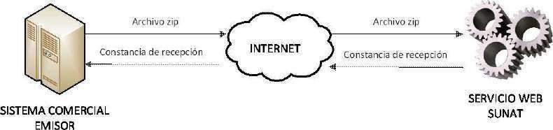 style="width:5.26472in;height:1.23958in" />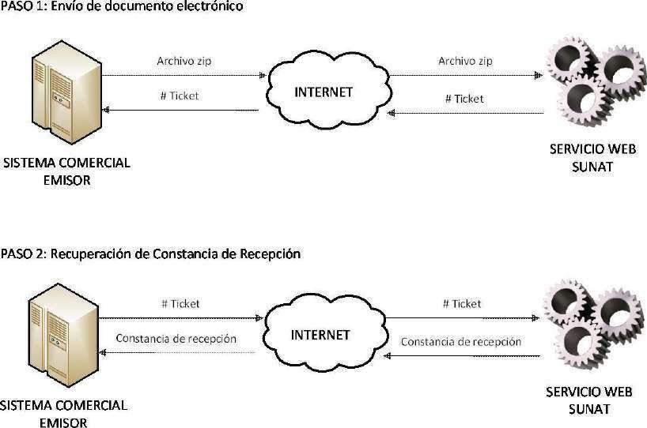 style="width:5.45486in;height:3.61292in" />
>
> **Envío** **Asíncrono**
>
> Este tipo de envío será utilizado para el caso del Resumen diario de
> Boletas de Venta y sus notas de crédito y debito asociadas así como la
> Comunicación de Baja. El servicio web de SUNAT recibirá el archivo a
> procesar y devolverá un número de ticket de atención, con el cual el
> emisor podrá consultar el resultado delproceso.
>
> **2.5** **Métodos** **disponibles**
>
> **2.5.1** **Para** **envió** **en** **producción** **y** **en** **el**
> **proceso** **dehomologación**.
>
> El servicio web de recepción cuenta con un método personalizado para
> aceptar cada tipo de documento electrónico. Los métodos de recepción
> definidos son los siguientes:
>
> \- ***sendBill***, este método recibe un archivo ZIP con un único
> documento XML de comprobante y devuelve un archivo Zip que contiene un
> documento XML que es la constancia de aceptación ó rechazo.
>
> ~ 15 ~
>
> SEE –Sistemas del Contribuyente Manual del
> programador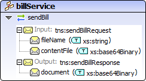 style="width:2.53542in;height:1.41639in" /> style="width:1.00139in;height:0.66622in" />
>
> \- ***sendSummary***, este método recibe un archivo Zip con un único
> documento XML de resúmenes, ya sea resumen de boletas o comunicación
> de bajaso reversiones de comprobantes de percepción y retención.
> Devuelve un ticket con el que posteriormente utilizando el método
> *getStatus* sepuede obtener el archivo Zip que contiene un documento
> XML que es la constancia de aceptación orechazo.
>
> \- **sendPack**, este método recibe un archivo Zip con un varios
> documentos XML, ya sean de facturas, boletas de venta, notas de
> crédito y notas de débito. Devuelve un ticket con el que
> posteriormente utilizando el método *getStatus* se puede obtener el
> archivo Zip que contiene varios documentos XML que es la constancia de
> aceptación o rechazo por documento enviado y un archivoresumen.
>
> \- **getStatus**, este método recibe el ticket como parámetro y
> devuelve un objeto que indica el estado del proceso y en caso de haber
> terminado, devuelve adjunta la constancia de aceptación o rechazo.
>
> A continuación se detalla el uso de cada uno de los métodos definidos:
>
> ~ 16 ~
>
> SEE –Sistemas del Contribuyente Manual del programador

||
||
||
||

||
||
||
||

> ~ 17 ~
>
> SEE –Sistemas del Contribuyente Manual del programador
>
> 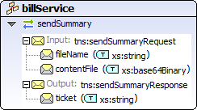 style="width:2.54167in;height:1.41597in" />*Parámetros* *de* *entrada*

||
||
||
||
||

> TODOS los parámetros de entrada son obligatorios, de no ingresar
> alguno o ingresar valores nulos el servicio emitirá una excepción.
>
> *Retorno*

||
||
||
||

> **Ejemplo** **SOAP** **para** **invocar** **el** **servicio:**
>
> \<soapenv:Envelope
> xmlns:soapenv=["http://schemas.xmlsoap.org/soap/envelope/"](http://schemas.xmlsoap.org/soap/envelope/)
> xmlns:ser=["http://service.sunat.gob.pe"](http://service.sunat.gob.pe/)
> xmlns:wsse=["http://docs.oasis-](http://docs.oasis-/)open.org/wss/2004/01/oasis-200401-wss-wssecurity-secext-1.0.xsd"\>
> \<soapenv:Header\>
>
> \<wsse:Security\> \<wsse:UsernameToken\>
>
> \<wsse:Username\>20100066603MODDATOS\</wsse:Username\>
> \<wsse:Password\>moddatos\</wsse:Password\> \</wsse:UsernameToken\>
>
> \</wsse:Security\> \</soapenv:Header\> \<soapenv:Body\>
> \<ser:sendSummary\>
>
> \<fileName\>20100066603-RC-20110522-1.zip\</fileName\>
> \<contentFile\>cid:20100066603-RC-20110522-1.zip\</contentFile\>
> \</ser:sendSummary\>
>
> \</soapenv:Body\> \</soapenv:Envelope\>
>
> ~ 18 ~
>
> SEE –Sistemas del Contribuyente Manual del programador

||
||
||
||

> ~ 19 ~
>
> SEE –Sistemas del Contribuyente Manual del
> programador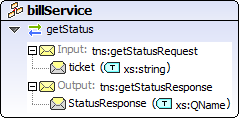 style="width:2.48889in;height:1.22882in" />
>
> \<soapenv:Body\>
>
> \<ser:sendSummary\>
>
> \<fileName\>20100066603-LT-20160822-1.zip\</fileName\>
> \<contentFile\>cid:20100066603-LT-20160822-1.zip\</contentFile\>
> \</ser:sendSummary\>
>
> \</soapenv:Body\> \</soapenv:Envelope\>
>
> ~ 20 ~
>
> SEE –Sistemas del Contribuyente Manual del programador

||
||
||
||
||
||

||
||
||
||
||
||

> ~ 21 ~
>
> SEE –Sistemas del Contribuyente Manual del programador

||
||
||
||
||
||

> ~ 22 ~
>
> SEE –Sistemas del Contribuyente Manual del programador
>
> **2.6** **Constancia** **de** **Recepción** **(CDR)**
>
> El documento electrónico de respuesta de SUNAT para todos los
> documentos electrónicos enviados es la Constancia de Recepción (CDR).
> Este documento informa al emisor el resultado del envío, y podrá tener
> el estado de aceptada o rechazada. Las implicancias de la aceptación o
> rechazo se explican en el numeral 4.1 del presente manual.
>
> La constancia de recepción ha sido clasificada en tres tipos de
> acuerdo al documento electrónico enviado:
>
> \- CDR- Factura y nota, cuando corresponde al resultado del envío de
> una Factura y/o Nota de crédito y débitorelacionadas
>
> \- CDR-ResumenDiario, cuando corresponde alresultado del Resumendiario
> de boletas de venta y notas de crédito y debito
> electrónicasrelacionadas.
>
> \- CDR – Baja, cuando corresponde al resultado de la Comunicación
> debaja.
>
> \- CDR – Resumen de Reversión, cuando corresponde al resultado del
> Resumen diariodereversiones decomprobantesde retenciónypercepción.
>
> Sin embargo, para el sistema, todos los tipos de constancias son
> iguales, es decir, tienen la misma estructura y por lo tanto,
> contienen la misma información.
>
> Las características generales de la constancia son las siguientes:
>
> \- **Formato** **yestructura:**
>
> Tendrá formato XML basado en el documento ApplicationResponse de UBL
> versión 2.0. En el Anexo 1 del presente manual se encuentra el detalle
> de los elementos utilizados para el caso peruano.
>
> \- **Nombre**:
>
> La constancia de recepción es devuelta por el servicio web de SUNAT
> dentro de un archivo zip. Al desempaquetar dichoarchivo, seencontrará
> la constancia con el siguiente formato de nombre:
>
> R-\<Nombre del archivo enviado sin extensión\>.xml
>
> ~ 23 ~
>
> SEE –Sistemas del Contribuyente Manual del programador
>
> Ejemplos:

||
||
||
||
||
||
||

> \- **Firma** **digital:**
>
> Todas las constancias se encontrarán firmadas digitalmente por SUNAT.
>
> **2.7** **Recuperación** **de** **la** **Constancia** **deRecepción**
>
> Para los resúmenes diarios y comunicaciones de baja (envío asíncrono),
> la recuperación de la constancia se efectuará invocando el servicio
> web de consulta del estado del proceso de envío. En la medida deque el
> proceso derecepción haya concluido, el sistema devolverá la constancia
> de recepción correspondiente al proceso asociado al número de ticket
> consultado.
>
> Para realizar la consulta de Constancia de Recepción de SUNAT
> (CDR-SUNAT), se efectuará invocando al servicio web de consulta de CDR
> de producción, podrá ser obtenida enviado información del documento
> electrónico (RUC Emisor, tipo, serie y número del comprobante), el
> sistema devolverá la constancia de recepción correspondiente al
> proceso asociado a la información del documento electrónico
> consultado.
>
> **2.7.1** **Para** **consulta** **o** **recupero** **de** **CDR**
> **en** **producción** **de** **Factura,** **nota** **de** **crédito**
> **o** **debito**
>
> **getStatusCdr**: Este método recibe los datos de un CDP (Ruc del
> emisor, tipo de comprobante, serie y número) como parámetro ydevuelve
> un objeto que indica el estado del proceso y en caso de haber
> terminado, devuelve adjunto elCDR.
>
> **2.7.2** **Para** **consulta** **de** **CDR** **en** **producción**
> **de** **Resumen** **Diario** **o** **Comunicación** **de** **Baja**
> **o** **Resumen** **de** **Reversiones** **o** **Lotes**
> **deFacturas.**
>
> **getStatus** **(del** **ticket)**, este método recibe los datos de un
> ticket como parámetro y devuelve un objeto que indica el estado del
> proceso y en caso de haber terminado, devuelve adjunto el CDR.
>
> ~ 24 ~
>
> SEE –Sistemas del Contribuyente Manual del programador
>
> **2.8** **Servicios** **de** **consulta**
>
> Se ha puesto disposición servicios automáticos de consulta de validez
> del documento electrónico (XML), así como del estado del envío de
> documentos

||
||
||
||
||
||

> **<u>Servicio Web para consultas</u>**: Es un servicio automático de
> consulta de validez del documento electrónico (XML), así como del
> estado del envío de estos.
>
> ~ 25 ~
>
> SEE –Sistemas del Contribuyente Manual del programador
>
> **3** **FirmaDigital**
>
> Todos los documentos electrónicos que se enviarán a SUNAT deberán ser
> firmados digitalmente por el emisor, haciendo uso de un certificado
> digital. Las características que se deben cumplir se detallan a
> continuación:
>
> **3.1** **Consideraciones** **sobre** **el** **certificado**
> **digital** **autilizarse**
>
> a\) El certificado debe cumplir con los siguientes requisitostécnicos:
>
> ▪ Formato estándar X.509v3.
>
> ▪ Longitud mínima de clave privada de 1024bits
>
> ▪ Permitirqueseidentifique altitulardelaFirmadigital, señalandonombre
> y apellidos y DNI, y el número de RUC de la empresa querepresenta.
>
> ▪ El número de RUC deberá estar consignado en el campo OU
> (Organizational Unit) del atributo Subject Name.
>
> El proveedor de los certificados digitales, deberá identificar a los
> titulares y/o suscriptores del certificado digital mediante el
> levantamiento de datos y la comprobación dela información brindada por
> el referido titular.
>
> b\) El certificado digital deberá previamente ser comunicado a SUNAT.
> Para ello se utilizará la opción de “Actualización de certificado
> digital” habilitada en el Menú SOL.
>
> c\) El certificado debe encontrarse vigente y no revocado, ya que el
> receptor de SUNAT valida estos dos requisitos.
>
> **3.2** **Consideraciones** **sobre** **el** **proceso** **defirmado**
>
> a\) Para todos los documentos, la firma digital se consignará en un
> elemento \<ext:UBLExtensions/ext:UBLExtension/ext:ExtensionContent\>.
> Dentro de éste elemento es donde se incluye la firma \[XMLDSig\] del
> emisor del documento. Por tanto, en el documento únicamente habrá un
> solo \<ext:UBLExtension\> para la inclusión de la firma.
>
> b\) Se firmará todo el documento completo, es decir, todo el contenido
> del elemento raíz: Invoice, CreditNote, DebitNote, SummaryDocuments o
> VoidedDocuments. Se deberá utilizar el estándar de firmasXMLDSig.
>
> c\) Antes de firmar el documento, el archivo debe contener la
> totalidad de la información del documento, incluyendo el elemento
> \<cac:Signature\> definido por el estándar UBL con su respectiva
> información. Además se debe generar el elemento donde se ubicará la
> firmadigital.
>
> Ejemplo de elemento \<ext:UBLExtensions\> antes de firmar:
> \<ext:UBLExtensions\>
>
> ~ 26 ~
>
> SEE –Sistemas del Contribuyente Manual del programador
>
> \<ext:UBLExtension\> \<ext:ExtensionContent\>
> \<sac:AdditionalInformation\> \<sac:AdditionalMonetaryTotal\>
> \<cbc:ID\>1001\</cbc:ID\>
>
> \<cbc:PayableAmountcurrencyID="PEN"\>348199.15\</cbc:PayableAmount\>
> \</sac:AdditionalMonetaryTotal\>
>
> \<sac:AdditionalProperty\> \<cbc:ID\>1000\</cbc:ID\>
>
> \<cbc:Value\>CUATROCIENTOS VEINTITRES Y 00/100\</cbc:Value\>
> \</sac:AdditionalProperty\>
>
> \</sac:AdditionalInformation\> \</ext:ExtensionContent\>
> \</ext:UBLExtension\> **\<ext:UBLExtension\>**
> **\<ext:ExtensionContent\>** **\</ext:ExtensionContent\>**
> **\</ext:UBLExtension\>** \</ext:UBLExtensions\>
>
> d\) La firma digital se debe alojar en el elemento
> \<ext:ExtensionContent\>creado para tal fin.
>
> e\) Para firmar un documento electrónico se utilizará la clave privada
> de un certificado digital X509. Luego de este proceso no podrán
> añadirse nuevos datos al documento, ni siquiera extensiones en el
> formato acordado, puesto que la validación consideraría que el
> documento ha sidoalterado.
>
> f\) La firma deberágenerarse con el mismo tipo de codificación con el
> cual se generó el documento xml. Por ejemplo, si el archivo xml a
> firmar es generado con el ISO-8859-1, la firma también deberá ser
> generada con dichacodificación.
>
> g\) Mayores detalles de la firma digital se encuentra en cada informe
> de definición de los documentos electrónicos y también puede ser
> revisado en la página web del ConsorcioWorldWideWeb
> -W3C[(http://www.w3.org/TR/xmldsig-core/).](http://www.w3.org/TR/xmldsig-core/))
>
> ~ 27 ~
>
> SEE –Sistemas del Contribuyente Manual del programador
>
> **4** **Procedimientos** **específicos**
>
> **4.1** **Manejo** **de** **errores**
>
> El sistema realiza una serie de validaciones durante el proceso de
> recepción de los documentos electrónicos. Cada una de estas
> validaciones en caso de no cumplirse genera un tipo de error. Estos
> tiposson:
>
> **1.** **Excepciones:**
>
> Son errores graves que imposibilitan el procesamiento del archivo. En
> estos casos, el documento se considera como no informado, y el emisor
> deberá corregir el problema para volver a enviar el documento.
>
> **2.** **Errores** **que** **generanrechazos:**
>
> En estos casos se procesó el documento electrónico, pero se detectaron
> errores que no permiten registrarlo como documento válido. Las
> implicancias de este tipo de error dependen del tipo de documento
> procesado y son las siguientes:
>
> • **En** **Facturas** **y** **Notas** **de** **crédito** **y**
> **débitoasociadas:**
>
> Para estos documentos, la numeración se considera ya utilizada, pero
> la factura o nota electrónicano es válida. En estos casos el emisor ya
> no podrá utilizar ese número, y tendrá que generar un nuevo documento
> corrigiendo el problema que generó el error y asignar un nuevo número
> aldocumento.
>
> • **En** **Retenciones,** **Percepciones** **y** **Guías**
> **deRemisión:**
>
> Para estos documentos, se rechaza el documento completo. No hay
> procesamiento parcial, y tampoco se invalidan los números. Todo el
> documento completo se considera como no informado.
>
> El emisor debe corregir el problema y volver a enviar todo el
> documento nuevamente.
>
> Puede utilizar el mismo nombre de archivo.
>
> • **En** **Resúmenes** **diarios** **de** **Boletas** **de**
> **Venta,** **Comunicación** **de** **baja,** **Resumen** **de**
> **Reversiones:**
>
> En estos documentos donde se informa más de un número de comprobante,
> se rechaza todo el documento completo. No hay procesamiento parcial, y
> tampoco se invalidan los números. Todo el documento completo se
> considera como no informado.
>
> El emisor debe corregir el problema y volver a enviar todo el
> documento nuevamente.
>
> Puede utilizar el mismo nombre de archivo.
>
> • **Lotes** **de** **facturas,** **notas** **de** **crédito** **y**
> **notas** **de** **débitos** **electrónicos:** En estos documentos
> donde se informa más de un número de comprobante, cada documento
> cumple sus validaciones segúnel tipo de documento.
>
> ~ 28 ~
>
> SEE –Sistemas del Contribuyente Manual del programador
>
> **3.** **Observaciones**
>
> Son errores que *no* *invalidan* el documento y por lo tanto el
> sistema registrará el comprobante como válido. Las observaciones se
> informarán en la Constancia de Recepción.
>
> La relación de los códigos de error y su descripción se encuentra en
> el parámetro 742. Los códigos se han clasificado de acuerdo al tipo de
> error:
>
> \- Del 0100 al 999 Excepciones propias de SUNAT.
>
> \- Del 1000 al 1999 Excepciones (formatos y estructura)propias del
> contribuyente.
>
> \- Del 2000 al 3999 Errores que generanrechazo - Del 4000 en
> adelanteObservaciones
>
> De acuerdo al tipo de error que se genera, el sistema responde de
> manera distinta al emisor. Las respuestas son:
>
> \- Si es una EXCEPCION, el sistema responde como una excepción del
> programa, es decir, retorna el código de error con sudescripción.
>
> \- Si hay un ERROR QUE GENERA RECHAZO, el sistema genera una
> constancia de recepción (CDR)con estado rechazada, indicando que el
> comprobante no ha sido registrado en SUNAT por tenererrores.
>
> \- Si hay OBSERVACIONES, el sistema genera una constancia de recepción
> (CDR)con estado aceptada con advertencias, indicando que el
> comprobante ha sido correctamente enviado y registrado en SUNAT. Las
> advertencias se muestran en la constancia de recepción.
>
> \- Finalmente, si no hay ningún tipo de error, se genera una
> constancia de recepción (CDR) aceptada, indicando que el comprobante
> ha sido correctamente enviado y registrado en SUNAT.
>
> **4.2** **Utilización** **de** **campos** **del** **estándar** **UBL**
>
> El estándar UBL permite consignar una gran cantidad de datos
> comerciales. Todos los elementos disponibles en la versión 2.0 de UBL
> pueden ser utilizados por el emisor, siempre que cumplan con el
> formato establecido por elestándar.
>
> La comprobación del cumplimiento del estándar se realiza verificando
> que el documento cumple con el esquema (archivos con extensión xsd)
> que define su estructura. Este proceso denominado “parseo” en el
> ámbito informático, debería realizarse siempre luegode construido un
> documento electrónico yantes de realizar su envío a SUNAT. Los
> diferentes lenguajes de programación ofrecen librerías que permiten
> realizar esta verificación.
>
> ~ 29 ~
>
> SEE –Sistemas del Contribuyente Manual del programador
>
> **4.3** **PROCESO** **DE** **CONTINGENCIA**
>
> Se ha definido que los contribuyentes obligados al uso del comprobante
> de pago electrónico, tengan la posibilidad de emitir comprobantes
> impresos por imprenta autorizada, en aquellas situaciones en las
> cuales, por causas no imputables al emisor, éste se vea imposibilitado
> de emitirlos por medios electrónicos. En tal sentido, si ello ocurre,
> dicho emisor deberá cumplir con el envío de dicha información a través
> la opción habilitada para tal efecto en SUNAT Operación en Línea del
> portal de la SUNAT, según se indica a continuación:
>
> **4.3.1** **Factura,** **boleta** **de** **venta,** **notas** **de**
> **crédito** **y** **débito** **ytickets**
>
> **a)** **Condiciones** **de** **envío.**
>
> Para poder utilizar este procedimiento el contribuyente debe estar
> registrado como emisor electrónico obligado.
>
> Los comprobantes de pago a ser informados son aquellos impresos o
> importados por imprenta autorizada y tickets o cintas emitidas por
> maquinas registradoras. En caso de comprobantes impresos por imprenta
> autorizada, deberán corresponder a rangos previamente autorizados por
> SUNAT
>
> **b)** **Procedimiento** **de** **envío**
>
> El envío del archivo resumen de comprobantes impresos, lo realiza el
> emisor electrónico obligado utilizando la opción correspondiente
> habilitada en SUNAT Operaciones en Linea. Para realizar el envio se
> deberá realizar lo siguiente:
>
> **Paso** **1**: Preparar un archivo de extensión “TXT” conteniendo la
> información de los comprobantes, en ninguno de los casos se incluye el
> detalle o descripción de los ítems del comprobante.
>
> Las especificaciones de cada campo de este RESUMEN está descrito en el
> ANEXO 11 RESUMEN **DE** **COMPROBANTES** **IMPRESOS**
>
> Luego de completar la longitud de cada campo se debe incluir un
> símbolo conocido como pipa o palote “\|”.
>
> El registro de los comprobantes debe completarse de la siguiente
> forma:
>
> — Facturas: Se prepara la información de la factura una por línea. —
> Boletas: Se prepara la información de la boleta una porlínea.
>
> — Notas de crédito (Relacionadas con Facturas y Boletas): Se prepara
> una por línea. — Notas de debito (Relacionadas con Facturas y
> Boletas): Se prepara una por línea. — Tickets que otorguen derecho a
> crédito fiscal: se preparan de uno porlínea.
>
> — Tickets que no otorguen derecho a crédito fiscal: se prepara como
> resumen.
>
> — Boleto de viaje emitido por las empresas de transporte público
> interprovincial de pasajeros: Se prepara uno por línea
>
> **Una** **vez** **elaborado** **el** **archivo** **deberá** **ser**
> **guardado** **con** **extensión.** **“txt.”.** **Para** **efecto**
> **del** **nombre** **del** **archivo** **deberá** **considerar**
> **lo** **indicado** **en** **el** **punto** **6.4.6**
>
> Paso 2: Comprimir el archivo TXT en otro de extensión “ZIP” .
>
> Paso 3: Cargue en archivo .ZIP, recibirá un número de constancia
> generada por SUNAT operaciones en Linea ( “ticket”)
>
> ~ 30 ~
>
> SEE –Sistemas del Contribuyente Manual del programador
>
> **c)** **Procedimiento** **de** **envío** **por** **correcciones**
>
> En caso se requiera corregir un envío realizado, se deberá elaborar
> nuevamente el archivo Resumen de Comprobantes Impresos como si se
> tratase del original.
>
> El último archivo RESUMEN enviado reemplazará por completo al
> anterior,
>
> **d)** **Procesamiento** **de** **envíos**
>
> Los envíos son procesados secuencialmente, al momento de su recepción.
>
> En caso de existir errores, éstos serán puestos a disposición en la
> opción correspondiente de SUNAT Operacioens en Linea (Opción
> consultas) . A través de esta opción, se activará un link de descarga
> de archivo de errores.
>
> Los envíos sin errores será cargados como comprobantes de pago, notas
> de crédito y/o notas de débito informados por contingencia
>
> **e)** **Seguimiento** **de** **envíos**
>
> Los contribuyentes pueden hacer consultas de sus envíos utilizando la
> opcion correspondiente habilitada en SUNAT Operaciones en Línea, por
> número de constancia generada por SUNAT Operaciones en línea
> (“ticket”) o rangos de fechas.
>
> **f)** **Estructura** **del** **Nombre** **del** **Archivo** **–**
> **Comprobantes** **Impresos**
>
> El nombre de los archivos está en función a la fecha a la que
> corresponde el envío.
>
> El nombre del archivo debe cumplir con el formato
>
> **"99999999999-RF-DDMMYYYY-99"** donde:
>
> – 99999999999 números de ruc
>
> – RF: Caracteres identificativos del archivo "RF" textualmente
> representa resumen defacturas.
>
> – DDMMYYYY: Fecha de emisión en contingencia en formato "DDMMYYYY”;
> ejemplo 15072014.
>
> – 99: Numero de envío dato entre 01 al 99.
>
> Las extensiones del archivo son .TXT y .ZIP según corresponda.
>
> **4.3.2** **Comprobantes** **de** **Retención** **yPercepción**
>
> **Resumen** **diario** **de** **comprobantes** **de**
> **percepción/retención** **emitidos** **en** **formatos** **impresos**
> **(contingencia)**

||
||
||
||
||
||
||
||

> ~ 31 ~
>
> SEE –Sistemas del Contribuyente Manual del programador

||
||
||
||
||
||
||
||
||
||
||
||
||

> Los comprobantes a ser informados son aquellos emitidos en formatos
> impresos por imprenta autorizada, cuyos rangos han sido previamente
> autorizados por la SUNAT.
>
> • **Procedimiento** **de** **envío**
>
> El envio del archivo Resumen diario de comprobantes de
> percepción/retención emitidos en formatos impresos lo realiza el
> emisor electrónico utilizando la opción correspondiente habilitada en
> SUNAT Operaciones en Línea.
>
> Para realizar el envío se deberá realizar lo siguiente:
>
> ❖ Paso 1: Preparar un archivo de extensión “TXT” conteniendo la
> información de los comprobantes y sus documentos relacionados,
>
> Las especificaciones de cada campo de este RESUMEN están descritos en
> los Anexos 19 y 20. Luego de completar la longitud de cada campo se
> debe incluir un símbolo conocido como pipa o palote “\|”.
>
> **Una** **vez** **elaborado** **el** **archivo** **deberá** **ser**
> **guardado** **con** **extensión.** **“txt.”.** **Para** **efecto**
> **del** **nombre** **del** **archivo** **deberá** **considerar**
> **lo** **indicado** **en** **el** **punto** **“Estructura** **del**
> **nombre** **del** **archivo”**
>
> ❖ Paso 2: Comprimir el archivo TXT en otro de extensión“ZIP”
>
> ❖ Paso 3: Cargue el archivo .ZIP, recibirá un número de constancia
> generada por SUNAT operaciones en Linea ( “ticket”)
>
> • **Procedimiento** **de** **envío** **por** **correcciones**
>
> En caso se requiera corregir un envío realizado, se deberá elaborar
> nuevamente el archivo RESUMEN como si se tratase del original. El
> ultimo archivo RESUMEN enviado reemplazará por completo al anterior.
>
> • **Procesamiento** **de** **envíos**
>
> ~ 32 ~
>
> SEE –Sistemas del Contribuyente Manual del programador
>
> Los envíos son procesados secuencialmente, al momento de su recepción.
> En caso de existir errores, éstos serán puestos a disposición en la
> opción correspondiente de SUNAT Operaciones en Línea (Opción
> consultas). A través de esta opción, se activará un link de descarga
> de archivo de errores.
>
> • **Seguimiento** **de** **envíos**
>
> Los contribuyentes pueden hacer consultas de sus envíos utilizando la
> opcion correspondiente habilitada en SUNAT Operaciones en Línea, por
> número de constancia generada por SUNAT Operaciones en línea
> (“ticket”) o rangos de fechas.
>
> • **Estructura** **del** **Nombre** **del** **Archivo-**
> **Contingencia**
>
> El nombre de los archivos está en función a la fecha a la que
> corresponde el envío.
>
> El nombre del archivo debe cumplir con lo indicado en el literal e).
>
> **"RRRRRRRRRRR-TT-20150522-1"** donde:
>
> – RRRRRRRRRRR: RUC del emisor electrónico – TT: Tipo de comprobante,
> pueden ser:
>
> o 40 Comprobante de Percepción.
>
> o 41 Comprobante de Percepción Venta Interna. o 20 Comprobante de
> Retención.
>
> – YYYYMMDD: Fecha de emisión en contingencia en formato "YYYYMMDD”
>
> – 1: Número correlativo del archivo. Este campo es variante, seespera
> un mínimo de 1 y máximo de5.
>
> Las extensiones del archivo son .TXT y .ZIP según corresponda.
>
> ~ 33 ~
>
> SEE –Sistemas del Contribuyente Manual del programador
>
> **ANEXO** **1:** **Constancia** **de** **Recepción**
>
> La Constancia de Recepción es el documento que permitirá indicar la
> respuesta de la aplicación SUNAT a la transacción de recepción de la
> factura, nota o resúmenes enviados por el contribuyente. Este
> documento informará el estado de recepción, indicando si ha sido
> aceptado o rechazado por SUNAT.
>
> El objetivo de este anexo es describir las normas de uso que usará
> SUNAT cuando construya el documento de respuesta al proceso de
> recepción de documentos electrónicos. Este documento está basado en el
> esquema del documento ApplicationResponse del estándar UBL versión
> 2.0.
>
> **A.** **Información** **contenida** **en** **la** **Constancia**
> **de** **Recepción** **yestructuraXML**
>
> Los diferentes campos contenidos en la constancia de recepción se
> detallan en el cuadro del literal A.1.
>
> Para elaborar dicho cuadro se ha tomado en cuenta la siguiente
> nomenclatura: • Para los tipos de campos y longitud:
>
> a caracter alfabético n caracter numérico
>
> an caracter alfanumérico
>
> a3 3 caracteres alfabéticos de longitud fija n3 3 caracteres numéricos
> de longitudfija
>
> an3 3 caracteres alfa-numéricos de longitud fija a..3 hasta 3
> caracteres alfabéticos
>
> n..3 hasta 3 caracteres numéricos an..3 hasta 3 caracteres
> alfa-numéricos
>
> • Para la condición de obligatoriedad o no de un determinadoelemento:
>
> **M**: Mandatorio u obligatorio **C**: Condicional u opcional
>
> • En lo referente a la identificación del formato de loselementos:
>
> n(12,2)
>
> n(2,2)
>
> F#####
>
> <u>YYYY-MM-DD</u>

elemento numérico hasta12 enteros + punto decimal+ hasta dos decimales

> elemento numérico hasta 2 enteros + punto decimal+ hasta dos

elemento inicia con la letra F seguida de cinco dígitos

> <u>formato fecha yyyy=año, mm=mes,dd=día</u>
>
> En el cuadro del literal A.2 se muestra la estructura del documento
> ApplicationResponse de acuerdo a UBL versión 2.0 y una referencia a la
> información que estará contenida en cada elemento. Además se muestra
> la cardinalidad de acuerdo al UBL y el asumido para el caso peruano
>
> ~ 34 ~
>
> SEE –Sistemas del Contribuyente Manual del programador

**A.1** **Campos** **contenidos** **en** **la** **Constancia**
**deRecepción**

> **N°** **CAMPOS** **NIVEL**
>
> **1** Firma Digital (Firma electrónica) Global **2** Número
> identificador del proceso de recepción Global **3** Fecha
> derecepcióndel documento electrónico procesado Global **4**
> Horaderecepcióndel documento electrónico procesado Global **5** Fecha
> de generación de la constancia de recepción Global **6** Horade
> generación de la constancia de recepción Global **7** Mensajes o notas
> asociados a la constancia de recepción Global **8** Número de RUC del
> Emisor delaconstancia Global **9** Número de RUC del Receptor de la
> constancia Global **10** Identificador del documento electrónico
> enviado Global
>
> **11** Código de respuesta del envío Global **12** Descripción de la
> respuesta del envío Global **13** Identificador del documento
> electrónico procesado Global
>
> **14** Identificación del receptor del documento electrónico Global
> procesado
>
> **15** Versión del UBL Global **16** Versión dela estructura del
> documento Global
>
> **CONDICIÓN**

M M M M M M M M M M

M M M

M

M M

> **TIPO** **Y** **LONGITUD**

an..3000 n15 an..10 an..11 an..10 an..11 an..100 n11

n11 an..23

n..4 an..100 an..23

an..13

an..10 an..10

> **FORMATO**

YYYY########### YYYY-MM-DD hh:mm:ss

YYYY-MM-DD hh:mm:ss

> **OBSERVACIONES**

Formato Date del XML

Formato Date del XML

Formato de acuerdo al tipo de documento procesado

Formato de acuerdo al tipo de documento procesado

> ~ 35 ~
>
> SEE –Sistemas del Contribuyente Manual del
> programador style="width:0.97361in;height:3.38403in" />

**A.2** **Estructura** **XML** **de** **ApplicationResponse** **según**
**normaUBL**

> **<u>ESTRUCTURA XML APPLICATIONRESPONSE -PERU</u>**

||
||
||
||
||

||
||
||
||
||
||
||
||
||
||
||
||
||
||
||
||
||

> ~ 36 ~

SEE –Sistemas del Contribuyente Manual del
programador

||
||
||
||
||
||
||
||
||
||
||
||
||
||
||
||
||
||
||
||
||
||
||
||
||
||
||
||
||
||
||

> ~ 37 ~

SEE –Sistemas del Contribuyente Manual del programador

||
||
||
||
||
||
||
||
||
||
||
||
||
||
||
||
||
||

> ~ 38 ~
>
> SEE –Sistemas del Contribuyente Manual del
> programador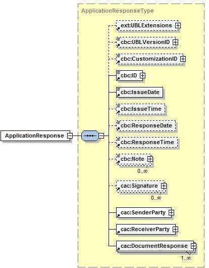 style="width:4.19167in;height:5.35431in" />
>
> **B.** **Elementos** **de** **la** **Constancia** **deRecepción**
>
> Para un mejor entendimiento de la estructura del archivo XML, se
> muestra el diagrama respectivo en donde se muestra los elementos
> utilizados para la constancia de recepción.
>
> A continuación se detallan los elementos que forman parte de la
> constancia de recepción. En cada uno de ellos se indica una
> explicación de la información que almacena:
>
> ***B.1*** ***ext:UBLExtensions***
>
> Contenedor de Componentes de extensión. Para el caso peruano se
> utilizará para consignar la información correspondiente a la firma
> digital.
>
> ~ 39 ~
>
> SEE –Sistemas del Contribuyente Manual del
> programador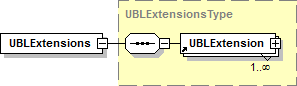 style="width:3.10139in;height:0.89575in" />
>
> •  **ds:Signature:** Este elemento complejo se ubicará dentro del tag
> \<ext:ExtensionContent\>y contendrá la información correspondiente a
> la firma digital, la cual se encontrará estructurada de acuerdo a las
> especificaciones de XMLDSig (recomendación de W3C para firmas
> digitales).
>
> ***B.2*** ***cbc:UBLVersionID***
>
> Versión del esquema UBL utilizado para la elaboración de la constancia
> de recepción. Para el caso peruano se ha utilizado la versión “2.0”.
>
> \<cbc:UBLVersionID\>2.0\</cbc:UBLVersionID\>
>
> ***B.3*** ***cbc:CustomizationID***
>
> Identifica una personalización de UBL definida para un uso específico.
> Para nuestro caso corresponderá a la versión 1.0. Por cada variación o
> adecuación del esquema se deberá de aumentar la versión.
>
> \<cbc:CustomizationID\>1.0\</cbc:CustomizationID\>
>
> ***B.4*** ***cbc:ID***
>
> Número único asignado por SUNAT para identificar el proceso de
> recepción.
>
> ***B.5*** ***cbc:IssueDate***
>
> Fecha de recepción del documento electrónico enviado por el
> contribuyente. El tipo de dato corresponde con el tipo Date de XML por
> lo que el formato deberá ser yyyy-mm-dd.
>
> \<cbc:IssueDate\>2012-06-01\</cbc:IssueDate\>
>
> ***B.6*** ***cbc:IssueTime***
>
> Hora de recepción del documento electrónico enviado por el
> contribuyente. El documento puede ser un comprobante de pago, nota
> electrónica, resumen diario o
>
> ~ 40 ~
>
> SEE –Sistemas del Contribuyente Manual del
> programador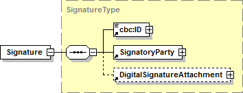 style="width:3.6875in;height:1.41667in" />
>
> comunicación de baja. El tipo de dato corresponde con el tipo Time de
> XML por lo que el formato deberá ser hh:mm:ss.
>
> \<cbc:IssueTime\>15:12:23\</cbc:IssueTime\>
>
> ***B.7*** ***cbc:ResponseDate***
>
> Fecha de generación de la constancia de recepción. El tipo de dato
> corresponde con el tipo Date de XML por lo que el formato deberá ser
> yyyy-mm-dd.
>
> \<cbc:ResponseDate\>2012-06-01\</cbc:ResponseDate\>
>
> ***B.8*** ***cbc:ResponseTime***
>
> Hora de generación de la constancia de recepción. El tipo de dato
> corresponde con el tipo Time de XML por lo que el formato deberá ser
> hh:mm:ss.
>
> \<cbc:ResponseTime\>15:13:00\</cbc:ResponseTime\>
>
> ***B.9*** ***cac:Signature***
>
> Utilizado para identificar al firmante y otro tipo de información
> relacionada con la firma digital. Su uso se da principalmente para
> especificar la ubicación de la firma digital.
>
> • **cbc:ID*.*** Identificador de lafirma.
>
> • **cac:SignatoryParty.** Asociación con la parte firmante, la cual
> para el caso de la constancia de recepción corresponde a los datos
> deSUNAT.
>
> o **PartyIdentification.** A través del elemento ID, se consigna el
> RUC de la partefirmante.
>
> o **PartyName.** A través del elemento Name, se consigna el nombre de
> la parte firmante. En este caso corresponde aSUNAT.
>
> • **cac:DigitalSignatureAttachment.** En este componente se puede
> referenciar lafirma del documentocomo una referencia externa a una URI
> local o remota.
>
> ~ 41 ~
>
> 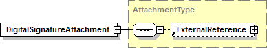 style="width:4.02972in;height:0.73611in" />SEE –Sistemas del
> Contribuyente Manual del programador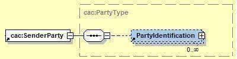 style="width:4.16667in;height:1.04153in" />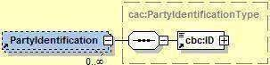 style="width:3.15903in;height:0.76039in" />
>
> o **ExternalReference.** Información vinculado. Los vínculos pueden

acerca de un documento ser externos (referenciados

> mediante un elemento ***URI***), internos (accesibles mediante un
> elemento MIME) o pueden estar contenidos dentro del mismo documento en
> el que se alude a ellos (mediante elementos DocumentoIncrustado). Este
> últimoserá el casoa utilizar, es decir una referencia dentro del mismo
> documento ***ApplicationResponse.***Específicamente se referencia
> hacia el componente ***UBLExtensions***donde se ha colocado la firma
> digital.
>
> ***B.10*** ***cbc:Note***
>
> Los mensajes o notas almacenados en este elemento, corresponderán a
> advertencias sobre inconsistencias detectadas en el proceso
> derecepción del documento electrónico, pero que no representan
> rechazos. Estos mensajes se consignarán con el siguiente formato:
>
> \<Código de observación\>-\<Descripción de la observación\>
>
> \<cbc:Note\>4001-Número de RUC del receptor no existe\</cbc:Note\>
>
> 4031-Debe indicar el nombre comercial
>
> ***B.11*** ***cac:*** ***SenderParty***
>
> Información sobre la parte que remite la información.
>
> • PartyIdentification. En este elemento se consigna los datos de
> identificación de la parte emisora de la constancia de recepción. En
> este caso corresponde a datos de SUNAT.
>
> o cbc:ID. Indica el Número de RUC del emisor de la
>
> ~ 42 ~
>
> SEE –Sistemas del Contribuyente Manual del
> programador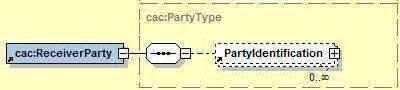 style="width:4.16667in;height:0.9375in" />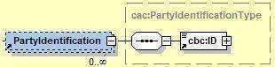 style="width:3.22986in;height:0.79156in" />
>
> \<cac:SenderParty\> \<cac:PartyIdentification\>
>
> \<cbc:ID\>20131312955\</cbc:ID\> \</cac:PartyIdentification\>
>
> \</cac:SenderParty\>
>
> ***B.12*** ***cac:*** ***ReceiverParty***
>
> Información sobre la parte que recibe la constancia de recepción.
>
> • **PartyIdentification.** Eneste elemento se consigna los datos de
> identificación de la parte que recibe la constancia de recepción. En
> este caso corresponde a datos del emisor del documento electrónico
> enviado a SUNAT.
>
> o cbc:ID.Indica el Número de RUC del receptor de la constancia de
> recepción.
>
> Un ejemplo de ReceiverParty, sería:
>
> \<cac:ReceiverParty\> \<cac:PartyIdentification\>
>
> \<cbc:ID\>20100043218\</cbc:ID\> \</cac:PartyIdentification\>
>
> \</cac:ReceiverParty\>
>
> ***B.13*** ***cac:DocumentResponse***
>
> Información sobre la respuesta que se da al proceso de recepción del
> documento electrónico enviado por el contribuyente.
>
> ~ 43 ~
>
> SEE –Sistemas del Contribuyente Manual del
> programador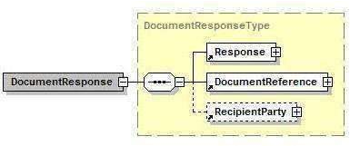 style="width:3.73972in;height:1.55903in" />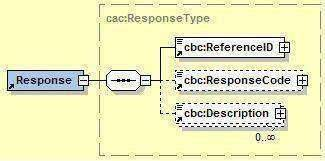 style="width:3.38611in;height:1.67694in" />
>
> • **Response:**Respuesta al documentorecibido.
>
> o **cbc:ReferenceID.** Identificador del documento enviado por el
> contribuyente.
>
> o Para el caso defacturas,notas de crédito ynotasde débito se
> consignará la serie y número de documento separado por un
> guión:\<FAAA\>-\<NNNNNNNN\>
>
> o Para el caso de resúmenes diarios y comunicaciones de baja, se
> colocará el nombre del archivo de acuerdo al siguienteformato:
>
> \<RA\>-\<YYYYMMDD\>-\<NNNNN\>
>
> \<RB\>-\<YYYYMMDD\>-\<NNNNN\>
>
> o **cbc:ResponseCode.** Proporciona el código que da respuesta al
> proceso de recepción. Indica el estado de la recepción del documento
> enviado por elcontribuyente:
>
> o Si es Aceptada se colocará el valor cero(“0”).
>
> o quecorrespondealcódigodelerrorquegeneraelrechazo.
>
> o **cbc:Description.** Describe la respuesta que se da al documento.
> En el caso de estado aceptado, se muestra una descripción
>
> indicando dicha situación. En caso de estado rechazado, se muestra la
> descripción del error que generó elrechazo.
>
> • **DocumentReference:** En este elemento se ubicará la identificación
> del documento electrónico procesado.
>
> ~ 44 ~
>
> SEE –Sistemas del Contribuyente Manual del
> programador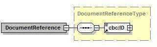 style="width:3.39167in;height:1.03042in" />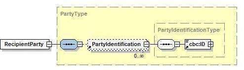 style="width:5.21778in;height:1.50417in" />
>
> o **cbc:ID**. Identificador del documento electrónicoprocesado.
>
> o Si el documento es un comprobante de pago o nota, se consignará la
> serie y número de comprobante.
>
> o Si el documento es un resumen diario o una comunicación de baja, se
> consignará el nombre del archivo.
>
> • **RecipientParty:** En este elemento se ubicará la identificación
> del receptor del documento electrónico procesado.
>
> o **PartyIdentification.** A través del elemento ID, se consigna la
> identificación de la parte receptora el documento electrónico
> procesado.
>
> o cbc:ID. Indica el tipo y número de documento de identidad
>
> Para la factura y notas, corresponde a los datos del adquiriente o
> usuario. Los datos se encontrarán separados por un guión:
>
> \<Tipo documento\>-\<Número de documento\>
>
> Para el caso del resumen diario y la comunicación de baja, se
> consignará un guión.
>
> ~ 45 ~
>
> SEE –Sistemas del Contribuyente Manual del programador
>
> Ejemplo:
>
> \<cac:DocumentResponse\> \<cac:Response\>
>
> \<cbc:ReferenceID\>F001-747\</cbc:ReferenceID\>
> \<cbc:ResponseCode\>0\</cbc:ResponseCode\> \<cbc:Description\>La
> factura numero F001-747, ha sido aceptada
>
> \</cbc:Description\> \</cac:Response\> \<cac:DocumentReference\>
>
> \<cbc:ID\> F001-747\</cbc:ID\> \</cac:DocumentReference\>
> \<cac:RecipientParty\>
>
> \<cbc:ID\>06-20100088982\</cbc:ID\> \</cac:RecipientParty\>
>
> \</cac:DocumentResponse\>
>
> ~ 46 ~
>
> SEE –Sistemas del Contribuyente Manual del programador
>
> **C.** **Ejemplos**
>
> **C.1** **Respuesta** **de** **aplicación** **SUNAT** **–** **Estado**
> **ACEPTADO**

||
||
||
||
||
||
||
||
||
||
||

> \<?xml version="1.0" encoding="ISO-8859-1" standalone="no" ?\>
> \<ar:ApplicationResponse
> xmlns="**urn:oasis:names:specification:ubl:schema:xsd:ApplicationResponse-2**"
> xmlns:cac="**urn:oasis:names:specification:ubl:schema:xsd:CommonAggregateComponents-2**"
> xmlns:cbc="**urn:oasis:names:specification:ubl:schema:xsd:CommonBasicComponents-2**"
> xmlns:ds=["**http://www.w3.org/2000/09/xmldsig#**"](http://www.w3.org/2000/09/xmldsig)
> xmlns:ext="**urn:oasis:names:specification:ubl:schema:xsd:CommonExtensionComponents-2**"\>
> \<ext:UBLExtensions\>
>
> \<ext:UBLExtension\> \<ext:ExtensionContent\> \<ds:Signature
> Id="**SignSUNAT**"\> \<ds:SignedInfo\>
>
> \<ds:CanonicalizationMethodAlgorithm=["**http://www.w3.org/TR/2001/REC-xml-c14n-**](http://www.w3.org/TR/2001/REC-xml-c14n-)**20010315**"
> /\>
>
> \<ds:SignatureMethodAlgorithm=["**http://www.w3.org/2000/09/xmldsig#rsa-sha1**"](http://www.w3.org/2000/09/xmldsig#rsa-sha1)
> /\>
>
> \<ds:Reference URI=""\> \<ds:Transforms\>
>
> \<ds:TransformAlgorithm=["**http://www.w3.org/2000/09/xmldsig#enveloped-signature**"](http://www.w3.org/2000/09/xmldsig#enveloped-signature)
> /\> \</ds:Transforms\>
> \<ds:DigestMethodAlgorithm=["**http://www.w3.org/2000/09/xmldsig#sha1**"](http://www.w3.org/2000/09/xmldsig#sha1)/\>
> \<ds:DigestValue\>**2Hp6yx1+sD9H6n0hDMC625+I40U=**\</ds:DigestValue\>
>
> \</ds:Reference\> \</ds:SignedInfo\>
>
> \<ds:SignatureValue\>**32xhlEkXaoaTKAhxiIdf13qXNGFhcIPROd8dSZpFRqgr8em43vXl4Is/I+mMhTgn9o**
> **Agg5CxpVfa**
> **AExM5JJxp9laI+YC4QUKJ8jyIurMCxk2SngUnV5tfrp/ydy/y4bASVDuNp+ewNIUVhXEUQA9sLs+**
> **JnWYj0WPlppqykHm5W8=**\</ds:SignatureValue\>
>
> \<ds:KeyInfo\> \<ds:X509Data\>
>
> \<ds:X509Certificate\>**MIIC3TCCAcUCCQCbWZdbGxwQajANBgkqhkiG9w0BAQUFADCBhzELMAkGA1UEBhMCU**
> **EUxDTALBgNV**
> **BAgTBExpbWExDTALBgNVBAcTBExpbWExDjAMBgNVBAoTBVNVTkFUMQ0wCwYDVQQLEwRERFNUMRYw**
> **FAYDVQQDEw1Kb2hubnkgVmFsZGV6MSMwIQYJKoZIhvcNAQkBFhRqdmFsZGV6QHN1bmF0LmdvYi5w**
> **ZTAeFw0wODA3MTYxNzE2MDdaFw0xNDAxMDYxNzE2MDdaMF0xCzAJBgNVBAYTAlBFMQ0wCwYDVQQI**
> **EwRMaW1hMQ0wCwYDVQQHEwRMaW1hMQ4wDAYDVQQKEwVTVU5BVDENMAsGA1UECxMERERTVDERMA8G**
> **A1UEAxMIc3J2ZGVzYTEwgZ8wDQYJKoZIhvcNAQEBBQADgY0AMIGJAoGBAOP4nN062737OUzejMiH**
> **p5hba8/IbAfvyedc7aTXWpf6MHXpxT7X6qVoUSG2ulmKygkPW2h8ogyZC9RLo/SBIoGZrt5bD+Cm**
> **1dsK3H4ObRgLDlK6ftdIVZFkvr6rYXGiz92je0QNaNVXuktsNskmvGUbMG6bcUSypQB4rDZhgR9r**
> **AgMBAAEwDQYJKoZIhvcNAQEFBQADggEBALN/qz38GM4H4M8T7uPXEqPGurSqfUT59KYqoZ/R24Kf**
> **aI/t44usI0QbNJSp8w9Yl01XyO+ewnBzJNOKJtL3M8LiawjRoz0DSa8uPJQEMgQXvgJeipAe+IO7**
> **yLMiYA3rOaG1nSXcBYUaRTh6AGeWW+pIheThhcq+Z7uHXMoqbBkIzpUuflkZKPAZFFkSQTUYyhrB**
> **Bv1Vj8nEfoy+y9758KTc7n6yF3GJOIUUpzDQJ65iaIrL6CIlbyHHPhNIcrS2iDvYskqjamiI4Qzs**

<u>**Kcm+qcFRf7UZWYNPCA9w9QISByv5KqVfDQtgZGRh3Uved9BR15mpbdVvs9tJhLYrTHw7Fb8=**\</ds:X509Cert</u>

> ~ 47 ~
>
> SEE –Sistemas del Contribuyente Manual del programador
>
> ificate\> \</ds:X509Data\> \</ds:KeyInfo\> \</ds:Signature\>
>
> \</ext:ExtensionContent\> \</ext:UBLExtension\> \</ext:UBLExtensions\>
> \<cbc:UBLVersionID\>**2.0**\</cbc:UBLVersionID\>
>
> \<cbc:CustomizationID\>**1.0**\</cbc:CustomizationID\>
> \<cbc:ID\>**201200000230061**\</cbc:ID\>
> \<cbc:IssueDate\>**2012-06-12**\</cbc:IssueDate\>
> \<cbc:IssueTime\>**10:09:27**\</cbc:IssueTime\>
> \<cbc:ResponseDate\>**2012-06-12**\</cbc:ResponseDate\>
> \<cbc:ResponseTime\>**10:09:30**\</cbc:ResponseTime\>
>
> \<cbc:Note\>**4031** **-** **Debe** **indicar** **el** **nombre**
> **comercial**\</cbc:Note\> \<cbc:Note\>**4001** **-** **El**
> **numero** **de** **RUC** **del** **receptor** **no**
> **existe.**\</cbc:Note\>
>
> \<cac:Signature\> \<cbc:ID\>**SignSUNAT**\</cbc:ID\>
>
> \<cac:SignatoryParty\> \<cac:PartyIdentification\>
>
> \<cbc:ID\>**20131312955**\</cbc:ID\> \</cac:PartyIdentification\>
>
> \<cac:PartyName\> \<cbc:Name\>\<\![CDATA\[SUNAT\]\]\>\</cbc:Name\>
>
> \</cac:PartyName\> \</cac:SignatoryParty\>
>
> \<cac:DigitalSignatureAttachment\> \<cac:ExternalReference\>
>
> \<cbc:URI\>**\#SignSUNAT**\</cbc:URI\> \</cac:ExternalReference\>
> \</cac:DigitalSignatureAttachment\> \</cac:Signature\>
>
> \<cac:SenderParty\> \<cac:PartyIdentification\>
>
> \<cbc:ID\>**20131312955**\</cbc:ID\> \</cac:PartyIdentification\>
> \</cac:SenderParty\>
>
> \<cac:ReceiverParty\>
>
> \<cac:PartyIdentification\> \<cbc:ID\>**20150147718**\</cbc:ID\>
> \</cac:PartyIdentification\> \</cac:ReceiverParty\>
>
> \<cac:DocumentResponse\> \<cac:Response\>
>
> \<cbc:ReferenceID\>**FA01-981**\</cbc:ReferenceID\>
> \<cbc:ResponseCode\>**0**\</cbc:ResponseCode\>
>
> \<cbc:Description\>\<\![CDATA\[La Factura numero FA01-981, ha sido
> aceptada\]\]\>\</cbc:Description\>
>
> \</cac:Response\> \<cac:DocumentReference\>
>
> \<cbc:ID\>**FA01-981**\</cbc:ID\> \</cac:DocumentReference\>
>
> \<cac:RecipientParty\> \<cac:PartyIdentification\>
>
> \<cbc:ID\>**6-20997898754**\</cbc:ID\> \</cac:PartyIdentification\>
> \</cac:RecipientParty\> \</cac:DocumentResponse\>
>
> \</ar:ApplicationResponse\>
>
> ~ 48 ~
>
> SEE –Sistemas del Contribuyente Manual del programador
>
> **C.2** **Respuesta** **de** **aplicación** **SUNAT** **–** **Estado**
> **RECHAZADO**

||
||
||
||
||
||
||
||
||
||
||
||
||
||

> \<?xml version="1.0" encoding="ISO-8859-1" standalone="no" ?\>
> \<ar:ApplicationResponse
> xmlns="**urn:oasis:names:specification:ubl:schema:xsd:ApplicationResponse-2**"
> xmlns:cac="**urn:oasis:names:specification:ubl:schema:xsd:CommonAggregateComponents-2**"
> xmlns:cbc="**urn:oasis:names:specification:ubl:schema:xsd:CommonBasicComponents-2**"
> xmlns:ds=["**http://www.w3.org/2000/09/xmldsig#**"](http://www.w3.org/2000/09/xmldsig)
> xmlns:ext="**urn:oasis:names:specification:ubl:schema:xsd:CommonExtensionComponents-2**"\>
> \<ext:UBLExtensions\>
>
> \<ext:UBLExtension\> \<ext:ExtensionContent\> \<ds:Signature
> Id="**SignSUNAT**"\> \<ds:SignedInfo\>
>
> \<ds:CanonicalizationMethodAlgorithm=["**http://www.w3.org/TR/2001/REC-xml-c14n-**](http://www.w3.org/TR/2001/REC-xml-c14n-)**20010315**"
> /\>
>
> \<ds:SignatureMethodAlgorithm=["**http://www.w3.org/2000/09/xmldsig#rsa-sha1**"](http://www.w3.org/2000/09/xmldsig#rsa-sha1)
> /\> \<ds:Reference URI=""\>
>
> \<ds:Transforms\>
> \<ds:TransformAlgorithm=["**http://www.w3.org/2000/09/xmldsig#enveloped-signature**"](http://www.w3.org/2000/09/xmldsig#enveloped-signature)
> /\> \</ds:Transforms\>
> \<ds:DigestMethodAlgorithm=["**http://www.w3.org/2000/09/xmldsig#sha1**"](http://www.w3.org/2000/09/xmldsig#sha1)/\>
> \<ds:DigestValue\>**urbmyAumKx6HkJbT8fvUIJxzV+c=**\</ds:DigestValue\>
>
> \</ds:Reference\>
>
> \</ds:SignedInfo\>
> \<ds:SignatureValue\>**GnHp455UMFKgplGx7urhV3G1XHGg0loKPsnj4fDgy1byNd93lzVtkIKQXOJtSQVJ3t**
> **mss94dzxl0**
> **Yf3gKfLt01M4QCNOuyTnRNdvwl9pjjzKUbN3H8Tsb3BAX91NvzNlgUhbw7dxJgGeWJkTfihEZGPT**
> **/02COVKdDwrBPBWp2zU=**\</ds:SignatureValue\>
>
> \<ds:KeyInfo\> \<ds:X509Data\>
>
> \<ds:X509Certificate\>**MIIC3TCCAcUCCQCbWZdbGxwQajANBgkqhkiG9w0BAQUFADCBhzELMAkGA1UEBhMCU**
> **EUxDTALBgNV**
> **BAgTBExpbWExDTALBgNVBAcTBExpbWExDjAMBgNVBAoTBVNVTkFUMQ0wCwYDVQQLEwRERFNUMRYw**
> **FAYDVQQDEw1Kb2hubnkgVmFsZGV6MSMwIQYJKoZIhvcNAQkBFhRqdmFsZGV6QHN1bmF0LmdvYi5w**
> **ZTAeFw0wODA3MTYxNzE2MDdaFw0xNDAxMDYxNzE2MDdaMF0xCzAJBgNVBAYTAlBFMQ0wCwYDVQQI**
> **EwRMaW1hMQ0wCwYDVQQHEwRMaW1hMQ4wDAYDVQQKEwVTVU5BVDENMAsGA1UECxMERERTVDERMA8G**
> **A1UEAxMIc3J2ZGVzYTEwgZ8wDQYJKoZIhvcNAQEBBQADgY0AMIGJAoGBAOP4nN062737OUzejMiH**
> **p5hba8/IbAfvyedc7aTXWpf6MHXpxT7X6qVoUSG2ulmKygkPW2h8ogyZC9RLo/SBIoGZrt5bD+Cm**
> **1dsK3H4ObRgLDlK6ftdIVZFkvr6rYXGiz92je0QNaNVXuktsNskmvGUbMG6bcUSypQB4rDZhgR9r**
> **AgMBAAEwDQYJKoZIhvcNAQEFBQADggEBALN/qz38GM4H4M8T7uPXEqPGurSqfUT59KYqoZ/R24Kf**
> **aI/t44usI0QbNJSp8w9Yl01XyO+ewnBzJNOKJtL3M8LiawjRoz0DSa8uPJQEMgQXvgJeipAe+IO7**

**<u>yLMiYA3rOaG1nSXcBYUaRTh6AGeWW+pIheThhcq+Z7uHXMoqbBkIzpUuflkZKPAZFFkSQTUYyhrB</u>**

> ~ 49 ~
>
> SEE –Sistemas del Contribuyente Manual del programador
>
> **Bv1Vj8nEfoy+y9758KTc7n6yF3GJOIUUpzDQJ65iaIrL6CIlbyHHPhNIcrS2iDvYskqjamiI4Qzs**
> **Kcm+qcFRf7UZWYNPCA9w9QISByv5KqVfDQtgZGRh3Uved9BR15mpbdVvs9tJhLYrTHw7Fb8=**\</ds:X509Cert
> ificate\>
>
> \</ds:X509Data\> \</ds:KeyInfo\> \</ds:Signature\>
> \</ext:ExtensionContent\> \</ext:UBLExtension\> \</ext:UBLExtensions\>
>
> \<cbc:UBLVersionID\>**2.0**\</cbc:UBLVersionID\>
> \<cbc:CustomizationID\>**1.0**\</cbc:CustomizationID\>
> \<cbc:ID\>**201200000230098**\</cbc:ID\>
> \<cbc:IssueDate\>**2012-06-13**\</cbc:IssueDate\>
> \<cbc:IssueTime\>**13:20:37**\</cbc:IssueTime\>
> \<cbc:ResponseDate\>**2012-06-13**\</cbc:ResponseDate\>
> \<cbc:ResponseTime\>**13:21:38**\</cbc:ResponseTime\>
>
> \<cac:Signature\> \<cbc:ID\>**SignSUNAT**\</cbc:ID\>
>
> \<cac:SignatoryParty\> \<cac:PartyIdentification\>
>
> \<cbc:ID\>**20131312955**\</cbc:ID\> \</cac:PartyIdentification\>
>
> \<cac:PartyName\> \<cbc:Name\>\<\![CDATA\[SUNAT\]\]\>\</cbc:Name\>
>
> \</cac:PartyName\> \</cac:SignatoryParty\>
>
> \<cac:DigitalSignatureAttachment\>
>
> \<cac:ExternalReference\> \<cbc:URI\>**\#SignSUNAT**\</cbc:URI\>
> \</cac:ExternalReference\> \</cac:DigitalSignatureAttachment\>
> \</cac:Signature\>
>
> \<cac:SenderParty\> \<cac:PartyIdentification\>
>
> \<cbc:ID\>**20131312955**\</cbc:ID\> \</cac:PartyIdentification\>
> \</cac:SenderParty\>
>
> \<cac:ReceiverParty\>
>
> \<cac:PartyIdentification\> \<cbc:ID\>**20150147718**\</cbc:ID\>
> \</cac:PartyIdentification\> \</cac:ReceiverParty\>
>
> \<cac:DocumentResponse\> \<cac:Response\>
>
> \<cbc:ReferenceID\>**FT01-982**\</cbc:ReferenceID\>
> \<cbc:ResponseCode\>**2047**\</cbc:ResponseCode\>
>
> \<cbc:Description\>\<\![CDATA\[Es obligatorio al menos un
> AdditionalMonetaryTotal con codigo 1001, 1002 o
> 1003\]\]\>\</cbc:Description\>
>
> \</cac:Response\> \<cac:DocumentReference\>
>
> \<cbc:ID\>**FT01-982**\</cbc:ID\> \</cac:DocumentReference\>
>
> \<cac:RecipientParty\> \<cac:PartyIdentification\>
>
> \<cbc:ID\>**6-20196582743**\</cbc:ID\> \</cac:PartyIdentification\>
> \</cac:RecipientParty\> \</cac:DocumentResponse\>
>
> \</ar:ApplicationResponse\>
>
> ~ 50 ~
>
> SEE –Sistemas del Contribuyente Manual del programador
>
> **C.3** **Respuesta** **de** **aplicación** **SUNAT** **–**
> **Excepción** **en** **producción.**
>
> \<soap-env:Envelope
> xmlns:s[oap-env="http://schemas.xmlsoap.org/soap/envelope/"](http://schemas.xmlsoap.org/soap/envelope/)\>
>
> \<soap-env:Header/\> \<soap-env:Body\>
>
> \<soap-env:Fault\>
>
> \<faultcode\>soap-env:Server.0835\</faultcode\>
>
> \<!—en algunos casos podría retonar soap-env:Server, soap-env:Client
> --\> \<faultstring\>descripción del error\</faultstring\>
>
> \</soap-env:Fault\> \</soap-env:Body\>
>
> \</soap-env:Envelope\>
>
> El indicador faultcode, nos puede indicar:
>
> \- Server: es probable que el problema (causante de la excepción) se
> encuentre por el servidor de SUNAT.
>
> \- Client: es probable que el problema se encuentre en la parte del
> cliente. Por ejemplo el archivo está malformado.
>
> ~ 51 ~
>
> SEE –Sistemas del Contribuyente Manual del programador
>
> **ANEXO** **2:** **SERVICIO** **WEB** **CONSULTA** **DE** **FACTURAS**
> **Y** **NOTAS**
>
> 1\. La consulta es un servicio web
>
> 2\. Esta versión sólo permite consultar facturas y notas de crédito y
> debito, que inicien con “F”
>
> 3\. Para utilizar esta consulta, se tiene que construir un cliente que
> se conecte al servicio web.
>
> La URL del servicio web es la siguiente:
>
> [<u>https://www.sunat.gob.pe/ol-it-wsconscpegem/billConsultService</u>](https://www.sunat.gob.pe/ol-it-wsconscpegem/billConsultService)
>
> 4\. El cliente envía una petición al servidor en formato XML; un
> ejemplo de esta petición es:
>
> \<soapenv:Envelope
> xmlns:ser=["<u>http://service.sunat.gob.pe</u>"](http://service.sunat.gob.pe/)
>
> xmlns:soapenv=["<u>http://schemas.xmlsoap.org/soap/envelope/</u>"](http://schemas.xmlsoap.org/soap/envelope/)
>
> xmlns:wsse=["<u>http://docs.oasis-open.org/wss/2004/01/oasis-200401-wss-wssecurity-secext-</u>](http://docs.oasis-open.org/wss/2004/01/oasis-200401-wss-wssecurity-secext-1.0.xsd)
>
> [<u>1.0.xsd"</u>](http://docs.oasis-open.org/wss/2004/01/oasis-200401-wss-wssecurity-secext-1.0.xsd)\>
>
> \<soapenv:Header\>
>
> \<wsse:Security\> \<wsse:UsernameToken\>
>
> \<wsse:Username\>20100066603MODDATOS\</wsse:Username\>
> \<wsse:Password\>moddatos\</wsse:Password\>
>
> \</wsse:UsernameToken\> \</wsse:Security\>
>
> \</soapenv:Header\> \<soapenv:Body\>
>
> \<ser:getStatus\> \<rucComprobante\>1028308796\</rucComprobante\>
> \<tipoComprobante\>01\</tipoComprobante\>
> \<serieComprobante\>f213\</serieComprobante\>
> \<numeroComprobante\>12345\</numeroComprobante\>
>
> \</ser:getStatus\> \</soapenv:Body\>
>
> \</soapenv:Envelope\>
>
> Donde:
>
> ~ 52 ~
>
> SEE –Sistemas del Contribuyente Manual del
> programador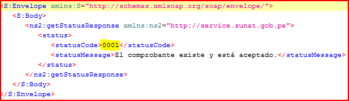 style="width:5.96667in;height:1.71861in" />
>
> \- \<wsse:Username\>20100066603MODDATOS\</wsse:Username\>
> 20100066603MODDATOS = RUC contribuyentemás usuariosol.
>
> \- \<wsse:Password\>moddatos\</wsse:Password\> moddatos =clave sol
> delcontribuyente
>
> \- \<rucComprobante\>1028308796\</rucComprobante\> 1028308796 = RUC
> del comprobante que se quiereconsultar
>
> \- \<tipoComprobante\>01\</tipoComprobante\>
>
> 01 = tipo de comprobante que se quiere consultar (01:factura, 07: nota
> de
>
> crédito y 08:nota de debito)
>
> \- \<serieComprobante\>f213\</serieComprobante\>
>
> f213 = número de serie del comprobante que se quiere consultar
>
> \- \<numeroComprobante\>12345\</numeroComprobante\> 12345 = número del
> comprobante que se quiereconsultar
>
> 5\. La consulta es solo del estado del documentoelectrónico.
>
> Ejemplo del XML de retorno del servidor.
>
> Donde
>
> \- \<statusCode\>0001\</statusCode\> 0001 = código deretorno
>
> \- \<statusMessage\> El comprobante existe y
> estáaceptado.\<statusMessage\> - El comprobante existe y está
> aceptado. = descripción delmensaje.
>
> 6\. Posibles valores de retorno en la siguiente tabla.
>
> ~ 53 ~
>
> SEE –Sistemas del Contribuyente Manual del programador

||
||
||
||
||
||
||
||
||
||
||
||
||
||
||

> ~ 54 ~
